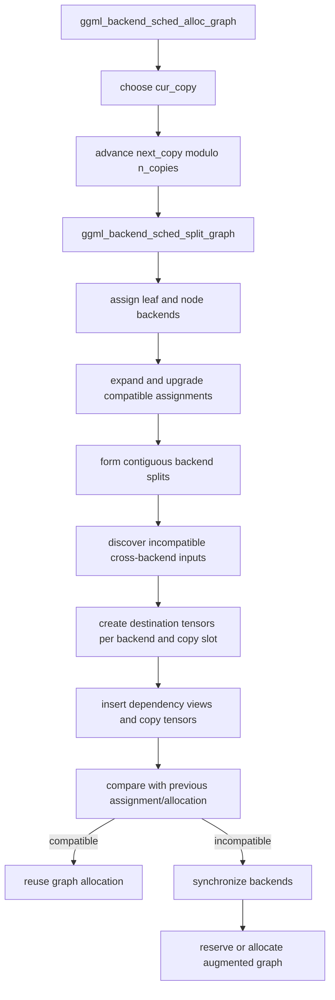
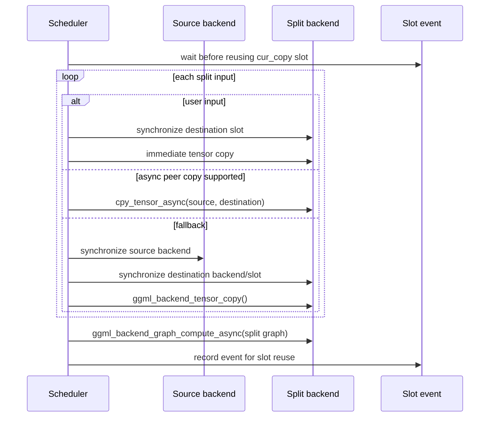

# Backend scheduler internals — Pass A

> **Pinned source baseline:** llama.cpp [`e3546c7948e3af463d0b401e6421d5a4c2faf565`](https://github.com/ggml-org/llama.cpp/commit/e3546c7948e3af463d0b401e6421d5a4c2faf565)
>
> This page describes the scheduler at that revision. Later scheduler PRs and branches are historical or newer evidence, not silent replacements for the pinned behavior.

## Scope

This Pass A inventory follows the transition from a completed GGML graph to backend execution:

```text
ggml_cgraph
→ backend assignment
→ contiguous backend splits
→ cross-backend input discovery
→ per-backend, per-copy-slot destination tensors
→ augmented allocation graph
→ copy readiness and fallback synchronization
→ asynchronous split submission
→ event record
→ graph/copy-slot reuse
→ global synchronization and teardown
```

The primary implementation is [`ggml/src/ggml-backend.cpp`](https://github.com/ggml-org/llama.cpp/blob/e3546c7948e3af463d0b401e6421d5a4c2faf565/ggml/src/ggml-backend.cpp), with public declarations in [`ggml/include/ggml-backend.h`](https://github.com/ggml-org/llama.cpp/blob/e3546c7948e3af463d0b401e6421d5a4c2faf565/ggml/include/ggml-backend.h) and allocator support in [`ggml/src/ggml-alloc.c`](https://github.com/ggml-org/llama.cpp/blob/e3546c7948e3af463d0b401e6421d5a4c2faf565/ggml/src/ggml-alloc.c).

## File and symbol inventory

| File / symbol | Role | Caller | Important callees | Owned or referenced state |
|---|---|---|---|---|
| `ggml_backend_sched_new()` | Construct scheduler and copy/event resources | `llama_context` setup | graph allocator, backend event creation | Owns scheduler object, metadata arrays, split array, context buffer, events, graph allocator |
| `ggml_backend_sched_split_graph()` | Assign backends and construct splits/copies | allocation path | backend support tests, buffer compatibility, tensor duplication, graph-view construction | Rebuilds scheduler temporary GGML context and split metadata |
| `ggml_backend_sched_alloc_splits()` | Allocate original and augmented graphs | `ggml_backend_sched_alloc_graph()` | graph allocator reserve/alloc | Owns allocation plan through scheduler graph allocator |
| `ggml_backend_sched_alloc_graph()` | Select copy slot and prepare graph | async compute path or explicit reserve path | split, compare/reuse, allocate | Advances `cur_copy`/`next_copy`; may synchronize before reallocation |
| `ggml_backend_sched_compute_splits()` | Populate split inputs and submit work | async compute entry | async peer copy, tensor copy fallback, backend compute, event wait/record | Uses scheduler-owned copies/events; references graph and backend queues |
| `ggml_backend_sched_graph_compute_async()` | Public asynchronous scheduler entry | llama.cpp decode/encode | allocate graph, compute splits | Returns after submission, not necessarily completion |
| `ggml_backend_sched_graph_compute()` | Synchronous wrapper | callers requiring completion | async entry, scheduler synchronize | No new persistent ownership |
| `ggml_backend_sched_synchronize()` | Establish backend completion | synchronous wrapper, reset/reallocation/teardown paths | each backend synchronize | Waits on referenced backend queues |
| `ggml_backend_sched_reset()` / free path | Invalidate graph-specific state and release resources | context reuse or teardown | synchronization where required, event/free routines | Releases scheduler resources, not model weights or KV/recurrent memory |

## Scheduler state model

At the pinned revision, `ggml_backend_sched` contains:

- ordered backend handles and their selected buffer types;
- one graph allocator;
- tensor-to-backend IDs;
- tensor-copy pointers indexed by tensor, destination backend, and copy slot;
- previous node/leaf assignments used to detect compatible allocation reuse;
- an augmented graph whose inputs may be rewritten to scheduler copies;
- contiguous split records and their graph views;
- `n_copies`, `cur_copy`, and `next_copy`;
- backend events for each backend/copy-slot pair;
- a temporary GGML context and backing buffer for scheduler-created tensor metadata.

The last backend is asserted or treated as the CPU fallback. Lower backend indices have higher scheduling priority.

## Allocation-time call chain



### Backend assignment

**Verified.** Assignment is multi-pass:

1. Preserve user or preallocated placement where possible.
2. Prefer the backend already owning a compatible destination, view source, or weight.
3. Put graph inputs on the CPU fallback.
4. Expand non-CPU assignments across adjacent supported nodes.
5. Assign remaining nodes to a supported backend with the greatest compatible-input count.
6. Upgrade to a higher-priority backend when buffer-type and operation support permit it.
7. Propagate placement through views and still-unassigned sources.

**Interpretation.** Assignment is constrained placement, not a simple `n_gpu_layers` lookup. Persistent weight placement influences the decision, but scheduler operation support and buffer compatibility determine whether an operation can remain there.

### Split construction

**Verified.** A split is a contiguous graph interval assigned to one backend. A backend can appear in multiple splits. New boundaries arise when the backend changes and may also be forced by input-count or memory-lifetime constraints.

Each split stores its backend ID, node interval, discovered external inputs, and a graph view over that interval.

## Cross-backend copies and validity

For a source tensor that cannot be consumed directly by a split backend, the scheduler creates a destination-layout tensor for every active copy slot.

```text
copy[tensor][destination backend][copy slot]
```

The split node's source pointer is rewritten to the copy for `cur_copy`. The original tensor remains the authoritative source.

### Ownership

| Resource | Owner | Backing allocation | Valid when | Invalid or unsafe when |
|---|---|---|---|---|
| Original model or activation tensor | model, memory subsystem, or graph allocation | its original backend buffer | producing work completed | producer still queued or lifetime ended |
| Scheduler copy tensor metadata | scheduler temporary GGML context | context buffer | split graph exists | scheduler reset/re-split/free |
| Scheduler copy tensor payload | scheduler graph allocator on destination backend | selected destination buffer type | required transfer completed | slot reused before prior consumer completion or source values changed without refresh |
| Dependency view | scheduler augmented graph | aliases original source | allocation graph preserves source lifetime | re-split/reset |
| Backend event | scheduler | backend-specific event object | recorded after work consuming the slot | never recorded, unsupported, or destroyed |

**Verified.** Copy tensors are scheduler execution storage. They are not published into `llama_model` and are not KV/recurrent memory.

**Interpretation.** Destination validity is generation-scoped. A pointer to an allocated copy only proves allocation; it does not prove that the bytes correspond to the current graph invocation or that the previous consumer has finished.

## Execution-time call chain



### User-input capture

**Verified.** `GGML_TENSOR_FLAG_INPUT` changes the lifetime assumption. User-owned input storage may be overwritten after the scheduler API returns, so the scheduler synchronizes the destination slot and captures the input immediately rather than depending on later asynchronous source availability.

### Peer-copy fallback

**Verified.** A failed or unavailable asynchronous peer copy does not imply that the same operation is safe synchronously without ordering. The fallback synchronizes relevant source and destination work before calling the generic tensor-copy path.

### MoE partial weight transfer

**Verified.** The pinned executor has a `GGML_OP_MUL_MAT_ID` specialization for host-resident expert weights consumed by an offloaded backend. It reads selected expert IDs, groups used ranges, and transfers only those expert slices into the active scheduler destination copy.

**Interpretation.** This reduces transfer volume but is not a persistent expert-cache policy. The active destination generation is still refreshed for the invocation; no LRU admission or OS-residency guarantee follows from this path.

## Copy ring and events

With pipeline parallelism disabled, the scheduler uses one copy slot. With it enabled, the scheduler can use up to `GGML_SCHED_MAX_COPIES` slots and creates events per backend and slot.

The event is a reuse fence:

```text
wait(slot event)
→ overwrite destination copy
→ submit split consuming it
→ record(slot event)
```

**Interpretation.** Multiple slots permit overlap across graph invocations, but they do not make data coherent automatically. Correctness still requires event support or conservative synchronization.

## Graph-allocation reuse

The scheduler stores prior node and leaf backend assignments. If the new graph is compatible, the existing allocation can be reused. If allocation must change, backends are synchronized first because reallocation can move or destroy split-input storage that queued work still references.

**Verified.** Reuse preserves compatible placement and allocation structure.

**Interpretation.** Reuse does not preserve current input values, copy-generation validity, output values, or sequence-memory state. Those must be refreshed or mutated for every invocation.

## Backend variants

| Variant | Typical splits | Copies | Completion behavior |
|---|---:|---:|---|
| CPU-only | Usually one | Usually none for normal edges | CPU backend may execute synchronously internally, but scheduler API semantics remain distinct |
| CPU + one accelerator | One or more | At incompatible boundaries | Async peer copy when implemented; otherwise synchronized fallback |
| Multiple accelerators/backends | Multiple possible | Per destination backend and slot | Backend-specific events/queues determine real overlap |
| Pipeline parallel | Same logical boundaries plus rotating slots | Multiple generations | Events prevent premature slot overwrite |
| Evaluation callback | Split graph may be submitted in smaller views | Same input preparation | Synchronization is introduced for callback-visible data |

## Error, reset, and teardown paths

**Verified.** Important failure and cleanup behavior includes:

- allocation failure returns `GGML_STATUS_ALLOC_FAILED`;
- split execution stops on a non-success backend status;
- peer-copy failure falls back to synchronized generic copy;
- graph reallocation synchronizes before moving reusable storage;
- synchronous compute wraps asynchronous submission and then synchronizes all registered backends;
- scheduler destruction must not release events, graph allocations, or backend-referenced storage while work is queued.

**Interpretation.** The safe teardown dependency is:

```text
finish or synchronize queued backend work
→ release scheduler events and graph allocation
→ release runtime backend instances
```

Persistent model buffers and context memory have separate owners and destruction paths.

## Historical context

Historical scheduler PRs can explain rationale, regressions, and newer designs, but must not be read back into this baseline:

- [PR #20793 — scheduler synchronization and pipeline parallelism](https://github.com/ggml-org/llama.cpp/pull/20793)
- [PR #25319 — asynchronous scheduler memory copies](https://github.com/ggml-org/llama.cpp/pull/25319)

The pinned source remains implementation truth for this page.

## Open questions

- Which pinned CPU, CUDA, Metal, Vulkan, SYCL, RPC, CANN, and OpenCL backends implement true asynchronous peer copy versus synchronous or unsupported behavior?
- What exact backend event primitive backs every event interface at this revision?
- Which graph-shape and assignment differences force scheduler reallocation during prefill versus token decode?
- Can runtime instrumentation expose copy generation, bytes, event waits, fallback synchronizations, and split submission timestamps without perturbing scheduling significantly?
- Which later scheduler changes invalidate or extend the pinned copy-validity model?

## Related pages

- [Backend scheduler execution](../lifecycle/backend-scheduler-execution.md)
- [Generic copy fallback](../lifecycle/generic-copy-fallback.md)
- [Buffer compatibility](../lifecycle/buffer-compatibility.md)
- [System ownership and execution map](system-ownership-and-execution-map.md)
- [Memory lifetimes](../foundations/memory-lifetimes.md)
