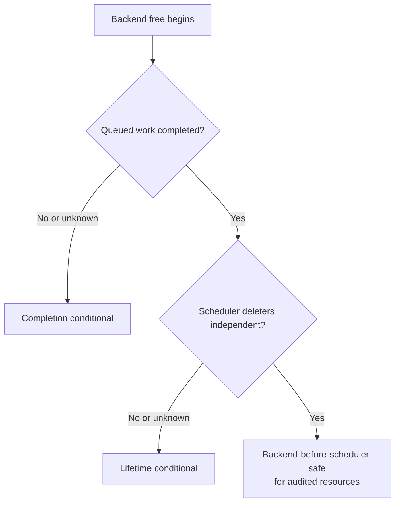

# Backend teardown audit method

This page is a reusable, source-pinned method for deciding whether a llama.cpp backend can be destroyed before scheduler-owned buffers and events. It complements the [cross-backend comparison](backend-teardown-comparison.md) and the backend-specific audits.

> **Baseline:** llama.cpp `e3546c7948e3af463d0b401e6421d5a4c2faf565`

## The two proofs

A teardown classification requires two independent proofs:

1. **Completion proof** — every command that may still reference backend or buffer state has reached a host-visible completion boundary.
2. **Deleter-independence proof** — later scheduler buffer/event destructors retain all state they need and do not dereference the deleted per-backend context.



A backend can pass one proof and fail the other. CANN, RPC, CUDA, and SYCL demonstrate why these properties must not be collapsed into one label.

## Audit worksheet

| Step | Evidence to locate | Questions to answer |
|---|---|---|
| 1. Entry point | backend interface table and backend `free` callback | What exact function starts teardown? |
| 2. Submission model | graph compute, async copy, event record/wait | Can work remain queued when API calls return? |
| 3. Completion boundary | stream/queue/device synchronize, fence wait, command-buffer wait | Does backend free establish host-visible completion, and for every queue? |
| 4. Context ownership | backend context fields and destructor | Which streams, pools, graphs, scratchpads, caches, programs, or kernels are context-owned? |
| 5. Scheduler events | event create/free/record/wait callbacks | Does event destruction require the deleted backend context, only persistent device state, or only the event handle? |
| 6. Scheduler buffers | buffer context and free callback | Does buffer destruction retain device/allocation/transport state independently? |
| 7. Registry lifetime | device and buffer-type factories | Are these static/process-wide, backend-owned, or dynamically invalidated? |
| 8. Destruction order | explicit body plus C++ member reverse destruction | Are resources destroyed after their runtime/device/context remains valid? |
| 9. Optional paths | graph capture, profiling, binary kernels, communication, extra buffers | Do optional features introduce another queue or owner? |
| 10. Runtime test | immediate compute → free variants | Does asynchronous destruction survive sanitizers and backend validation layers? |

## Evidence hierarchy

### Verified

Use this label only for behavior visible in the pinned source, an authoritative API contract, or a reproducible runtime test. Record the exact function, owner, and completion primitive.

### Interpretation

Use this label for conclusions assembled from several verified facts, such as “the scheduler buffer remains independently destructible.” State the assumptions explicitly.

### Historical

Use this label for PR rationale, older/newer revisions, or behavior that differs from the pinned baseline.

### Open question

Use this label whenever queue coverage, destructor semantics, runtime reset behavior, or optional-path ownership is not proven. Do not upgrade absence of an obvious call into proof that no completion occurs.

## Classification vocabulary

Use one of these bounded conclusions:

- **Verified safe for audited resources** — both proofs are established for the named ordinary/optional paths.
- **Structurally independent; completion conditional** — scheduler deleters survive, but queued-work completion is not fully proven.
- **Completion-safe; teardown-order conditional** — work completion is explicit, but later destruction may occur after reset or owner invalidation.
- **Locally independent; remote completion conditional** — client ownership is sound, but distributed execution completion is not acknowledged.
- **Open question** — one or both proofs lack enough source or runtime evidence.

Always include the resource scope. A result for ordinary buffers does not automatically cover graph capture, profiling, communication, extra-buffer types, or vendor binary paths.

## Minimum runtime matrix

For asynchronous backends, test at least:

```text
compute → backend free → scheduler free
compute → explicit synchronize → backend free → scheduler free
async copy → backend free → scheduler free
record event → backend free → event free
compute → buffer free
compute → context/model teardown
```

Repeat with optional streams/queues, graph capture, profiling, split buffers, and two simultaneous contexts when supported. Run validation layers, sanitizers, or vendor diagnostics where available.

## Practical cleanup rule

Until both proofs are established for the active backend configuration, prefer an explicit completion boundary before context destruction:

```cpp
llama_synchronize(ctx);
llama_free(ctx);
```

This is a conservative application rule, not proof that every backend’s public synchronize callback covers every internal queue.

## Current project application

The [backend teardown comparison](backend-teardown-comparison.md) applies this method to ordinary CPU, CUDA, Metal, Vulkan, SYCL, RPC, CANN, and the current OpenCL gap. The OpenCL audit remains the highest-priority unfinished application of this worksheet.

## Open questions

- Can CI generate this worksheet automatically from backend interface tables and source-index metadata?
- Which backends need all-stream or all-queue synchronization rather than their current default-stream callback?
- Which optional buffer types have owners different from the ordinary backend path?
- What is the smallest portable asynchronous-destruction regression suite across accelerators?
