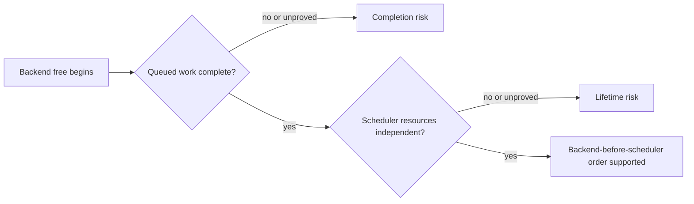

# Backend teardown comparison

This page compares the teardown audits for the pinned llama.cpp baseline
[`e3546c7948e3af463d0b401e6421d5a4c2faf565`](https://github.com/ggml-org/llama.cpp/commit/e3546c7948e3af463d0b401e6421d5a4c2faf565).
It is a navigation and reasoning aid: the backend-specific pages remain the source of detailed evidence.

## Why this comparison matters

Destroying a backend wrapper before the scheduler is safe only when **both** of these conditions hold:

1. later scheduler event and buffer deleters retain valid state without dereferencing the deleted backend context;
2. commands that still reference those resources have completed before the resources are released.

These are different questions. Object independence does not prove command completion, and synchronization does not repair an invalid ownership chain.



## Pinned comparison matrix

| Backend | Execution/completion boundary | Scheduler resource independence | Pinned classification | Detailed audit |
|---|---|---|---|---|
| Ordinary CPU | Graph computation completes before the callback returns; no asynchronous queue or event interface | No scheduler CPU events; buffers use buffer-local callbacks and static registry state | **Verified safe** | [CPU teardown](cpu-backend-teardown.md) |
| CUDA family | Explicit synchronize callback exists, but backend destruction does not explicitly synchronize every created stream before context members unwind | Ordinary scheduler events and buffers retain their own CUDA handles/device identity | **Structurally independent; completion conditional** | [CUDA teardown](cuda-backend-teardown.md) |
| Metal | Backend free calls Metal synchronization before releasing context-owned command resources | Scheduler events and buffers retain independent Objective-C/device or buffer-local state | **Verified safe for audited ordinary resources** | [Metal teardown](metal-backend-teardown.md) |
| Vulkan | Cleanup discards unsubmitted recording and synchronizes submitted work before destroying context-owned submission resources | Scheduler events use persistent device state; buffers retain shared device/buffer ownership | **Verified safe for audited ordinary resources** | [Vulkan command lifetimes](vulkan-command-lifetime.md) · [Vulkan teardown](vulkan-backend-teardown.md) |
| SYCL | Graphs and copies can be asynchronous; backend free does not explicitly wait, and the public synchronize path has limited queue scope | Ordinary events and buffers retain independent `sycl::event`, queue, device, and allocation state | **Structurally independent; completion conditional** | [SYCL teardown](sycl-backend-teardown.md) |
| RPC | Client graph submission has no completion response and RPC synchronize is a no-op; remote completion depends on the concrete server backend | RPC buffers retain a shared socket and remote handle after client backend deletion | **Locally independent; remote completion conditional** | [RPC teardown](rpc-backend-teardown.md) |
| CANN | Backend free performs device-wide synchronization | Device reset occurs before later context and scheduler resource destruction, leaving post-reset validity unresolved | **Completion-safe; teardown-order conditional** | [CANN teardown](cann-backend-teardown.md) |
| OpenCL | Full queue-completion and destructor chain not yet established | Buffer-local `cl_mem` ownership is mapped, but complete scheduler/program/kernel/context independence is unfinished | **Open question** | [OpenCL build and buffer lifetimes](opencl-build-and-buffer-lifetimes.md) |

## Cross-backend patterns

### Verified

- Ordinary CPU is the simplest case because execution is synchronous and scheduler events are unsupported.
- Metal and Vulkan establish explicit completion boundaries during backend cleanup before releasing context-owned submission resources.
- CUDA and SYCL scheduler resource deleters are structurally independent of the deleted per-backend wrapper in the audited ordinary paths.
- RPC client buffers preserve the transport and remote allocation handle needed for later release.
- CANN explicitly completes device work before reset.

### Interpretation

- The strongest teardown contract combines an explicit host-visible completion boundary with scheduler-resource deleters that depend only on persistent device or buffer-local state.
- CUDA and SYCL are not classified unsafe; their source-level completion proof is incomplete for every queue/stream and destruction state.
- RPC extends the same distinction across a process and network boundary: command transmission and server dispatch do not necessarily mean accelerator completion.
- CANN demonstrates that completion and resource validity can diverge: work may be complete while post-reset destructor calls remain questionable.

### Historical

Backend queue counts, graph-capture implementations, event types, allocation pools, registry lifetimes, and destructor order are revision-sensitive. This table must not be silently applied to newer llama.cpp revisions.

### Open questions

- Complete the OpenCL backend/context free, queue completion, event, program, kernel, context, and optional binary-library teardown chain.
- Test immediate asynchronous graph submission followed by context destruction for every accelerator backend.
- Verify CUDA all-stream and SYCL all-queue synchronization coverage.
- Validate CANN stream/event/buffer destruction before and after device reset.
- Add an RPC synchronization protocol that provides server-side backend completion rather than only socket ordering.
- Audit optional CPU extra-buffer implementations separately from the ordinary CPU backend.

## Practical application rule

Until a backend-specific page proves a stronger contract, use an explicit completion boundary before destroying a context that may have queued accelerator or remote work:

```cpp
llama_synchronize(ctx);
llama_free(ctx);
```

This rule does not replace ownership analysis. The model must still outlive every context that borrows it, and scheduler resources must still have valid deleter state when their turn in reverse destruction order arrives.

## Reading order

1. [Model and context teardown order](model-context-teardown-order.md)
2. [Scheduler core teardown](scheduler-teardown-core.md)
3. This comparison matrix
4. The backend-specific audit for the deployment target
