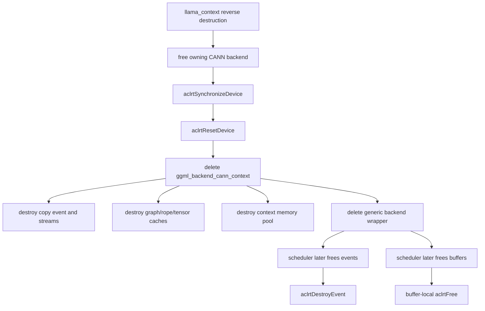

# CANN backend teardown

This page traces ordinary CANN backend destruction at llama.cpp revision [`e3546c7948e3af463d0b401e6421d5a4c2faf565`](https://github.com/ggml-org/llama.cpp/commit/e3546c7948e3af463d0b401e6421d5a4c2faf565). It separates queued-work completion from object-lifetime correctness.

## Result

> **Classification:** CANN backend free establishes a device-wide completion boundary, and scheduler events/buffers are structurally independent of the per-backend wrapper. However, the pinned free order resets the device *before* deleting context-owned streams, events, pools, graph cache, and device allocations. Without a verified CANN API contract proving those later destroy/free calls remain valid after `aclrtResetDevice()`, backend-before-scheduler destruction is **completion-safe but teardown-order conditional**.



## Verified

### Backend free synchronizes the whole device

`ggml_backend_cann_free()` calls `aclrtSynchronizeDevice()`, then `aclrtResetDevice(cann_ctx->device)`, then deletes the context and generic backend wrapper.

Pinned source: [`ggml-cann.cpp#L2058-L2065`](https://github.com/ggml-org/llama.cpp/blob/e3546c7948e3af463d0b401e6421d5a4c2faf565/ggml/src/ggml-cann/ggml-cann.cpp#L2058-L2065).

This is stronger for queued-work completion than the public backend `synchronize` callback, which waits only on the context's default stream.

Pinned source: [`ggml-cann.cpp#L2207-L2211`](https://github.com/ggml-org/llama.cpp/blob/e3546c7948e3af463d0b401e6421d5a4c2faf565/ggml/src/ggml-cann/ggml-cann.cpp#L2207-L2211).

### Context destruction owns several device resources

The context owns up to eight lazily created streams, an optional copy event, a memory pool, rope/tensor caches, and—when enabled—an ACL graph LRU cache. Its destructor destroys the copy event and streams. C++ member destruction then releases caches and the memory pool.

Pinned source: [`common.h#L560-L650`](https://github.com/ggml-org/llama.cpp/blob/e3546c7948e3af463d0b401e6421d5a4c2faf565/ggml/src/ggml-cann/common.h#L560-L650).

The pool contract explicitly warns that CANN operators are asynchronous and memory must remain available until an operator completes.

Pinned source: [`common.h#L111-L138`](https://github.com/ggml-org/llama.cpp/blob/e3546c7948e3af463d0b401e6421d5a4c2faf565/ggml/src/ggml-cann/common.h#L111-L138).

### Scheduler events do not depend on the backend context

A scheduler event owns an `aclrtEvent` and records the registry device. Its free callback destroys the event directly, ignores the passed device object, and never dereferences the deleted per-backend context.

Pinned source: [`ggml-cann.cpp#L2891-L2934`](https://github.com/ggml-org/llama.cpp/blob/e3546c7948e3af463d0b401e6421d5a4c2faf565/ggml/src/ggml-cann/ggml-cann.cpp#L2891-L2934).

### Scheduler buffers are buffer-local

A CANN buffer context stores its device id and device pointer. Its destructor calls `aclrtFree(dev_ptr)`; the buffer free callback only deletes this buffer-local context. It does not use the deleted backend wrapper.

Pinned source: [`ggml-cann.cpp#L799-L896`](https://github.com/ggml-org/llama.cpp/blob/e3546c7948e3af463d0b401e6421d5a4c2faf565/ggml/src/ggml-cann/ggml-cann.cpp#L799-L896).

### Registry devices outlive individual backend wrappers

The CANN registry and its device objects are function-static process state initialized once. Scheduler events therefore retain a registry device object whose lifetime is independent of an individual backend context.

Pinned source: [`ggml-cann.cpp#L2951-L3021`](https://github.com/ggml-org/llama.cpp/blob/e3546c7948e3af463d0b401e6421d5a4c2faf565/ggml/src/ggml-cann/ggml-cann.cpp#L2951-L3021).

## Interpretation

`aclrtSynchronizeDevice()` establishes the important completion boundary: queued kernels and copies should no longer be using context or scheduler allocations when teardown begins.

The unresolved part is resource validity after `aclrtResetDevice()`. The source resets the device before destructors call `aclrtDestroyEvent`, `aclrtDestroyStream`, and `aclrtFree`. That order may be intentionally supported, redundant, or erroneous depending on the CANN runtime contract. The source alone cannot prove which.

Therefore two questions must remain separate:

1. **Is queued work complete?** Yes, the pinned free path explicitly synchronizes the device.
2. **Are later resource destroy/free calls valid after reset?** Not verified.

## Historical

The same reset-before-context-delete order is still present in the upstream file inspected on 2026-07-13. This persistence is evidence of implementation history, not proof of API correctness across CANN versions.

CANN graph mode, stream counts, pool behavior, event flags, and device-reset semantics are runtime- and revision-sensitive.

## Open questions

- What does the supported CANN version guarantee about `aclrtDestroyStream`, `aclrtDestroyEvent`, and `aclrtFree` after `aclrtResetDevice`?
- Does `aclrtResetDevice` implicitly destroy or invalidate all resources, making the later destructor calls redundant or invalid?
- Should context-owned resources be destroyed before device reset, followed by reset only after the context is gone?
- Can scheduler event and buffer destruction safely call ACL APIs after the owning backend already reset the device?
- Does freeing one CANN backend reset shared process/device state still needed by another backend instance on the same device?
- Are multi-context and immediate graph-compute → context-destruction paths covered by CANN backend tests?

## Practical rule

Until the reset contract is verified, treat CANN teardown as requiring dedicated runtime validation. Application-level synchronization is still useful, but it does not resolve reset-before-resource-destruction ordering.

```cpp
llama_synchronize(ctx);
llama_free(ctx);
```

## Next investigation

Create a minimal CANN teardown test matrix covering one and two backend contexts, scheduler events, scheduler buffers, graph execution, and explicit destruction before versus after `aclrtResetDevice()`.