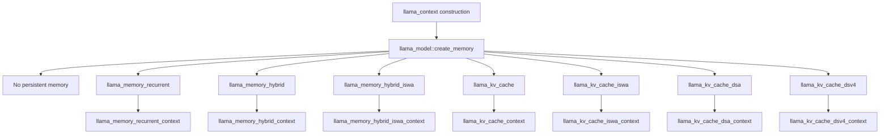

# Context memory implementations

> **Evidence scope:** llama.cpp [`e3546c7948e3af463d0b401e6421d5a4c2faf565`](https://github.com/ggml-org/llama.cpp/commit/e3546c7948e3af463d0b401e6421d5a4c2faf565). Architecture and factory behavior are revision-sensitive.

This page answers a deceptively simple question: **what does `llama_model::create_memory()` actually create?** At the pinned revision, context memory is a polymorphic family rather than one universal KV cache.

## Five-minute map

`llama_memory_i` owns persistent inference memory and sequence operations. `llama_memory_context_i` is the temporary per-batch or update plan returned by `init_batch()`, `init_full()`, or `init_update()`. The interface explicitly says that `apply()` is the mutation boundary.

## Exact concrete implementations

| Persistent implementation | Per-operation context | Internal composition | Selected by |
|---|---|---|---|
| `llama_kv_cache` | `llama_kv_cache_context` | Cell/sequence metadata plus backend-buffer-backed K/V tensors | Default attention models without separate iSWA handling |
| `llama_kv_cache_iswa` | `llama_kv_cache_iswa_context` | Two ordinary KV caches: base/full-attention and SWA | Attention model with `hparams.swa_type != NONE` |
| `llama_kv_cache_dsa` | `llama_kv_cache_dsa_context` | Two KV caches: MLA model keys and lightning-indexer keys | `LLM_ARCH_DEEPSEEK32` |
| `llama_kv_cache_dsv4` | `llama_kv_cache_dsv4_context` | Raw iSWA cache, three compressed K caches, and three persistent compressor-state stores | `LLM_ARCH_DEEPSEEK4` |
| `llama_memory_recurrent` | `llama_memory_recurrent_context` | Recurrent R/S state tensors plus cell and rollback metadata | Architectures for which `llm_arch_is_recurrent()` is true |
| `llama_memory_hybrid` | `llama_memory_hybrid_context` | One filtered ordinary KV cache plus one filtered recurrent memory | Hybrid architecture without SWA |
| `llama_memory_hybrid_iswa` | `llama_memory_hybrid_iswa_context` | One filtered iSWA cache plus one filtered recurrent memory | Hybrid architecture with SWA |

`llama_kv_cache_dsv4_raw_context` also implements `llama_memory_context_i`, but it is an internal sub-context of the DSV4 wrapper rather than a separately returned `llama_memory_i`. `llama_kv_cache_dsv4_comp_context` is a helper context and does **not** implement the generic interface.

## Architecture-to-memory mapping

### No persistent context memory

The factory returns `nullptr` for:

- BERT, Jina BERT v2/v3, Nomic BERT and Nomic BERT MoE;
- NeoBERT, EuroBERT, ModernBERT, and Gemma Embedding;
- WavTokenizer decoder;
- Dream, LLaDA, LLaDA MoE, and RND1.

These are encoder, embedding, audio-decoder, or diffusion-style paths for which the factory does not instantiate autoregressive sequence memory.

### Pure recurrent memory

`llm_arch_is_recurrent()` is true for exactly:

- Mamba;
- Mamba2;
- RWKV6;
- RWKV6-Qwen2;
- RWKV7;
- ARWKV7.

They receive `llama_memory_recurrent` with F32 recurrent state tensors. The factory sizes the cell space to at least one and normally to `n_seq_max`; `n_rs_seq` controls per-sequence rollback snapshots.

### Hybrid attention and recurrent memory

`llm_arch_is_hybrid()` is true for exactly:

- Jamba;
- Falcon H1;
- Plamo2;
- Granite Hybrid;
- LFM2 and LFM2-MoE;
- Nemotron H and Nemotron H MoE;
- Qwen3-Next;
- Kimi Linear;
- Qwen3.5 and Qwen3.5-MoE.

The factory chooses `llama_memory_hybrid_iswa` when the model declares SWA, otherwise `llama_memory_hybrid`. Layer filters divide attention and recurrent layers. Falcon H1 admits both categories through explicit filters; Nemotron H variants exclude layers whose feed-forward width is nonzero; Qwen3.5 variants constrain filters to the main-model layer range. An MTP context for hybrid Qwen3.5 is a special exception: its dense-attention MTP head receives a plain attention cache rather than the hybrid wrapper.

### Specialized attention memories

- **DeepSeek 3.2:** `llama_kv_cache_dsa`, separating MLA keys from lightning-indexer keys.
- **DeepSeek 4:** `llama_kv_cache_dsv4`, combining raw/SWA token state with compressed CSA, HCA, and LID stores and compressor state.
- **All other attention decoders:** ordinary `llama_kv_cache`, or `llama_kv_cache_iswa` when SWA is declared.

Gemma3n and Gemma4 can provide a layer-reuse callback. Gemma4 Assistant can additionally share selected attention storage with another context through `mem_other`. Step3.5 and MTP contexts can filter main versus next-token layers.

## What each family owns

| Family | Persistent storage | Placement | Mutation model | Sequence semantics |
|---|---|---|---|---|
| Ordinary KV | Cell metadata, stream mapping, K/V tensors, backend buffers | CPU or offloaded according to `offload_kqv` and selected buffer types | Slot planning followed by `apply()`, graph K/V writes, optional update graph for shifts/copies | Full remove/copy/keep/add/div and state I/O |
| iSWA | Base KV plus SWA KV | Each child owns its buffers | Child contexts are advanced and applied together | Operations forwarded to both caches |
| Recurrent | Cell metadata, R/S tensors, rollback indexes, backend buffers | CPU or offloaded | Contiguous recurrent slots and graph-visible recurrent state | Sequence operations manipulate recurrent snapshots rather than token K/V rows |
| Hybrid | Attention child plus recurrent child | Mixed child placements | One wrapper coordinates two child contexts for the same ubatch | Operations and state I/O are composed across both children |
| DSA | MLA child plus indexer child | Child cache placement | Both child plans must remain aligned | Wrapper forwards sequence/state operations to both |
| DSV4 | Raw iSWA, compressed caches, persistent compressor state, visibility plans | Multiple backend-buffer-backed stores | Raw writes and compressed graph outputs follow different plans | Specialized block visibility and compressed-state serialization constraints |

## Allocation, updates, and synchronization

### Ordinary KV

The cache separates host-side cell and sequence metadata from backend-buffer-backed K/V payloads. `prepare()` chooses slots; the per-batch context exposes those slots to graph builders. `cpy_k()` and `cpy_v()` create graph operations that write new state. Pending shifts and stream copies can require a backend-executed update graph, so state serialization or conflicting reuse must wait for completion.

### Recurrent

Recurrent memory stores per-layer `r_l` and `s_l` tensors plus cell metadata identifying source, tail, and sequence ownership. It supports rollback groups through widened state tensors and `rs_idx`. Unlike ordinary attention, its reusable state is a recurrent snapshot rather than an ever-growing token-indexed K/V history.

### Composite wrappers

The iSWA, hybrid, hybrid-iSWA, and DSA wrappers own child memory objects with `unique_ptr`. Their contexts own child context plans and combine statuses. A wrapper-level success therefore depends on all participating child plans being valid and advanced consistently.

### DSV4

DSV4 is materially different from “two KV caches.” It owns a raw iSWA cache, separate compressed K-only stores, and persistent compressor-state tensors. Compressed rows are graph outputs; visibility and block planning live in the DSV4 context. The pinned header warns that unified mode is not fully supported and that token position is currently conflated with buffer contents.

## Invariants

1. A `llama_memory_i` object is context-owned persistent state; a `llama_memory_context_i` object is temporary planning state.
2. `apply()` is the intended mutation boundary for generic memory contexts.
3. Composite wrappers own their children; graph builders borrow typed child-context views.
4. Backend allocation does not imply data validity or queue completion.
5. Sequence mutation and state I/O are polymorphic operations and must not assume ordinary KV-row semantics.
6. `nullptr` from `create_memory()` is a valid architecture decision, not an allocation failure.
7. MTP context type can select a different memory layout from the main context of the same model.

## Truth labels

### Verified

- The pinned tree contains seven concrete `llama_memory_i` implementations and their seven primary context implementations listed above.
- The recurrent and hybrid architecture sets are explicit switch statements in `llama-arch.cpp`.
- DeepSeek 3.2 and DeepSeek 4 have dedicated factory branches.
- Attention models with SWA use iSWA wrappers; hybrid models with SWA use the hybrid-iSWA wrapper.
- The generic interface defines `apply()` as the only method intended to mutate memory and its context.

### Interpretation

- The memory factory is an architecture-to-state-machine compiler: it converts model architecture, context type, SWA properties, offload settings, and layer filters into one concrete persistent state implementation.
- Composite memories are coordination layers, not new monolithic tensor layouts; their correctness depends on aligned child contexts.
- “KV cache size” is not a universal memory metric for recurrent and compressed-cache models.

### Historical

- This polymorphic family, the exact architecture sets, DSV4 compression scheme, MTP exception, and rollback support are revision-sensitive. Earlier llama.cpp revisions used materially different KV and recurrent abstractions.

### Open questions

- Which architecture-specific graph builders downcast to each context type, and which tensors they read or write.
- Exact runtime bytes and update cost per family under CPU-only and offloaded execution.
- Whether later revisions change DSV4 unified-mode limitations or separate token position from buffer validity.
- Public concurrency guarantees for sequence operations and state serialization while backend work is queued.

## Pinned source map

- [`src/llama-memory.h`](https://github.com/ggml-org/llama.cpp/blob/e3546c7948e3af463d0b401e6421d5a4c2faf565/src/llama-memory.h)
- [`src/llama-model.cpp`](https://github.com/ggml-org/llama.cpp/blob/e3546c7948e3af463d0b401e6421d5a4c2faf565/src/llama-model.cpp)
- [`src/llama-arch.cpp`](https://github.com/ggml-org/llama.cpp/blob/e3546c7948e3af463d0b401e6421d5a4c2faf565/src/llama-arch.cpp)
- [`src/llama-kv-cache.h`](https://github.com/ggml-org/llama.cpp/blob/e3546c7948e3af463d0b401e6421d5a4c2faf565/src/llama-kv-cache.h)
- [`src/llama-kv-cache-iswa.h`](https://github.com/ggml-org/llama.cpp/blob/e3546c7948e3af463d0b401e6421d5a4c2faf565/src/llama-kv-cache-iswa.h)
- [`src/llama-kv-cache-dsa.h`](https://github.com/ggml-org/llama.cpp/blob/e3546c7948e3af463d0b401e6421d5a4c2faf565/src/llama-kv-cache-dsa.h)
- [`src/llama-kv-cache-dsv4.h`](https://github.com/ggml-org/llama.cpp/blob/e3546c7948e3af463d0b401e6421d5a4c2faf565/src/llama-kv-cache-dsv4.h)
- [`src/llama-memory-recurrent.h`](https://github.com/ggml-org/llama.cpp/blob/e3546c7948e3af463d0b401e6421d5a4c2faf565/src/llama-memory-recurrent.h)
- [`src/llama-memory-hybrid.h`](https://github.com/ggml-org/llama.cpp/blob/e3546c7948e3af463d0b401e6421d5a4c2faf565/src/llama-memory-hybrid.h)
- [`src/llama-memory-hybrid-iswa.h`](https://github.com/ggml-org/llama.cpp/blob/e3546c7948e3af463d0b401e6421d5a4c2faf565/src/llama-memory-hybrid-iswa.h)

## Related pages

- [Runtime context and memory Pass A](runtime-context-memory-pass-a.md)
- [System ownership and execution map](system-ownership-and-execution-map.md)
- [Memory lifetimes](../foundations/memory-lifetimes.md)
- [`llama_context`](../objects/llama-context.md)
