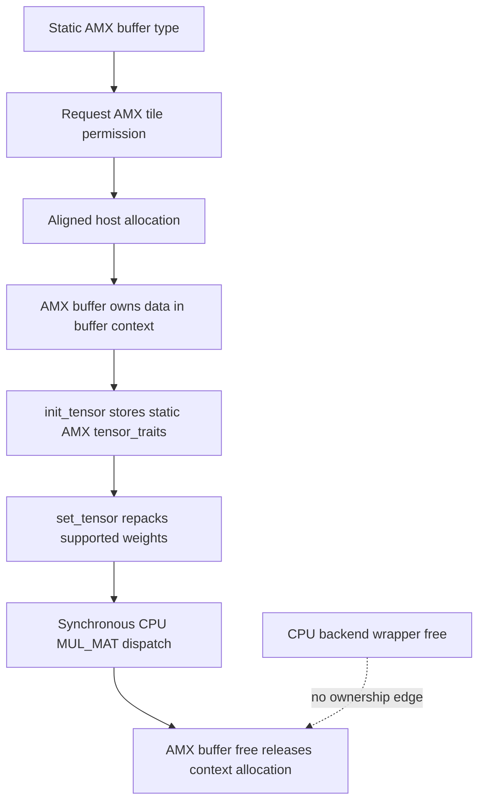

# CPU AMX extra-buffer lifetime

This page applies the [backend teardown audit method](backend-teardown-audit-method.md) to the optional AMX CPU path at llama.cpp revision [`e3546c7948e3af463d0b401e6421d5a4c2faf565`](https://github.com/ggml-org/llama.cpp/commit/e3546c7948e3af463d0b401e6421d5a4c2faf565).

The scope is deliberately bounded to the `__AMX_INT8__ && __AVX512VNNI__` implementation in `ggml/src/ggml-cpu/amx/amx.cpp`. It does not classify KleidiAI, SpacemiT IME, CPU HBM, or newer AMX revisions.

## Five-minute result

> **Classification:** the pinned AMX extra-buffer path is **verified independent of the ordinary CPU backend wrapper for audited resources**, with one allocator-pairing question retained for platform validation.

Unlike CPU repack, AMX allocates a dedicated aligned host buffer and installs an AMX-specific buffer interface. The buffer object itself retains the allocation pointer in `buffer->context`; its free callback releases that pointer without consulting `ggml_backend_cpu_context`. AMX tensor traits and the extra-buffer-type object are function-static/process-lifetime state. Execution still enters the synchronous ordinary CPU graph path, so AMX adds no independent command queue or scheduler-event lifetime.



## Verified

### Compilation and runtime admission are explicit

The implementation is compiled only when both `__AMX_INT8__` and `__AVX512VNNI__` are defined. Before returning the function-static AMX buffer type, `ggml_backend_amx_buffer_type()` calls `ggml_amx_init()`. On Linux that requests `XFEATURE_XTILEDATA` permission through `arch_prctl`; failure returns `nullptr` rather than publishing an unusable buffer type.

- [`amx.cpp#L21-L24`](https://github.com/ggml-org/llama.cpp/blob/e3546c7948e3af463d0b401e6421d5a4c2faf565/ggml/src/ggml-cpu/amx/amx.cpp#L21-L24)
- [`amx.cpp#L211-L248`](https://github.com/ggml-org/llama.cpp/blob/e3546c7948e3af463d0b401e6421d5a4c2faf565/ggml/src/ggml-cpu/amx/amx.cpp#L211-L248)

### AMX owns a dedicated host allocation

`ggml_backend_amx_buffer_type_alloc_buffer()` allocates `size` bytes with `ggml_aligned_malloc()` and passes the resulting pointer to `ggml_backend_buffer_init()` as the buffer context. The AMX-specific interface returns this pointer from `get_base`, uses it for `clear`, and releases it in `free_buffer`.

- [`amx.cpp#L47-L53`](https://github.com/ggml-org/llama.cpp/blob/e3546c7948e3af463d0b401e6421d5a4c2faf565/ggml/src/ggml-cpu/amx/amx.cpp#L47-L53)
- [`amx.cpp#L105-L136`](https://github.com/ggml-org/llama.cpp/blob/e3546c7948e3af463d0b401e6421d5a4c2faf565/ggml/src/ggml-cpu/amx/amx.cpp#L105-L136)

This differs from CPU repack, which delegates allocation and destruction to the ordinary CPU buffer interface. AMX has a distinct allocation owner, but that owner is still the buffer object rather than the CPU backend wrapper.

### Tensor metadata is static

`ggml_backend_amx_buffer_init_tensor()` stores the result of `ggml::cpu::amx::get_tensor_traits()` in `tensor->extra`. That function returns one function-static `tensor_traits` instance. The traits report AMX work size and dispatch supported `GGML_OP_MUL_MAT` operations to `ggml_backend_amx_mul_mat()`.

- [`amx.cpp#L23-L43`](https://github.com/ggml-org/llama.cpp/blob/e3546c7948e3af463d0b401e6421d5a4c2faf565/ggml/src/ggml-cpu/amx/amx.cpp#L23-L43)
- [`amx.cpp#L55-L60`](https://github.com/ggml-org/llama.cpp/blob/e3546c7948e3af463d0b401e6421d5a4c2faf565/ggml/src/ggml-cpu/amx/amx.cpp#L55-L60)

The function-static AMX buffer type retains a heap-allocated `extra_buffer_type` context. Its `supports_op()` accepts only compatible contiguous `MUL_MAT` inputs whose left operand already resides in the AMX buffer type; `get_tensor_traits()` then returns `op->src[0]->extra`.

- [`amx.cpp#L145-L203`](https://github.com/ggml-org/llama.cpp/blob/e3546c7948e3af463d0b401e6421d5a4c2faf565/ggml/src/ggml-cpu/amx/amx.cpp#L145-L203)
- [`amx.cpp#L230-L248`](https://github.com/ggml-org/llama.cpp/blob/e3546c7948e3af463d0b401e6421d5a4c2faf565/ggml/src/ggml-cpu/amx/amx.cpp#L230-L248)

### Weight conversion is synchronous host work

`set_tensor` either invokes `ggml_backend_amx_convert_weight()` for supported quantized types or performs `memcpy()` directly into the owned host allocation. `memset_tensor` and `clear` are also immediate host operations.

- [`amx.cpp#L62-L79`](https://github.com/ggml-org/llama.cpp/blob/e3546c7948e3af463d0b401e6421d5a4c2faf565/ggml/src/ggml-cpu/amx/amx.cpp#L62-L79)
- [`amx.cpp#L105-L107`](https://github.com/ggml-org/llama.cpp/blob/e3546c7948e3af463d0b401e6421d5a4c2faf565/ggml/src/ggml-cpu/amx/amx.cpp#L105-L107)

No AMX-specific asynchronous tensor callback, queue, event, or synchronize callback appears in this buffer interface. Compute is selected through the ordinary CPU extra-buffer dispatch and therefore inherits the synchronous CPU backend completion contract documented in [CPU backend teardown](cpu-backend-teardown.md).

### Backend-wrapper deletion does not own AMX resources

The ordinary CPU backend free path deletes backend work data, `ggml_backend_cpu_context`, and the generic wrapper. AMX allocations are instead released through each AMX buffer's own `free_buffer` callback; AMX traits and type metadata are static and outlive individual backend wrappers.

Therefore the audited ownership edges are:

```text
CPU backend wrapper ──owns──> CPU backend context/work data
AMX buffer          ──owns──> aligned host allocation
static AMX buft     ──owns──> process-lifetime extra_buffer_type
AMX tensor          ──borrows──> static tensor_traits
```

## Interpretation

AMX is closer to a specialized host-memory backend buffer than to the repack overlay:

1. it owns a separate aligned allocation;
2. it installs a complete AMX buffer interface;
3. it stores static dispatch traits in `tensor->extra`;
4. it still executes synchronously through CPU graph computation.

The key teardown conclusion is not that AMX and ordinary CPU buffers are identical. It is that the state needed to destroy an AMX buffer is local to the buffer and static AMX metadata, not `ggml_backend_cpu_context`.

## Historical

This result is pinned to revision `e3546c7948e3af463d0b401e6421d5a4c2faf565`. AMX admission, supported quantization types, tile-permission handling, allocation APIs, and trait ownership are revision- and platform-sensitive.

## Open questions

- `ggml_backend_amx_buffer_type_alloc_buffer()` calls `ggml_aligned_malloc()`, while the buffer callback calls `free()`. Confirm the allocator contract on every supported platform, especially Windows, and prefer the matching GGML aligned-free abstraction if required.
- `ggml_amx_init()` is called whenever the buffer type accessor runs. Is repeated Linux tile-permission acquisition intentional and tested across worker threads?
- The AMX buffer interface leaves `get_tensor` and `cpy_tensor` unset; the source contains disabled candidate implementations. Which higher-level paths are intentionally unsupported, and how are readback/copy errors surfaced?
- Should the process-lifetime `extra_buffer_type` context have explicit shutdown ownership?
- Add runtime tests covering backend-free-before-buffer-free, repeated AMX initialization, unsupported copy/readback paths, and allocator correctness under ASan/LSan.

## Bounded runtime test

Build on AMX-capable hardware with the pinned feature macros, allocate a supported AMX tensor, populate and execute `MUL_MAT`, then exercise:

```text
AMX allocation → CPU backend free → AMX buffer free
AMX set_tensor → compute → CPU backend free → tensor/buffer free
repeated buffer-type lookup on multiple worker threads
unsupported get/copy operation → explicit failure path
```

Run under AddressSanitizer and LeakSanitizer. On Windows, additionally validate that allocation and release use a compatible aligned-allocation pair.