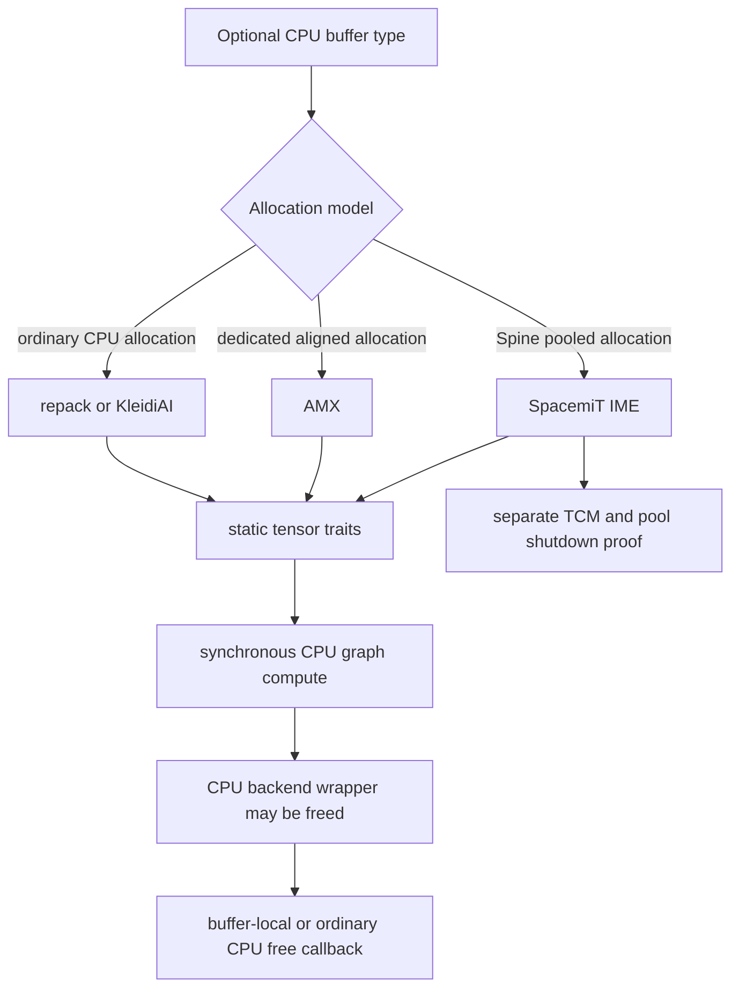

# CPU optional extra-buffer comparison

This page synthesizes four revision-pinned audits at llama.cpp revision [`e3546c7948e3af463d0b401e6421d5a4c2faf565`](https://github.com/ggml-org/llama.cpp/commit/e3546c7948e3af463d0b401e6421d5a4c2faf565): CPU repack, AMX, KleidiAI, and SpacemiT IME.

It compares allocation ownership, `tensor->extra` lifetime, execution completion, auxiliary state, unsupported transfer callbacks, and backend-before-buffer destruction.

## Five-minute result

> **Classification:** all four audited paths keep the state needed to free their weight buffers outside `ggml_backend_cpu_context`, and all execute through synchronous CPU graph computation. Their complete teardown risks differ because AMX owns a dedicated aligned allocation, KleidiAI and repack borrow ordinary CPU allocation machinery, and SpacemiT additionally coordinates thread-local TCM and process-level pool state.

| Path | Allocation/free owner | `tensor->extra` | Independent queue/event | Backend free before buffer free | Residual risk |
|---|---|---|---|---|---|
| CPU repack | Ordinary CPU buffer | Static repack traits | No | Verified for audited resources | Process-lifetime metadata and regression coverage |
| AMX | AMX buffer-local aligned allocation | Static AMX traits | No | Verified for audited resources | Allocator pairing, tile permission, null transfer callbacks |
| KleidiAI | Ordinary CPU buffer | Static KleidiAI traits | No | Verified for audited resources | Packed-layout portability, initialization, null transfer callbacks |
| SpacemiT IME | Spine pool allocation owned by buffer | Static IME/RVV traits | No | Verified for weight buffers | Thread-local TCM leases and process-level pool shutdown |



## Verified

### Shared properties

- Each implementation publishes process-static buffer-type metadata and stores a pointer to static traits in `tensor->extra`.
- Upload, repacking, and supported operation dispatch are synchronous host work inside the ordinary CPU execution model.
- None of the four paths introduces a scheduler event, accelerator stream, or independent asynchronous completion boundary.
- `ggml_backend_cpu_free()` does not own the already-created extra buffers or their static trait objects.

These shared properties explain why deleting the ordinary CPU backend wrapper does not, by itself, invalidate the data required by the audited buffer free callbacks.

### Allocation models differ

**CPU repack** and **KleidiAI** first allocate an ordinary CPU buffer and retain its allocation/free machinery. They override selected tensor initialization, upload, readback, or copy callbacks and add alternate packed layouts.

**AMX** allocates its own aligned host block and stores the pointer in the buffer context. Its free callback owns release of that block.

**SpacemiT IME** allocates through the mutex-protected Spine memory pool and returns the allocation through the matching pool API. This weight-buffer ownership is independent of the CPU backend wrapper, but the implementation also has thread-local TCM coordination outside the buffer object.

### Static traits are borrowed, not buffer-owned

Across the four implementations, `tensor->extra` points to implementation-specific process-static traits rather than a dynamically allocated object owned by `ggml_backend_cpu_context`.

That gives the common ownership shape:

```text
CPU backend wrapper ──owns──> CPU backend context/work data
extra buffer        ──owns/borrows──> allocation according to buffer interface
extra tensor        ──borrows──> process-static tensor traits
static buffer type  ──retains──> process-lifetime dispatch metadata
```

### Completion is synchronous, but auxiliary state still matters

The absence of an asynchronous queue means the main teardown question is ownership rather than command completion. This does not eliminate auxiliary-state risks:

- AMX requires platform-specific tile permission and compatible aligned allocation/free semantics.
- KleidiAI has process-static feature and kernel-selection initialization plus versioned packed slots.
- SpacemiT workers may acquire TCM leases that must be released through the clear-affinity path, independently of weight-buffer destruction.

## Interpretation

The four paths form two principal allocation families:

```text
Overlay family
  repack / KleidiAI
  → ordinary CPU allocation and free
  → alternate packed representation and static dispatch

Dedicated-allocation family
  AMX / SpacemiT
  → implementation-specific allocation owner
  → implementation-specific free callback
  → extra platform or worker state may outlive a weight buffer
```

Backend-wrapper independence is therefore not the same as complete implementation shutdown. For repack and KleidiAI, the strongest remaining concerns are metadata, unsupported operations, and tests. For AMX and especially SpacemiT, platform or thread-local resources create additional teardown obligations.

## Historical

This comparison is pinned to revision `e3546c7948e3af463d0b401e6421d5a4c2faf565`. Feature admission, callback tables, packing formats, allocator APIs, worker hooks, and static-lifetime choices are revision-sensitive.

## Open question

- Does every supported platform pair AMX allocation and release correctly?
- Do null `get_tensor`, `cpy_tensor`, and 2-D transfer callbacks fail explicitly and consistently for AMX, KleidiAI, and SpacemiT?
- Is KleidiAI process-static initialization safe under concurrent first use, and are packed layouts reusable across different selected kernel chains?
- Does every SpacemiT worker/error/threadpool-destruction path release TCM state before pool and device shutdown?
- Should process-lifetime extra-buffer metadata receive an explicit shutdown contract or sanitizer suppression policy?

## Portable destruction-test matrix

The first three rows are portable to any machine where the implementation can be compiled and admitted. Hardware-specific rows remain gated by AMX or SpacemiT support.

| Test | Repack | AMX | KleidiAI | SpacemiT IME | Expected result |
|---|---:|---:|---:|---:|---|
| Allocate/populate → free buffer normally | Required | Required | Required | Required | No leak or invalid free |
| Compute → CPU backend free → buffer free | Required | Required | Required | Required | No dependency on `ggml_backend_cpu_context` |
| Buffer allocation → CPU backend free → buffer free without compute | Required | Required | Required | Required | Buffer-local/ordinary free remains valid |
| Unsupported readback/copy invocation | Required | Required | Required | Required | Explicit failure, never null-call crash |
| Repeated buffer-type lookup from threads | Recommended | Required | Required | Recommended | Stable publication and initialization |
| Repeated threadpool creation/destruction | Recommended | Recommended | Recommended | Required | No stale worker-local state |
| Platform allocator validation | Ordinary CPU baseline | Required on Linux/Windows | Ordinary CPU baseline | Spine pool platforms | Matching allocation/free contract |
| ASan + LSan | Required | Required | Required | Required where supported | No UAF; intentional static lifetime documented |
| TSan | Recommended | Recommended | Required | Required | No unsafe first-use or pool/TCM races |
| Memory-expansion measurement | Packed-layout ratio | AMX converted size | One/two packed-slot ratio | Pool padding and MoE ratio | Quantified overhead |

### Minimal ordering harness

```text
create CPU backend
obtain optional buffer type
allocate supported tensor buffer
initialize and populate tensor
run one supported operation
free CPU backend wrapper
free tensor metadata and buffer
repeat under ASan/LSan
```

For SpacemiT, extend the harness with worker creation, TCM acquisition, clear-affinity execution, threadpool destruction, and process-level pool shutdown. For AMX, run the allocator and repeated tile-permission cases on every supported operating system.

## Detailed audits

- [CPU repack extra-buffer lifetime](cpu-repack-extra-buffer-lifetime.md)
- [CPU AMX extra-buffer lifetime](cpu-amx-extra-buffer-lifetime.md)
- [CPU KleidiAI extra-buffer lifetime](cpu-kleidiai-extra-buffer-lifetime.md)
- [CPU SpacemiT IME extra-buffer lifetime](cpu-spacemit-ime-extra-buffer-lifetime.md)
