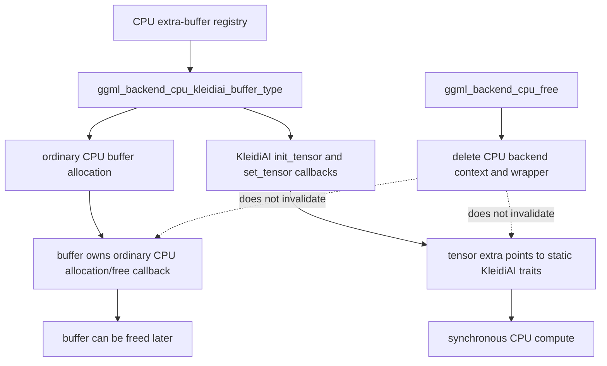

# CPU KleidiAI extra-buffer lifetime

This page audits the optional KleidiAI CPU extra-buffer path at llama.cpp revision [`e3546c7948e3af463d0b401e6421d5a4c2faf565`](https://github.com/ggml-org/llama.cpp/tree/e3546c7948e3af463d0b401e6421d5a4c2faf565).

## Bounded classification

> **The pinned KleidiAI extra-buffer path is verified independent of the ordinary CPU backend wrapper for the audited resources.**

KleidiAI delegates allocation and destruction to the ordinary CPU buffer implementation, then replaces only its buffer type plus tensor initialization and upload callbacks. Its tensor traits and extra-buffer type are function-static. Execution remains within synchronous CPU graph computation, so no separate queue, event, or completion lifetime is introduced.

## Lifetime map



## Verified

- KleidiAI keeps a process-static context containing CPU feature selection, selected Q4/Q8 kernel tables, SME thread limits, and tuning hints. Initialization is guarded by the GGML critical section and a function-static `initialized` flag.
- `ggml_backend_cpu_kleidiai_buffer_type_alloc_buffer()` first allocates through `ggml_backend_cpu_buffer_type()`. It then changes `buffer->buft` and replaces only `init_tensor` and `set_tensor`; it does not replace the ordinary CPU free callback.
- KleidiAI tensor initialization stores a pointer to a function-static `tensor_traits` instance in `tensor->extra`.
- `set_tensor` synchronously repacks Q4_0 or Q8_0 weights into the buffer. Packed layouts carry a header, version, slot offsets, and sizes; when no compatible slot exists, the implementation falls back to copying the original representation.
- The KleidiAI extra-buffer type and `ggml_backend_buffer_type` object are function-static. Their context therefore outlives any individual `ggml_backend_cpu_context`.
- Supported operations are restricted to compatible `MUL_MAT` and `GET_ROWS` cases with host-addressable activation/input buffers and selected kernel chains.
- The buffer type intentionally leaves `get_tensor` and `cpy_tensor` unset. That is an interface limitation to validate, not evidence of backend-context ownership.
- KleidiAI introduces no independent command queue or scheduler event. Its kernels execute through the ordinary synchronous CPU graph path.

## Interpretation

KleidiAI has the same high-level teardown shape as the completed CPU repack audit:

```text
ordinary CPU allocation and free ownership
+ alternate packed representation
+ static tensor traits and kernel-selection state
+ synchronous CPU execution
```

The packed bytes are owned by the ordinary CPU buffer allocation. The state required to interpret and execute them is process-static. Deleting the ordinary CPU backend wrapper therefore does not invalidate the buffer's later free callback or the static trait pointer.

KleidiAI is nevertheless more than a simple byte-layout alias: it maintains feature-selected kernel chains, optional SME policy, multiple packed slots, and fallback packing behavior. Those details affect correctness and performance even though they do not create a separate asynchronous teardown boundary.

## Historical

This classification is revision-pinned. KleidiAI feature detection, SME policy, supported quantizations, packed-header format, fallback behavior, and callback ownership can change between revisions.

## Open questions

- Add ASan/LSan coverage for `allocate → repack → compute → CPU backend free → KleidiAI buffer free`.
- Test unsupported readback and copy requests when `get_tensor` and `cpy_tensor` are null, and document the generic fallback or failure contract.
- Exercise initialization concurrently and confirm the GGML critical section plus static flag covers all reads and later use of the global KleidiAI context.
- Validate packed fallback behavior when feature-selected kernels differ across machines or when model buffers are persisted or reused.
- Measure the memory expansion caused by one versus two packed kernel slots for Q4_0 and Q8_0.

## Source map

- [`ggml/src/ggml-cpu/kleidiai/kleidiai.cpp`](https://github.com/ggml-org/llama.cpp/blob/e3546c7948e3af463d0b401e6421d5a4c2faf565/ggml/src/ggml-cpu/kleidiai/kleidiai.cpp)
- [`ggml/src/ggml-cpu/ggml-cpu.cpp`](https://github.com/ggml-org/llama.cpp/blob/e3546c7948e3af463d0b401e6421d5a4c2faf565/ggml/src/ggml-cpu/ggml-cpu.cpp)
- [CPU repack extra-buffer lifetime](cpu-repack-extra-buffer-lifetime.md)
- [CPU AMX extra-buffer lifetime](cpu-amx-extra-buffer-lifetime.md)
- [Backend teardown audit method](backend-teardown-audit-method.md)
