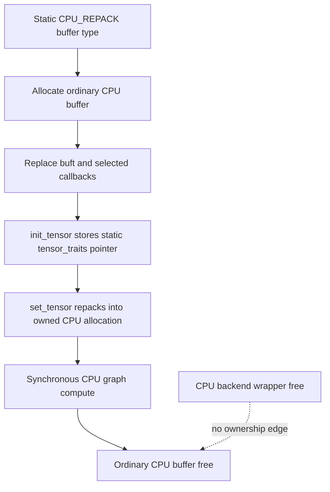

# CPU repack extra-buffer lifetime

This page applies the [backend teardown audit method](backend-teardown-audit-method.md) to one bounded optional CPU path: `GGML_USE_CPU_REPACK` at llama.cpp revision [`e3546c7948e3af463d0b401e6421d5a4c2faf565`](https://github.com/ggml-org/llama.cpp/commit/e3546c7948e3af463d0b401e6421d5a4c2faf565).

The result is deliberately narrower than an audit of AMX, KleidiAI, SpacemiT IME, or CPU HBM.

## Five-minute result

> **Classification:** the pinned CPU repack extra-buffer path is **verified independent of the ordinary CPU backend wrapper for audited resources**.

The repack buffer type is function-static process state. Its allocations are ordinary CPU buffers whose interface is selectively overridden for tensor initialization and repacking. The ordinary CPU buffer destructor therefore retains the allocation state it needs without dereferencing `ggml_backend_cpu_context`. Computation is executed through the synchronous CPU graph path, so there is no extra asynchronous queue or event lifetime to complete.



## Verified

### Registration is process-static

`ggml_backend_cpu_get_extra_buffer_types()` builds a function-static vector once. Under `GGML_USE_CPU_REPACK`, it adds `ggml_backend_cpu_repack_buffer_type()` to that vector. The CPU device exposes a second function-static, null-terminated view of the same buffer types.

Pinned source:

- [`ggml-cpu.cpp#L44-L85`](https://github.com/ggml-org/llama.cpp/blob/e3546c7948e3af463d0b401e6421d5a4c2faf565/ggml/src/ggml-cpu/ggml-cpu.cpp#L44-L85)

The repack buffer type itself is also function-static. Its `context` is a heap-allocated `ggml::cpu::repack::extra_buffer_type` retained for process lifetime by the static buffer-type object.

- [`repack.cpp#L4823-L4838`](https://github.com/ggml-org/llama.cpp/blob/e3546c7948e3af463d0b401e6421d5a4c2faf565/ggml/src/ggml-cpu/repack.cpp#L4823-L4838)

### Allocation delegates to the ordinary CPU buffer type

`ggml_backend_cpu_repack_buffer_type_alloc_buffer()` first allocates through `ggml_backend_cpu_buffer_type()`. It then changes the resulting buffer's `buft` pointer and overrides only `init_tensor`, `set_tensor`, `get_tensor`, and `cpy_tensor` entries.

It does **not** replace the ordinary buffer free callback or introduce a repack-specific allocation owner.

- [`repack.cpp#L4749-L4762`](https://github.com/ggml-org/llama.cpp/blob/e3546c7948e3af463d0b401e6421d5a4c2faf565/ggml/src/ggml-cpu/repack.cpp#L4749-L4762)

### Tensor traits are static, not backend-context-owned

During tensor initialization, the path stores a pointer returned by `ggml_repack_get_optimal_repack_type()` in `tensor->extra`. The selected trait objects are function-static instances. `set_tensor` later uses that trait object to repack bytes into the already allocated CPU buffer.

- [`repack.cpp#L4550-L4722`](https://github.com/ggml-org/llama.cpp/blob/e3546c7948e3af463d0b401e6421d5a4c2faf565/ggml/src/ggml-cpu/repack.cpp#L4550-L4722)
- [`repack.cpp#L4724-L4741`](https://github.com/ggml-org/llama.cpp/blob/e3546c7948e3af463d0b401e6421d5a4c2faf565/ggml/src/ggml-cpu/repack.cpp#L4724-L4741)

The generic CPU extra-dispatch functions retrieve the buffer-type `context`, ask it for tensor traits, and execute those traits synchronously inside CPU graph computation.

- [`traits.cpp#L14-L38`](https://github.com/ggml-org/llama.cpp/blob/e3546c7948e3af463d0b401e6421d5a4c2faf565/ggml/src/ggml-cpu/traits.cpp#L14-L38)

### The ordinary CPU backend wrapper is a separate owner

`ggml_backend_cpu_free()` deletes only the backend work allocation, `ggml_backend_cpu_context`, and generic backend wrapper. It does not own the static extra-buffer registry, repack buffer type, repack trait objects, or already allocated CPU buffers.

- [`ggml-cpu.cpp#L99-L125`](https://github.com/ggml-org/llama.cpp/blob/e3546c7948e3af463d0b401e6421d5a4c2faf565/ggml/src/ggml-cpu/ggml-cpu.cpp#L99-L125)

The ordinary CPU graph path calls `ggml_graph_compute()` directly and returns only after synchronous CPU execution. The backend interface provides no asynchronous tensor callbacks, synchronize callback, or event callbacks.

- [`ggml-cpu.cpp#L164-L212`](https://github.com/ggml-org/llama.cpp/blob/e3546c7948e3af463d0b401e6421d5a4c2faf565/ggml/src/ggml-cpu/ggml-cpu.cpp#L164-L212)

## Interpretation

The repack path is an **alternate buffer layout and CPU kernel-dispatch layer**, not a separate accelerator backend. It borrows the ordinary CPU allocation and buffer destruction machinery while adding static metadata and repacking callbacks.

Therefore, for the audited path:

1. command completion follows the ordinary synchronous CPU contract;
2. buffer destruction does not need `ggml_backend_cpu_context`;
3. trait and buffer-type metadata outlive individual backend wrappers.

This establishes backend-wrapper independence for ordinary repack allocations. It does not prove that every optional CPU extra-buffer implementation follows the same pattern.

## Historical

This classification is pinned to revision `e3546c7948e3af463d0b401e6421d5a4c2faf565`. Newer revisions may add extra state, asynchronous execution, different allocation callbacks, or explicit static cleanup.

## Open questions

- Do AMX, KleidiAI, and SpacemiT IME delegate allocation and free to ordinary CPU buffers in the same way?
- Is intentionally process-lifetime ownership of each extra-buffer-type `context` documented or tested?
- Should tests explicitly construct a repack buffer, destroy the CPU backend wrapper first, then free the buffer and tensor metadata?
- Does any optional path place dynamically owned objects in `tensor->extra` rather than static trait pointers?

## Bounded runtime test

A focused regression should build with `GGML_USE_CPU_REPACK`, allocate at least one supported repack tensor, populate it, run `MUL_MAT` and `MUL_MAT_ID`, then exercise:

```text
compute → CPU backend free → repack buffer free
compute → scheduler free → CPU backend free
repack buffer allocation → CPU backend free → buffer free
```

Run under AddressSanitizer and LeakSanitizer. The source audit predicts no use-after-free involving `ggml_backend_cpu_context`; process-lifetime static metadata may require explicit suppression or a separate shutdown-policy decision.
