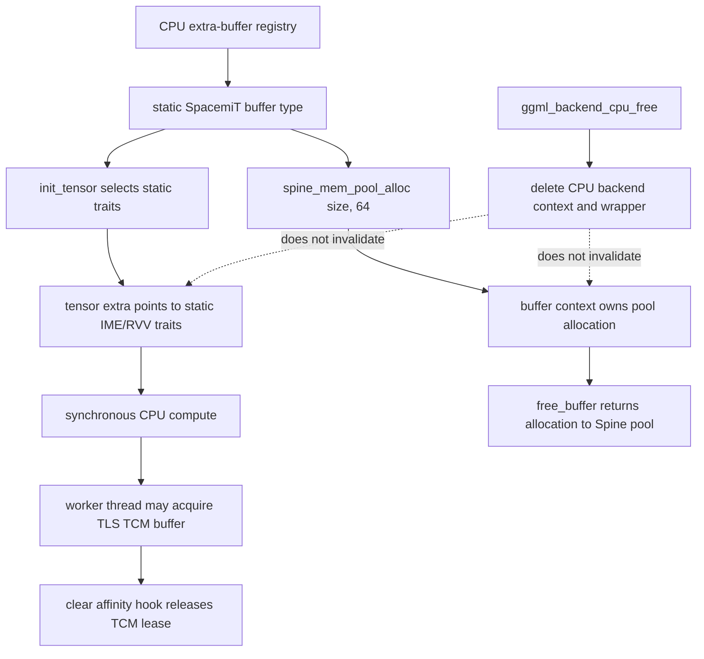

# CPU SpacemiT IME extra-buffer lifetime

This page audits the optional SpacemiT IME CPU extra-buffer path at llama.cpp revision [`e3546c7948e3af463d0b401e6421d5a4c2faf565`](https://github.com/ggml-org/llama.cpp/tree/e3546c7948e3af463d0b401e6421d5a4c2faf565).

## Bounded classification

> **The pinned SpacemiT IME buffer is independent of the ordinary CPU backend wrapper for buffer destruction, but complete worker/TCM teardown remains conditional on the thread-affinity cleanup contract.**

The weight buffer owns a dedicated 64-byte-aligned allocation from the process-level Spine memory pool and frees it through the matching pool callback. Tensor traits and buffer-type metadata are static, and graph execution remains synchronous CPU work. However, worker threads can also acquire thread-local TCM state that is released by an explicit affinity-cleanup hook; buffer ownership alone does not prove that every worker has released that auxiliary state.

## Lifetime map



## Verified

- The SpacemiT buffer type allocates with `spine_mem_pool_alloc(size, 64)` and stores the returned base pointer in `buffer->context`.
- Its free callback reads that pointer and calls the matching `spine_mem_pool_free(base)` function. The free path does not dereference `ggml_backend_cpu_context`.
- The Spine pool serializes allocation and release with a mutex, records live allocations, returns released ranges to the owning chunk, and can release an empty chunk.
- Tensor initialization selects an optimal IME1, IME2, or RVV trait object and stores that process-static trait pointer in `tensor->extra`.
- The extra-buffer type and `ggml_backend_buffer_type` object are function-static. Their metadata outlives any individual ordinary CPU backend wrapper.
- `set_tensor` repacks synchronously through the selected trait. The buffer interface owns `free_buffer`, `get_base`, `init_tensor`, `memset_tensor`, `set_tensor`, and `clear`; `get_tensor`, 2-D transfer, copy, and reset callbacks are unset.
- Supported accelerated dispatch includes selected `MUL_MAT` and `MUL_MAT_ID` layouts with host-addressable F32 activations. The same extra-buffer type can also return a common RVV trait for several ordinary CPU operations.
- Computation uses the CPU threadpool and explicit `ggml_barrier()` calls. It introduces no independent scheduler event or accelerator command queue.
- Worker affinity setup may bind a thread, acquire thread-local TCM state, and wait for its buffer. The paired clear-affinity hook calls `spine_mem_pool_tcm_mem_release()` when a TCM buffer is present.

## Interpretation

For the weight allocation itself, SpacemiT resembles AMX more than CPU repack or KleidiAI:

```text
SpacemiT IME
  → owns a dedicated pooled allocation
  → installs a complete buffer interface
  → stores static tensor traits in tensor->extra
  → executes synchronously through CPU workers
```

Therefore this sequence is structurally valid for the audited buffer resources:

```text
compute completes
→ ordinary CPU backend wrapper is freed
→ SpacemiT buffer is freed through the Spine pool
```

The important caveat is that the implementation also coordinates per-thread TCM resources outside the weight buffer. Those leases are tied to worker setup/cleanup rather than to `ggml_backend_buffer_t`. A buffer-free proof is therefore not a complete process/thread teardown proof.

## Historical

This classification is revision-pinned. IME1/IME2 admission, supported quantizations, Spine pool chunking, huge-page devices, TCM synchronization, thread binding, RVV fallbacks, and callback ownership can change between revisions.

## Open questions

- Prove that every CPU worker path which acquires thread-local TCM state always executes `ggml_backend_cpu_riscv64_spacemit_clear_numa_thread_affinity_threaded()`, including early errors and threadpool destruction.
- Determine the lifetime and shutdown order of the process-level Spine pool managers, mapped huge-page chunks, device file descriptors, and TCM synchronization objects.
- Test `compute → CPU backend free → SpacemiT buffer free` and repeated allocate/free cycles under ASan/LSan on supported RISC-V hardware.
- Test threadpool creation/destruction repeatedly with TCM enabled and verify that no lease, mapping, or file descriptor remains.
- Document generic behavior when `get_tensor`, `cpy_tensor`, and 2-D transfer callbacks are null.
- Measure memory expansion caused by each repacked quantization and padding rule, especially `MUL_MAT_ID` expert tensors.

## Source map

- [`ggml/src/ggml-cpu/spacemit/ime.cpp`](https://github.com/ggml-org/llama.cpp/blob/e3546c7948e3af463d0b401e6421d5a4c2faf565/ggml/src/ggml-cpu/spacemit/ime.cpp)
- [`ggml/src/ggml-cpu/spacemit/spine_mem_pool.cpp`](https://github.com/ggml-org/llama.cpp/blob/e3546c7948e3af463d0b401e6421d5a4c2faf565/ggml/src/ggml-cpu/spacemit/spine_mem_pool.cpp)
- [`ggml/src/ggml-cpu/ggml-cpu.cpp`](https://github.com/ggml-org/llama.cpp/blob/e3546c7948e3af463d0b401e6421d5a4c2faf565/ggml/src/ggml-cpu/ggml-cpu.cpp)
- [CPU repack extra-buffer lifetime](cpu-repack-extra-buffer-lifetime.md)
- [CPU AMX extra-buffer lifetime](cpu-amx-extra-buffer-lifetime.md)
- [CPU KleidiAI extra-buffer lifetime](cpu-kleidiai-extra-buffer-lifetime.md)
- [Backend teardown audit method](backend-teardown-audit-method.md)
