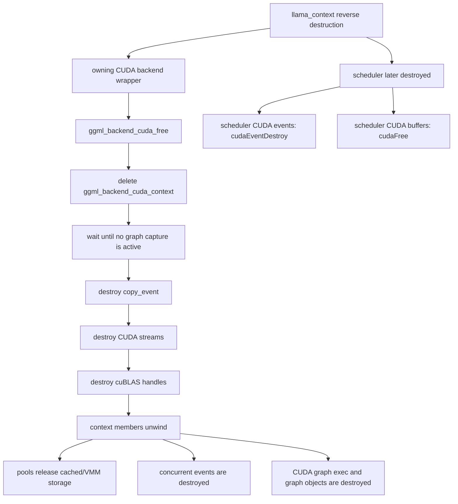

# CUDA backend teardown

This page audits the pinned CUDA backend at llama.cpp revision
[`e3546c7948e3af463d0b401e6421d5a4c2faf565`](https://github.com/ggml-org/llama.cpp/commit/e3546c7948e3af463d0b401e6421d5a4c2faf565).
It asks a narrow lifetime question: **can a `llama_context` destroy its owning CUDA backend wrapper before its scheduler is destroyed?**

## Result

> **Classification: structurally independent, but queued-work completion remains conditional.**
>
> Scheduler CUDA events, CUDA buffer types, and CUDA buffer contexts do not call through the deleted backend wrapper. Their deleters retain the device identity or CUDA object they need. However, the backend destructor contains no explicit stream synchronization before destroying streams and then allowing context members to release pools, concurrent events, and CUDA graph resources. Source inspection alone therefore does not prove completion safety for every queued-work state or CUDA/HIP/MUSA runtime variant.

## Teardown map



## Verified

### Backend wrapper and context

`ggml_backend_cuda_free()` deletes the CUDA context and then the generic backend wrapper. The wrapper itself does not own scheduler events or scheduler buffers.

The CUDA context destructor:

1. waits for the global graph-capture counter to reach zero;
2. destroys its copy event;
3. destroys every created stream;
4. destroys every created cuBLAS handle.

The wait protects cuBLAS-handle destruction from overlapping graph capture in another thread. It is **not** a general device-work synchronization call.

### Context-owned resources outlive the destructor body

The destructor body does not explicitly clear every member. Normal C++ member destruction follows afterward in reverse declaration order. Relevant members include:

- per-device/per-stream allocation pools;
- the concurrent-stream event map;
- the CUDA graph map.

Their destructors can call `cudaFree`, CUDA virtual-memory unmap/address-release functions, `cudaEventDestroy`, `cudaGraphExecDestroy`, and `cudaGraphDestroy` after the explicit stream-destruction loop has run.

### Scheduler events are backend-wrapper independent

CUDA scheduler events are created by the CUDA device interface. Each generic event stores:

- a borrowed `ggml_backend_dev_t`;
- its own `cudaEvent_t` context.

The CUDA event-free callback ignores the device argument, destroys the stored CUDA event, and deletes the event wrapper. It does not dereference `ggml_backend_cuda_context`.

The CUDA registry and device objects are process-lifetime static registry state, so deleting one CUDA backend wrapper does not delete the event's device-interface object.

### Scheduler buffers are backend-wrapper independent

A CUDA buffer owns a `ggml_backend_cuda_buffer_context` containing its device number and device pointer. Its free callback deletes that buffer context, whose destructor calls `cudaFree(dev_ptr)`.

The CUDA buffer type is held in a static per-device array initialized through the registry. Scheduler buffer destruction therefore does not require the deleted CUDA backend wrapper or its stream array.

### Execution is asynchronous

The CUDA backend exposes asynchronous set/get/copy methods, CUDA event record/wait callbacks, and a `synchronize` callback. Graph compute launches kernels or CUDA graphs on a context stream and returns success without synchronizing that stream.

`ggml_backend_cuda_synchronize()` synchronizes only the current context stream. This is the explicit source-level completion boundary available to callers and the scheduler.

## Interpretation

The lifetime problem has two separate parts:

1. **Object reachability:** can later scheduler deleters still find valid callback/device/buffer state?
2. **Command completion:** have commands that use those events and allocations finished?

The pinned source answers the first part positively for ordinary CUDA scheduler events and buffers: their destruction paths are independent of the deleted backend wrapper.

The second part is not fully established by the llama.cpp source. The backend destructor relies on CUDA-family object-destruction semantics rather than issuing an explicit `cudaStreamSynchronize()` or `cudaDeviceSynchronize()`. The safest portable application boundary remains:

```text
finish decode / pending copies
        ↓
explicit context or backend synchronization
        ↓
destroy llama_context
        ↓
destroy llama_model after every borrowing context is gone
```

## Historical

CUDA graph storage, concurrent-stream optimization, stream count, copy-event ownership, VMM pools, and device-registry lifetime are revision-sensitive. HIP and MUSA builds share substantial source but may expose different runtime destruction guarantees.

## Open questions

- Does every supported CUDA, HIP, and MUSA runtime guarantee safe stream, event, graph, and allocation destruction in the exact pinned order when work is still queued?
- Should `ggml_backend_cuda_context::~ggml_backend_cuda_context()` explicitly synchronize before destroying streams, or is that intentionally avoided because runtime destruction already provides the required ordering?
- Should context-owned pools, concurrent events, and CUDA graph maps be cleared before the explicit stream-destruction loop rather than after the destructor body?
- Is there a regression or sanitizer test that submits asynchronous CUDA work and immediately destroys `llama_context`?
- Does `ggml_backend_cuda_synchronize()` need to cover every lazily created stream rather than only `cuda_ctx->stream()` when concurrent-stream graph optimization has been used?

## Source index

Pinned upstream files:

- `ggml/src/ggml-cuda/ggml-cuda.cu`
  - `ggml_backend_cuda_free()`
  - `ggml_backend_cuda_context::~ggml_backend_cuda_context()`
  - `ggml_backend_cuda_synchronize()`
  - CUDA buffer and device-event callbacks
- `ggml/src/ggml-cuda/common.cuh`
  - CUDA context member declaration order
  - CUDA graph and concurrent-event destructors
- `ggml/src/ggml-backend.cpp`
  - generic backend, event, buffer, and scheduler deleter dispatch

## Practical rule

**Do not treat backend-wrapper deletion as proof that all accelerator work has completed.** The pinned CUDA objects needed by later scheduler event and buffer deleters remain reachable, but explicit synchronization before context destruction is the clearest portable rule until queued-work teardown is covered by runtime evidence and regression tests.
