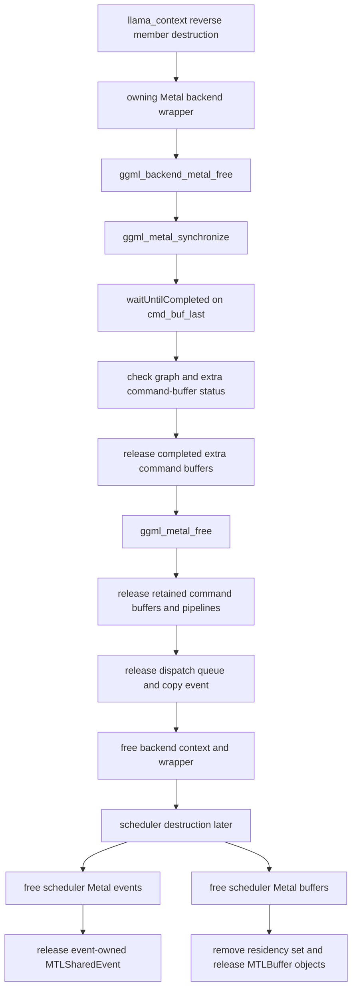

# Metal backend teardown and scheduler lifetime

> **Evidence scope:** llama.cpp commit [`e3546c7948e3af463d0b401e6421d5a4c2faf565`](https://github.com/ggml-org/llama.cpp/tree/e3546c7948e3af463d0b401e6421d5a4c2faf565). This classification is revision-pinned.

This page answers one narrow lifetime question: **is the pinned `llama_context` member order safe when an owning Metal backend wrapper is destroyed before the scheduler that used it?**

## Result

> **Verified safe for the ordinary pinned Metal backend.**
>
> `ggml_backend_metal_free()` explicitly synchronizes the Metal context before releasing it. Scheduler-owned Metal events and buffers are later destroyed through device-level objects and buffer-local contexts that remain valid after the backend wrapper is gone.

This result is stronger than the pinned CUDA classification because the Metal backend free callback contains an explicit queued-work completion boundary.

## Teardown chain



## Backend wrapper destruction

The generic Metal wrapper free callback performs three ordered actions:

```text
ggml_backend_metal_free(backend)
  -> ggml_metal_synchronize(ctx)
  -> ggml_metal_free(ctx)
  -> free(backend)
```

The comment in the pinned source states that synchronization waits for ongoing asynchronous operations. `ggml_metal_synchronize()` waits for `cmd_buf_last`, checks all graph command buffers and retained extra command buffers, releases completed extra command buffers, and records a persistent error state on failure.

Therefore ordinary graph submissions, asynchronous tensor transfers, Metal-to-Metal copies, and scheduler event signal/wait command buffers associated with that context reach a host completion boundary before context resources are released.

## Context-owned Objective-C resources

`ggml_metal_free()` releases context-local resources after synchronization:

- graph command buffers retained in `cmd_bufs`;
- extra transfer/event command buffers retained in `cmd_bufs_ext`;
- dynamically compiled pipeline state;
- the retained encoding block;
- the dispatch queue used for parallel encoding;
- the context-owned copy event;
- the C context allocation.

The Metal command queue itself is device-owned in the pinned design rather than backend-context-owned. `ggml_metal_init()` obtains it from `ggml_metal_device_get_queue()`, and the backend context does not release it.

## Scheduler event lifetime

A scheduler event contains:

```text
ggml_backend_event
  device  -> Metal backend device
  context -> ggml_metal_event
                MTLSharedEvent object
                atomic signal value
```

The event free callback calls `ggml_metal_device_event_free()`. That function releases the event-owned `MTLSharedEvent` and frees the event wrapper; it does not access a `ggml_metal` backend context. Its device parameter is unused by the concrete free function.

The backend device object is held by the static Metal registry and therefore outlives an individual backend wrapper.

## Scheduler buffer lifetime

Shared, private, and mapped Metal backend buffers carry a `ggml_metal_buffer` context. Buffer destruction:

1. removes the optional residency set from the device-wide registry;
2. releases each owned `MTLBuffer` wrapper;
3. ends and releases the optional residency set;
4. releases owned shared host allocation when applicable;
5. frees the buffer context.

This path does not call through the deleted `ggml_metal` backend context. It does require the process-lifetime Metal device object because the buffer context stores `buf->dev` and uses its residency-set registry.

Mapped buffers do not own the mapped host bytes: they release their `MTLBuffer` views but leave the underlying mapping to its actual owner.

## Storage mode is not completion state

- **Shared buffer** means the host allocation is addressable through an `MTLBuffer`; owned shared allocations are released with `vm_deallocate()` on macOS or `free()` on other Apple targets.
- **Private buffer** means the backing allocation is device-private and its synthetic host address is only an allocation identity used by GGML.
- **Mapped buffer** wraps externally owned host pages with one or more shared `MTLBuffer` views.
- **Residency set membership** is separate from ownership and command completion.
- **Synchronization** is what establishes completion before context teardown.

## Truth-labelled findings

### Verified

- `ggml_backend_metal_free()` calls `ggml_metal_synchronize()` before `ggml_metal_free()` and before freeing the generic backend wrapper.
- `ggml_metal_synchronize()` waits for the last relevant command buffer and verifies graph and extra command-buffer status.
- `ggml_metal_free()` releases retained command buffers, pipelines, the encoding block, the dispatch queue, and the context-owned copy event only after that synchronization call.
- The command queue is obtained from the device object and is not owned by an individual backend context.
- Scheduler events own independent `MTLSharedEvent` objects; event destruction does not require a live backend context.
- Scheduler shared/private/mapped buffers own buffer-local contexts and release their Metal views through the static device state rather than through the deleted backend wrapper.
- Metal device, registry, and buffer-type objects are static registry state that outlive individual backend instances.
- The pinned backend-before-scheduler member order is safe for ordinary Metal resources because queued work is synchronized and later scheduler deleters retain valid device-level dependencies.

### Interpretation

- Metal has a cleaner teardown contract than the pinned CUDA-family path: backend free itself establishes the host completion boundary instead of relying primarily on runtime object-destruction semantics.
- Device lifetime, backend-context lifetime, scheduler-resource lifetime, and mapped-host-memory lifetime are separate contracts even on unified-memory Apple systems.
- A safe scheduler buffer destructor does not imply ownership of mapped bytes; it only proves that the Metal wrapper can be released after backend-wrapper destruction.

### Historical

- Queue ownership, explicit synchronization in backend free, residency sets, shared/private defaults, event primitives, and registry lifetime are revision-sensitive.
- Newer Metal revisions may use different command-buffer retention, graph optimization, multi-device, or residency mechanisms.

### Open question

- Whether a regression test explicitly submits asynchronous Metal graph/copy/event work and immediately destroys `llama_context` under Metal API validation.
- Whether shutdown error reporting should propagate command-buffer failures discovered by `ggml_backend_metal_free()` rather than only storing `has_error` during final synchronization.
- Whether process/library unload ordering can ever destroy the static Metal registry before outstanding scheduler objects in plugin-based embedding scenarios.
- Whether residency-set removal after backend synchronization has measurable shutdown cost for very large mapped models.

## Source map

- [`ggml/src/ggml-metal/ggml-metal.cpp`](https://github.com/ggml-org/llama.cpp/blob/e3546c7948e3af463d0b401e6421d5a4c2faf565/ggml/src/ggml-metal/ggml-metal.cpp): backend free callback, backend interface, buffer callbacks, event device callbacks, static registry and buffer types.
- [`ggml/src/ggml-metal/ggml-metal-context.m`](https://github.com/ggml-org/llama.cpp/blob/e3546c7948e3af463d0b401e6421d5a4c2faf565/ggml/src/ggml-metal/ggml-metal-context.m): context initialization/free, command-buffer ownership, explicit synchronization, async transfer and graph submission.
- [`ggml/src/ggml-metal/ggml-metal-device.m`](https://github.com/ggml-org/llama.cpp/blob/e3546c7948e3af463d0b401e6421d5a4c2faf565/ggml/src/ggml-metal/ggml-metal-device.m): device lifetime, event ownership, shared/private/mapped buffer allocation, residency sets, and buffer free paths.
- [`Metal backend submission, copies, and synchronization`](../lifecycle/metal-backend-semantics.md): execution-time semantics that precede this teardown audit.
- [`Scheduler core teardown`](scheduler-teardown-core.md): generic event and graph-allocation destruction order.
- [`Model and context teardown order`](model-context-teardown-order.md): the member-order question this page resolves for Metal.
