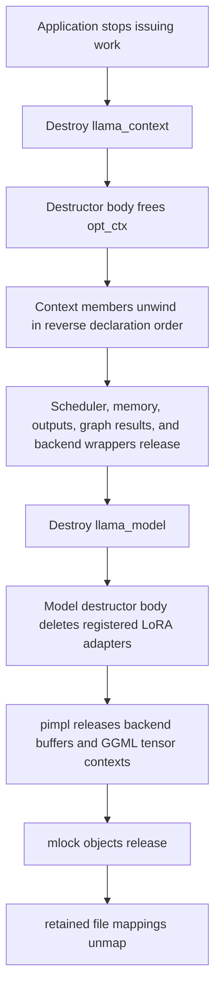

# `llama_model` and `llama_context` teardown order

> **Evidence scope:** llama.cpp revision [`e3546c7948e3af463d0b401e6421d5a4c2faf565`](https://github.com/ggml-org/llama.cpp/commit/e3546c7948e3af463d0b401e6421d5a4c2faf565). C++ destroys members in reverse declaration order after the destructor body finishes.

This page answers a narrow but important question: **what is actually released, in what order, when a model or context is destroyed?**

## Five-minute view



The safe public ordering is:

```text
finish or synchronize outstanding context work
→ free sampler and other context users
→ free llama_context
→ free llama_model
→ unload backend registrations only after all objects are gone
```

## C++ rule used by this analysis

For an object with a user-written destructor:

1. the destructor body runs first;
2. members are destroyed in reverse declaration order;
3. base classes are destroyed after derived members;
4. raw pointers and references are not freed automatically;
5. smart pointers and containers release their owned elements automatically.

This means source declaration order—not constructor assignment order—defines implicit cleanup order.

## `llama_model`: ownership and declaration order

Most tensor fields in `llama_model` are raw `ggml_tensor *` handles. They do not own tensor payloads. Persistent storage is concentrated in the private `pimpl`.

| Declaration group | Ownership | Teardown meaning |
|---|---|---|
| architecture/type, name, hyperparameters, vocabulary | value-owned | ordinary reverse member destruction |
| model-level and per-layer `ggml_tensor *` fields | non-owning handles | pointers disappear; storage is released by `pimpl` |
| `gguf_kv`, devices, tensor-name index | value-owned metadata | released after `pimpl` because they are declared earlier |
| `loras` | set of owning raw pointers by convention | explicitly deleted in `~llama_model()` |
| `params` | copied parameters, with selected borrowed fields normalized | destroyed after `pimpl` |
| `pimpl` | owning `unique_ptr` | first major model member released after destructor body |

### Explicit destructor body

The pinned destructor only loops over `loras` and deletes each adapter. It does not manually free mappings, model buffers, or GGML contexts; those are released by `pimpl` RAII.

### `llama_model::impl` reverse destruction

The relevant `impl` declaration order is:

```text
mappings
→ mlock_bufs
→ mlock_mmaps
→ ctxs_bufs
→ CPU/GPU buffer-type lists
→ layer/device placement records
→ tensor_split_owned
```

Therefore the resource-critical reverse order is:

```text
tensor_split_owned and placement metadata
→ CPU/GPU buffer-type metadata
→ ctxs_bufs
→ mlock_mmaps
→ mlock_bufs
→ mappings
```

`ctxs_bufs` stores pairs of a GGML metadata context and a vector of backend buffers. A `std::pair` destroys its second member before its first, so backend buffers are released before the GGML context whose tensor metadata describes them. Retained file mappings are released last among these model storage resources.

### Model teardown invariant

```text
backend tensor buffers die
before GGML tensor metadata contexts
before retained mmap regions
```

This ordering preserves mapped source bytes until model-owned buffers and tensor metadata no longer need them.

## `llama_context`: declaration groups

The context contains a non-owning model reference plus several independent ownership domains.

| Declaration group | Ownership | Important dependency |
|---|---|---|
| `model` | borrowed reference | model must outlive context |
| adapters and cross-attention state | context-owned wrappers/value state | may reference model tensors |
| `memory` | owning smart pointer | persistent KV/recurrent/hybrid state |
| host output views and sampling views | mostly non-owning views into output storage | invalid after output buffer release |
| `balloc`, output maps, swaps | context-owned host metadata | graph/input preparation only |
| `sched` | owning scheduler smart pointer | refers to backend instances and scheduler allocations |
| `backend_cpu` | raw alias | not independently freed |
| `backends` | owning backend smart pointers | concrete CPU/GPU/accelerator instances |
| `opt_ctx` | owning raw handle | explicitly freed in destructor body |
| thread pools | borrowed raw handles | caller must keep them alive while attached/in use |
| graph results | owning smart pointers | graph metadata and reuse state |
| `buf_output` | owning backend buffer | host-visible logits/embedding storage |
| `mem_storage` | owning saved-memory buffers | device-side state snapshots |

## Exact context teardown sequence

The pinned `~llama_context()` body:

1. reads scheduler buffer sizes for diagnostics when allocation is enabled;
2. calls `ggml_opt_free(opt_ctx)`;
3. does **not** explicitly call `synchronize()`;
4. does **not** explicitly reset the scheduler before backend wrappers.

After the body, reverse declaration order begins. Omitting trivial scalars, the significant order is:

```text
mem_storage
→ buf_output
→ gf_res_reserve
→ gf_res_prev
→ backend buffer-type/pointer metadata
→ borrowed thread-pool/callback fields (no automatic free)
→ owning backends vector
→ raw backend_cpu alias
→ sched
→ output/sampling/batch metadata
→ memory
→ adapters/cross state
→ borrowed model reference (no destruction)
```

### Dependency observation

At this pinned revision, `backends` is declared after `sched`, so normal reverse member destruction releases the owning backend wrappers **before** the scheduler smart pointer. The destructor body does not visibly compensate by calling `sched.reset()` first.

This must be treated carefully:

- it is **Verified** that declaration order produces this C++ member-destruction order;
- it is **Verified** that the destructor body does not explicitly synchronize or reset `sched`;
- whether scheduler destruction is safe after backend wrapper destruction depends on lower-level deleter contracts and whether pending work or event cleanup requires live backend objects;
- that final safety claim remains an **Open question** until backend/scheduler deleters are traced or runtime-tested.

## Partial construction and exceptions

### Model loading

Model creation uses temporary C++ ownership around the newly allocated architecture-specific model. If loading throws or cancellation fails publication, smart pointers and loader-owned containers unwind. Once published, `pimpl` owns the retained mappings, locks, GGML contexts, and backend buffers.

### Context construction

If the constructor throws, only fully constructed members are destroyed, in reverse order. The `llama_context` destructor body itself is not called for a constructor that never completed. This makes member RAII essential: smart pointers and vectors unwind, while raw borrowed pointers are left untouched.

The constructor establishes `model` first, then adapters and the batch allocator, and later creates memory, backends, scheduler state, graph results, and output storage. Failure at any point only destroys members whose construction completed.

## CPU versus accelerator teardown

### CPU-only

CPU execution may still be asynchronous at the scheduler API boundary, but there are usually fewer device events and peer-copy resources. Model mmap pages can remain in the OS page cache after unmapping even though the process no longer owns the virtual mapping.

### Accelerator or multi-backend

Accelerator contexts can additionally own:

- device allocations;
- scheduler copy-ring buffers;
- backend events;
- queued graph submissions;
- uploaded model buffers;
- device-side memory snapshots.

The application should synchronize before context destruction whenever work may still be queued. Destruction returning does not imply the OS immediately reclaims clean file pages, nor does it make previously returned logits/embedding pointers valid.

## Safe application teardown

```cpp
// Stop submitting decode/encode work first.
llama_synchronize(ctx);          // explicit completion boundary
llama_sampler_free(sampler);    // sampler may refer to context/model-facing data
llama_free(ctx);                // context-owned runtime state
llama_model_free(model);        // persistent weights, buffers, mappings
llama_backend_free();           // global/backend-registry cleanup last
```

The exact public helper names depend on the pinned API surface, but the lifetime relation is stable: **context before model, backend-global cleanup last**.

## Truth labels

### Verified

- `llama_context` stores `const llama_model &`; it does not own the model.
- `llama_model::~llama_model()` explicitly deletes entries in `loras`.
- Model mappings, lock objects, GGML contexts, and backend buffers live in `llama_model::impl`.
- `ctxs_bufs` releases backend buffers before its paired GGML context.
- Context destructor diagnostics inspect scheduler allocations and explicitly free `opt_ctx`.
- The pinned context destructor contains no explicit synchronization call.
- Context members unwind in reverse declaration order, including `backends` before `sched`.

### Interpretation

- `llama_model::impl` is an RAII ownership capsule that intentionally keeps mappings alive longer than model tensor buffers and metadata.
- Explicit application synchronization before teardown is the clearest portable boundary for accelerator work, even when some backend deleters may synchronize internally.
- Returned output pointers are borrowed views whose lifetime ends no later than output-buffer/context destruction.

### Historical

- Member order, scheduler deleters, backend shutdown behavior, and model-storage composition are revision-sensitive.
- Later revisions may reorder members or add explicit synchronization/reset logic; those changes must not be projected onto this baseline.

### Open question

- Does every pinned scheduler/backend deleter safely tolerate backend wrapper destruction before `sched` member destruction?
- Which backend deleters implicitly synchronize, and which require the caller to do so?
- Are there queued-work sanitizer or stress tests covering immediate context destruction after asynchronous compute?
- What is the strongest public thread-safety contract for concurrent context use, context/model destruction, and shared-model contexts?

## Pinned source map

- [`src/llama-model.h`](https://github.com/ggml-org/llama.cpp/blob/e3546c7948e3af463d0b401e6421d5a4c2faf565/src/llama-model.h) — model declaration and `pimpl` position.
- [`src/llama-model.cpp`](https://github.com/ggml-org/llama.cpp/blob/e3546c7948e3af463d0b401e6421d5a4c2faf565/src/llama-model.cpp) — `impl`, constructor, and destructor.
- [`src/llama-context.h`](https://github.com/ggml-org/llama.cpp/blob/e3546c7948e3af463d0b401e6421d5a4c2faf565/src/llama-context.h) — complete context member declaration order.
- [`src/llama-context.cpp`](https://github.com/ggml-org/llama.cpp/blob/e3546c7948e3af463d0b401e6421d5a4c2faf565/src/llama-context.cpp) — constructor, destructor, scheduler reserve, and synchronization.
- [`ggml/src/ggml-backend.cpp`](https://github.com/ggml-org/llama.cpp/blob/e3546c7948e3af463d0b401e6421d5a4c2faf565/ggml/src/ggml-backend.cpp) — scheduler ownership and deleter path.

## Related pages

- [System ownership and execution map](system-ownership-and-execution-map.md)
- [Runtime context and memory Pass A](runtime-context-memory-pass-a.md)
- [Backend scheduler Pass A](backend-scheduler-pass-a.md)
- [`llama_model`](../objects/llama-model.md)
- [`llama_context`](../objects/llama-context.md)
- [Memory lifetimes](../foundations/memory-lifetimes.md)
