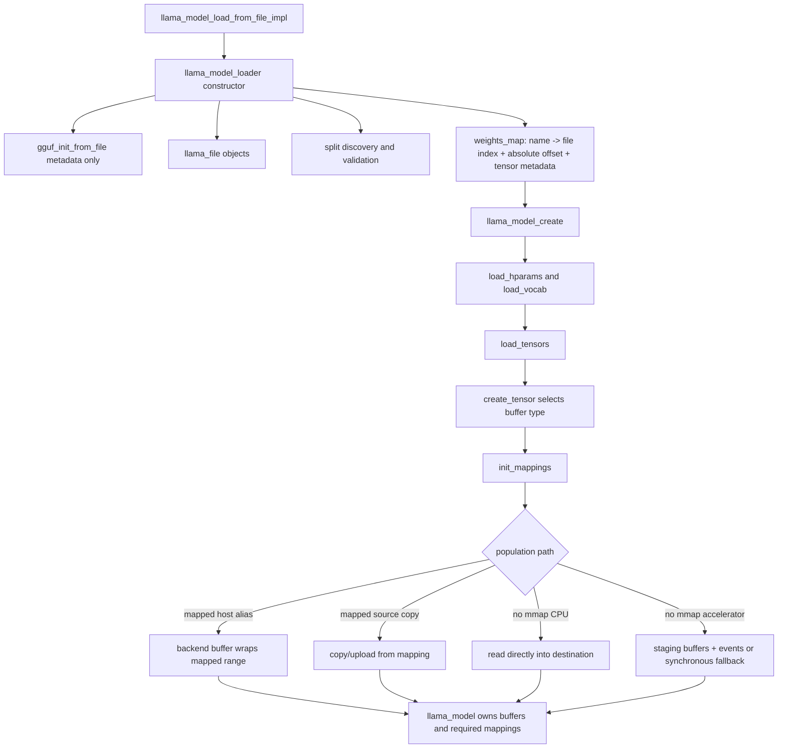

# Model and GGUF loader: file-by-file Pass A

> **Evidence scope:** llama.cpp revision [`e3546c7948e3af463d0b401e6421d5a4c2faf565`](https://github.com/ggml-org/llama.cpp/commit/e3546c7948e3af463d0b401e6421d5a4c2faf565). Newer behavior must be labelled separately.

This page inventories the files that turn one or more GGUF files into persistent model tensors. It focuses on construction order, ownership transfer, split indexing, tensor offsets, mmap/read/upload paths, cancellation, and partial-construction cleanup.

## Five-minute model



The key separation is:

1. GGUF parsing creates metadata and source tensor descriptors.
2. `weights_map` records where every tensor's bytes live.
3. architecture loading declares the destination tensors the model needs.
4. backend-aware allocation decides where those tensors will live at runtime.
5. data population aliases, reads, copies, or uploads bytes into that storage.

## File inventory

| File | Primary role | Major objects/functions | Owns or creates | Hands off to |
|---|---|---|---|---|
| [`src/llama-model-loader.h`](https://github.com/ggml-org/llama.cpp/blob/e3546c7948e3af463d0b401e6421d5a4c2faf565/src/llama-model-loader.h) | Loader state and contracts | `llama_model_loader`, `llama_tensor_weight`, `create_tensor()`, `init_mappings()`, `load_all_data()` | file wrappers, GGUF contexts, source tensor index, temporary destination metadata contexts, mappings during loading | persistent buffers and required mappings to `llama_model` |
| [`src/llama-model-loader.cpp`](https://github.com/ggml-org/llama.cpp/blob/e3546c7948e3af463d0b401e6421d5a4c2faf565/src/llama-model-loader.cpp) | Split discovery, metadata validation, buffer selection, mapping and population | loader constructor, `weight_buft_supported()`, `select_weight_buft()`, `create_tensor()`, `load_data_for()`, `load_all_data()` | unified `weights_map`, staging buffers/events, temporary read buffers | populated backend buffers |
| [`src/llama-model.cpp`](https://github.com/ggml-org/llama.cpp/blob/e3546c7948e3af463d0b401e6421d5a4c2faf565/src/llama-model.cpp) | Model construction and persistent storage | model factory, `load_hparams()`, `load_vocab()`, `load_tensors()` | architecture object, model tensor schema, backend buffers, retained mappings | reusable `llama_model` |
| [`src/llama-model.h`](https://github.com/ggml-org/llama.cpp/blob/e3546c7948e3af463d0b401e6421d5a4c2faf565/src/llama-model.h) | Model ownership boundary | `llama_model`, implementation members, tensor/layer records | model-lifetime tensors, buffers, metadata, mappings | referenced by contexts and graph builders |
| [`src/llama-mmap.h`](https://github.com/ggml-org/llama.cpp/blob/e3546c7948e3af463d0b401e6421d5a4c2faf565/src/llama-mmap.h) | RAII interfaces for files, mappings, and locking | `llama_file`, `llama_mmap`, `llama_mlock` | file descriptor/stream wrapper, virtual mapping, optional lock range | loader and model ownership containers |
| [`src/llama-mmap.cpp`](https://github.com/ggml-org/llama.cpp/blob/e3546c7948e3af463d0b401e6421d5a4c2faf565/src/llama-mmap.cpp) | Platform-specific I/O and virtual-memory implementation | constructors/destructors, reads, aligned direct I/O, mapping, prefetch, fragment unmapping, locking | OS handles and mappings | RAII wrappers |
| [`ggml/src/gguf.cpp`](https://github.com/ggml-org/llama.cpp/blob/e3546c7948e3af463d0b401e6421d5a4c2faf565/ggml/src/gguf.cpp) | GGUF parser and metadata/tensor descriptor API | `gguf_init_from_file()`, key/tensor lookup, data and tensor offsets | `gguf_context` and a metadata-only GGML context when `no_alloc=true` | `llama_model_loader` |

## Construction order

| Order | Caller | Operation | Important result |
|---:|---|---|---|
| 1 | model-loading facade | construct `llama_model_loader` | temporary loader becomes the owner of parse-time files, contexts, and indexes |
| 2 | loader constructor | call `gguf_init_from_file(..., no_alloc=true)` | parse metadata and tensor descriptors without allocating tensor payload storage |
| 3 | loader constructor | open the main `llama_file` | establish the source used for bounds checks and later reads/mapping |
| 4 | loader constructor | index main-file tensors | map each name to source split `idx`, absolute `offs`, and descriptor tensor |
| 5 | loader constructor | inspect split metadata | require split zero first, derive or validate the full split list, then parse every shard |
| 6 | loader constructor | merge shard descriptors | reject duplicate names and preserve each tensor's source-file index |
| 7 | model factory | create architecture-specific `llama_model` | establish the final persistent owner |
| 8 | model loading | load hyperparameters and vocabulary | consume typed GGUF metadata through loader accessors |
| 9 | architecture tensor declaration | call `create_tensor()` repeatedly | validate names/shapes and select a compatible destination buffer type per tensor |
| 10 | loader | `init_mappings()` | create one mapping per source file when mmap is enabled and compute progress totals |
| 11 | model/loader | allocate backend buffers and call `load_all_data()` | populate all destination tensors by alias, read, copy, or upload |
| 12 | successful completion | trim unused mapping fragments and transfer required storage | `llama_model` retains buffers and mappings needed after the loader dies |

## The unified tensor index

`llama_tensor_weight` stores three facts:

```text
source split index
absolute source-file byte offset
GGML tensor descriptor
```

The absolute offset is computed as:

```text
gguf_get_data_offset(gguf_ctx)
+ gguf_get_tensor_offset(gguf_ctx, tensor_index)
```

The constructor checks integer wraparound and verifies that `offset + tensor_bytes` stays within the corresponding source file. The loader then inserts every tensor into one name-indexed `weights_map`, regardless of which shard contains it.

This map is the bridge between format parsing and runtime placement. GGUF says where source bytes are; model architecture code says which logical tensor is required; backend selection says where the destination must live.

## Ownership transitions

| Resource | During loader construction | During data population | After successful model load | Failure behavior |
|---|---|---|---|---|
| `gguf_context` for primary metadata | owned by `metadata_ptr` unless supplied externally | queried for metadata and descriptors | selected metadata may be retained/copied by model state; loader-owned parse context is temporary | RAII pointer releases it |
| per-file GGML descriptor contexts | owned in `contexts` | provide source tensor metadata | not runtime weight storage | RAII contexts release on unwind |
| `llama_file` objects | owned in `files` | used by mappings or explicit reads | generally temporary once persistent mapped/buffer storage is established | unique pointers close files on unwind |
| `weights_map` | owned by loader | resolves each destination tensor to source bytes | temporary index; model tensors no longer require name lookup for execution | standard container cleanup |
| `llama_mmap` objects | owned in loader `mappings` | source for alias/copy paths | mappings backing persistent mapped buffers are transferred to model ownership | unique pointers unmap if not transferred |
| backend buffers | allocated for destination tensor contexts | receive aliases, reads, copies, or uploads | owned by `llama_model` for its lifetime | backend-buffer RAII/container cleanup must free partial allocations |
| pinned host buffers/events | local to `load_all_data()` | ring used for eligible asynchronous uploads | not retained after final event synchronization | local cleanup frees them on return/unwind |
| caller progress callback state | borrowed | invoked as bytes complete | not retained | cancellation returns `false` rather than publishing a completed model |

## Population paths

### 1. Mapped host-pointer alias

When the selected backend buffer type can wrap host memory, the destination buffer can refer directly to the mapped GGUF range. No tensor payload copy is required. This is the narrow case for which “zero copy” is accurate.

The virtual address being valid does **not** prove that all mapped pages are physically resident. First access can still fault pages into the OS page cache.

### 2. Mapped source copied or uploaded

Mmap may still be used only as the source address. If the final buffer is independently allocated, tensor bytes are copied or uploaded from the mapped range. The mapping and the destination buffer then have different ownership and residency states.

### 3. Direct read into host destination

Without mmap, CPU-addressable destination tensors can be populated by seeking to `llama_tensor_weight::offs` and reading the exact tensor byte range into already allocated storage.

### 4. Asynchronous accelerator upload

The pinned loader enables this path only when mmap and tensor validation are disabled and the selected device exposes asynchronous execution, host buffers, and events. It allocates four host staging buffers, records events, and reuses a slot only after the relevant event has completed.

### 5. Synchronous fallback

If the capability checks fail, the loader reads a tensor into temporary host memory and performs a synchronous backend tensor set/upload. Correctness is preserved, but overlap and temporary-memory behavior differ.

## Cancellation and partial construction

`load_all_data()` returns `false` when the progress callback cancels loading. Callers must treat that as an incomplete model and avoid publishing it as usable.

The main cleanup mechanism is C++ ownership:

- loader files, mappings, contexts, and local staging resources are stored in RAII containers;
- the model-loading facade uses temporary ownership for the model under construction;
- exceptions from malformed metadata, duplicate tensors, invalid dimensions, unsupported placement, bad tensor data, allocation failure, or I/O unwind temporary state;
- only a successful end-to-end load transfers/relinquishes persistent buffers and mappings to the final model.

A cancellation path is not the same as an exception path: it is an explicit `false` result and must be propagated deliberately.

## Synchronization boundaries

| Boundary | Why it exists |
|---|---|
| staging-slot event wait | prevents overwriting pinned host memory still consumed by an accelerator upload |
| final upload synchronization | ensures all destination tensors are valid before staging buffers/events are destroyed and the model is returned |
| mapped alias publication | requires buffer construction and tensor address assignment to finish, but does not force all file pages resident |
| model publication | must occur only after population, validation, cancellation checks, and ownership transfer finish |

## Backend and OS differences

- **CPU mapped:** model tensors may alias file-backed virtual addresses; page faults and page-cache reclaim remain OS-managed.
- **CPU allocated:** explicit reads populate anonymous/backend-owned memory; the file mapping is not the runtime backing store.
- **Discrete GPU or accelerator:** weights normally require independent device storage and upload/copy completion.
- **Shared/unified memory:** addressability does not by itself prove coherence or completion; backend contracts still decide synchronization.
- **Direct I/O:** alignment and platform support affect reads; the pinned constructor disables mmap when direct I/O is actually active and falls back to mmap when requested direct I/O is unavailable.

## Truth labels

### Verified

- GGUF parsing is requested with `no_alloc=true`; source tensor descriptors are indexed before runtime payload allocation.
- Every indexed tensor records a source-file index and an absolute, bounds-checked byte offset.
- Split loading requires the first shard, validates split count/index metadata, and rejects duplicate tensor names.
- `create_tensor()` selects destination buffer types using expected operations and backend support rather than only `n_gpu_layers`.
- `init_mappings()` creates per-file mappings only when mmap is enabled.
- Data population has mapped alias, mapped copy/upload, direct-read, asynchronous staging, and synchronous fallback variants.
- Asynchronous staging resources are event-synchronized before reuse and destruction.

### Interpretation

- `llama_model_loader` acts as a transactional bridge: it gathers temporary parse/I/O state and publishes persistent model storage only after the load is complete.
- The unified `weights_map` is the central join between GGUF physical layout and architecture/backend-aware tensor construction.
- “Model loaded” should mean destination bytes are valid and required asynchronous work is complete, not merely that metadata was parsed or virtual addresses were mapped.

### Historical

- GGUF versions, split conventions, direct-I/O support, asynchronous-upload capability checks, and backend buffer-selection behavior have evolved. This page describes only the pinned revision.

### Open question

- Which exact model implementation members receive every retained mapping and buffer in the pinned revision, and in what declaration/destruction order?
- Which platforms execute the direct-I/O path in practice, and what alignment/fallback costs appear in traces?
- How much of load time is parsing, mapping/prefetch, page faulting, explicit read, validation, host staging, upload, and final synchronization?
- Which backend-specific host-pointer wrapping implementations preserve file-backed aliasing versus creating an internal copy?

## Next Pass A group

Continue with runtime-context and memory implementations:

```text
src/llama-context.cpp / .h
src/llama-memory.cpp / .h
src/llama-kv-cache.cpp / .h
recurrent and hybrid memory implementations
```

The next synthesis should connect public API ownership, loader publication, model sharing, context-owned mutable state, graph allocation, and teardown.