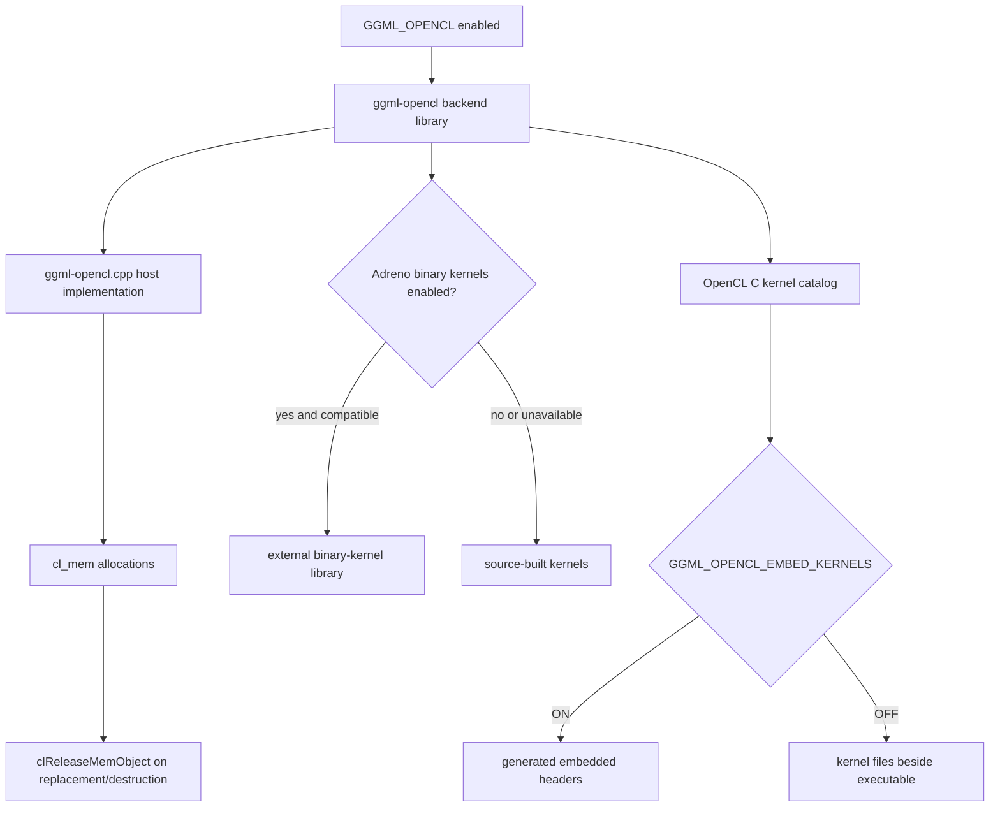

# OpenCL build and buffer lifetimes

> **Evidence scope:** llama.cpp `e3546c7948e3af463d0b401e6421d5a4c2faf565`. This is a bounded foundation for the still-open full OpenCL teardown audit.

## Five-minute view

The pinned OpenCL backend is not one precompiled GPU program. CMake builds a backend library around one large host-side implementation file and a catalog of OpenCL C kernels. Depending on configuration, those kernels are embedded into the backend binary or copied beside the executable. An optional Adreno binary-kernel library can replace selected source kernels when compatible binaries are available.

At runtime, the first ownership primitive visible in the pinned host source is a small RAII wrapper around `cl_mem`. It creates storage with `clCreateBuffer()` and releases the previous or final allocation with `clReleaseMemObject()`. This proves buffer-local ownership, but it does **not** by itself prove queue completion before buffer release or complete backend-before-scheduler teardown safety.

## Verified

- The top-level build registers OpenCL through `ggml_add_backend(OpenCL)`.
- The OpenCL subdirectory creates `ggml-opencl` from `ggml-opencl.cpp` and the public header, and links the discovered OpenCL libraries.
- Python is a required build dependency because embedded kernels are converted into generated headers.
- `GGML_OPENCL_EMBED_KERNELS` controls whether kernel sources become generated headers or are copied to the runtime output directory.
- The pinned kernel catalog includes ordinary elementwise operations, normalization, RoPE, convolution, attention, quantized matrix-vector and matrix-matrix kernels, and MoE-specific kernels such as expert sorting, reorder, combine, and `MUL_MAT_ID` variants.
- `GGML_OPENCL_USE_ADRENO_KERNELS` selects Adreno-oriented source kernels. `GGML_OPENCL_USE_ADRENO_BIN_KERNELS` enables an optional external binary-kernel library.
- The official backend guide describes OpenCL as primarily targeting Qualcomm Adreno, with some Intel GPU support, and documents Android, Windows Arm64, and Linux build paths.
- The host source defines `ggml_cl_buffer`, which owns one `cl_mem`, releases it in its destructor, and releases an older allocation before replacing it with a larger one.

## Interpretation

- The backend has two lifetimes that should not be conflated: **build/deployment lifetime** for kernel source or binary artifacts, and **runtime lifetime** for contexts, queues, programs, kernels, events, and memory objects.
- The `ggml_cl_buffer` wrapper establishes local ownership of a memory object. It does not establish that all commands referencing that object have completed before `clReleaseMemObject()`.
- Because the backend is a large single translation unit with generated or deployed kernel assets, future source indexing should expose symbol-level slices rather than treating the file as one opaque source node.
- MoE support in the kernel catalog shows that OpenCL participates in more than generic tensor offload; it contains backend-specific routing and expert-compute kernels that deserve links from the graph/MoE chapter.

## Historical

- OpenCL device support, kernel names, Adreno compiler compatibility, and binary-library coverage are revision-sensitive.
- The official pinned guide lists specific tested Snapdragon and Intel configurations; these are evidence for that revision, not a universal hardware-support guarantee.
- Kernel deployment can change between embedded source, runtime source files, and vendor binary libraries without changing the higher-level GGML graph.

## Open questions

- What is the exact backend/context destructor chain in the pinned host file?
- Does backend free call `clFinish()`, wait on retained events, or otherwise prove completion before releasing queues, programs, kernels, buffers, and the context?
- Are scheduler events implemented as independent `cl_event` objects, and can they be destroyed after the backend wrapper?
- Do scheduler buffers retain enough context/device state to release `cl_mem` after backend destruction?
- In what order are command queues, programs, kernels, events, memory objects, and the OpenCL context released?
- Does the optional Adreno binary-kernel loader retain a dynamic-library handle, and when is that handle closed relative to kernel destruction?
- Which optional CPU extra-buffer types can coexist with OpenCL placement, and are their deleters independent of the ordinary CPU backend wrapper?

## Source map

Pinned primary sources:

- [`ggml/src/CMakeLists.txt`](https://github.com/ggml-org/llama.cpp/blob/e3546c7948e3af463d0b401e6421d5a4c2faf565/ggml/src/CMakeLists.txt)
- [`ggml/src/ggml-opencl/CMakeLists.txt`](https://github.com/ggml-org/llama.cpp/blob/e3546c7948e3af463d0b401e6421d5a4c2faf565/ggml/src/ggml-opencl/CMakeLists.txt)
- [`ggml/src/ggml-opencl/ggml-opencl.cpp`](https://github.com/ggml-org/llama.cpp/blob/e3546c7948e3af463d0b401e6421d5a4c2faf565/ggml/src/ggml-opencl/ggml-opencl.cpp)
- [`docs/backend/OPENCL.md`](https://github.com/ggml-org/llama.cpp/blob/e3546c7948e3af463d0b401e6421d5a4c2faf565/docs/backend/OPENCL.md)

## Teardown classification

> **Not yet classified.** This increment verifies build composition, kernel deployment modes, and one buffer-local RAII path. A safe/conditional/unsafe backend-before-scheduler classification requires the remaining queue, event, program, kernel, context, and scheduler-resource free paths.

## Next reading

- [Backend scheduler Pass A](backend-scheduler-pass-a.md)
- [Graph construction and MoE](../ggml/graph-construction-and-moe.md)
- [CPU backend teardown](cpu-backend-teardown.md)
- [Model and context teardown order](model-context-teardown-order.md)
