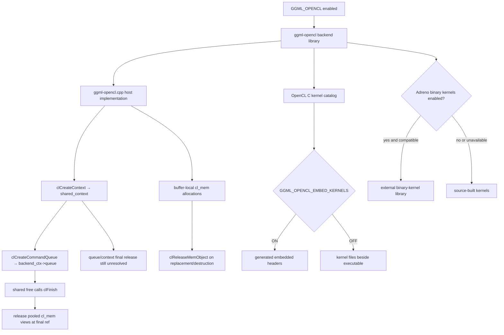

# OpenCL build and buffer lifetimes

> **Evidence scope:** llama.cpp `e3546c7948e3af463d0b401e6421d5a4c2faf565`. This page includes a bounded classification of the exact pinned lifecycle-call report generated by GitHub Actions.

## Five-minute view

The pinned OpenCL backend is not one precompiled GPU program. CMake builds a backend library around one large host-side implementation file and a catalog of OpenCL C kernels. Depending on configuration, those kernels are embedded into the backend binary or copied beside the executable. An optional Adreno binary-kernel library can replace selected source kernels when compatible binaries are available.

At runtime, `ggml_cl_buffer` provides local RAII for one `cl_mem`. The pinned report also shows one direct context creation assigned to `shared_context` and one direct command-queue creation assigned to `backend_ctx->queue`. The shared OpenCL `free()` path calls `clFinish(queue)` before decrementing its reference count and before releasing pooled image/sub-buffer views when the final reference disappears. However, the expanded direct-call report still contains no `clReleaseCommandQueue()`, `clReleaseContext()`, `clRetainCommandQueue()`, or `clRetainContext()` call. Creation is now located, but final ownership remains unresolved rather than proven safe or leaked.

## Exact pinned lifecycle inventory

GitHub Actions run `29390227929` regenerated the report from the complete pinned translation unit after direct creation/retention APIs were added. The expanded report contains 558 selected direct API calls:

| API | Direct calls | First-pass role |
|---|---:|---|
| `clReleaseMemObject` | 343 | Buffer, sub-buffer, image, temporary, and pooled-view release |
| `clReleaseProgram` | 121 | Mostly release after kernel creation plus compile-failure cleanup |
| `clWaitForEvents` | 51 | Explicit completion for profiling, barriers, copies, kernels, conversions, and readback paths |
| `clReleaseKernel` | 23 | Error/fallback cleanup and rejected optional-kernel candidates |
| `clFinish` | 11 | Shared free path, readback/debug paths, allocation retry, and temporary allocation cleanup |
| `clReleaseEvent` | 6 | Profiling, blocking copy, synchronization, and selected kernel/readback paths |
| `clFlush` | 1 | Cross-device marker publication before a dependent barrier |
| `clCreateContext` | 1 | Creates a context and assigns it to `shared_context` at pinned line 5545 |
| `clCreateCommandQueue` | 1 | Creates a queue and assigns it to `backend_ctx->queue` at pinned line 5902 |
| `clCreateContextFromType` | 0 | No direct call found by the bounded extractor |
| `clCreateCommandQueueWithProperties` | 0 | No direct call found by the bounded extractor |
| `clRetainContext` | 0 | No direct retain found by the bounded extractor |
| `clRetainCommandQueue` | 0 | No direct retain found by the bounded extractor |
| `clReleaseCommandQueue` | 0 | No direct release found by the bounded extractor |
| `clReleaseContext` | 0 | No direct release found by the bounded extractor |

The `clCreateContext` context window shows platform properties built from `default_device->platform->id`, followed by assignment to `shared_context`. The `clCreateCommandQueue` context window shows optional profiling flags and assignment to `backend_ctx->queue`. These are exact direct-call observations; they do not establish the declaration lifetime of `shared_context` or the destructor behavior of `backend_ctx`.

These counts are navigation evidence. They do not include wrapper calls, macro-expanded calls, disabled preprocessor regions, or semantic ownership inferred from type destructors.

## Verified

- The top-level build registers OpenCL through `ggml_add_backend(OpenCL)`.
- The OpenCL subdirectory creates `ggml-opencl` from `ggml-opencl.cpp` and the public header, and links the discovered OpenCL libraries.
- Python is a required build dependency because embedded kernels are converted into generated headers.
- `GGML_OPENCL_EMBED_KERNELS` controls whether kernel sources become generated headers or are copied to the runtime output directory.
- The pinned kernel catalog includes ordinary elementwise operations, normalization, RoPE, convolution, attention, quantized matrix-vector and matrix-matrix kernels, and MoE-specific kernels such as expert sorting, reorder, combine, and `MUL_MAT_ID` variants.
- `GGML_OPENCL_USE_ADRENO_KERNELS` selects Adreno-oriented source kernels. `GGML_OPENCL_USE_ADRENO_BIN_KERNELS` enables an optional external binary-kernel library.
- The official backend guide describes OpenCL as primarily targeting Qualcomm Adreno, with some Intel GPU support, and documents Android, Windows Arm64, and Linux build paths.
- `ggml_cl_buffer` owns one `cl_mem`, releases it in its destructor, and releases an older allocation before replacing it with a larger one.
- One direct `clCreateContext(...)` call assigns the returned handle to `shared_context` at pinned line 5545.
- One direct `clCreateCommandQueue(...)` call assigns the returned handle to `backend_ctx->queue` at pinned line 5902.
- The expanded report contains no direct context/queue retain or release call.
- The shared OpenCL `free()` path calls `clFinish(queue)` before `ref_count--`; when the count becomes zero, it releases pooled image and sub-buffer views and clears those pools.
- The cross-device synchronization path enqueues marker events on other queues, calls `clFlush()` on those queues, enqueues a barrier with the collected wait list on the destination queue, and then releases the event references.
- Multiple temporary conversion/readback paths enqueue work, wait for the returned event, and only then release the temporary `cl_mem`; selected readback paths additionally use blocking reads and/or `clFinish()`.
- Program objects are commonly released immediately after kernels are created, which is valid as a program-lifetime pattern only because created kernels retain the program state required by OpenCL; the report itself records the call order but does not replace the API contract.

## Interpretation

- `shared_context` naming and assignment suggest a backend-wide or process-wide shared context, while `backend_ctx->queue` is directly associated with one backend context object. The report does not prove either object’s destructor or process-exit policy.
- The asymmetric result—one direct create for each handle type, zero direct retains, and zero direct releases—makes wrapper/global/process-lifetime ownership the next review target. It is not proof of a leak.
- The `clFinish(queue)` at the start of the shared `free()` method is strong evidence that work submitted to that queue is completed before the final-reference pool release performed by that method.
- This does **not** yet prove complete backend-before-scheduler safety. A scheduler-owned buffer or event may outlive the backend wrapper, and queue/context lifetime may be process-scoped, global, wrapper-owned, or missing from the direct-call inventory.
- Releasing an OpenCL memory-object reference after enqueue is not automatically the same as freeing the underlying storage immediately; OpenCL reference and command-retention semantics matter. Explicit wait-before-release sites are nevertheless stronger and easier to audit.
- The high number of `clReleaseMemObject()` sites reflects many generated or specialized temporary paths, not 343 independent long-lived owners.
- Three context lines are enough to locate the direct assignments but not the declarations or destruction paths. Targeted enclosing-owner inspection is now justified for `shared_context` and `backend_ctx` only.

## Historical

- OpenCL device support, kernel names, Adreno compiler compatibility, and binary-library coverage are revision-sensitive.
- The official pinned guide lists specific tested Snapdragon and Intel configurations; these are evidence for that revision, not a universal hardware-support guarantee.
- Kernel deployment can change between embedded source, runtime source files, and vendor binary libraries without changing the higher-level GGML graph.
- The first generated report covered completion and release calls only. Run `29390227929` added direct context/queue creation and retention APIs and narrowed the ownership question to two exact assignments.

## Open questions

- Where is `shared_context` declared, and is its lifetime intentionally process-wide?
- What destructor or free function owns `backend_ctx->queue`, and why is there no direct `clReleaseCommandQueue()` in the translation unit?
- Is release performed through a wrapper, platform singleton, generated path, or process-exit policy not captured by the direct-call extractor?
- Are scheduler events independent `cl_event` objects, and can they be destroyed after the backend wrapper?
- Do scheduler buffers retain enough context/device state to release `cl_mem` after backend destruction?
- Which enqueue-then-release sites rely solely on OpenCL retention semantics, and which require explicit completion because host memory or wrapper state is also destroyed?
- Does the optional Adreno binary-kernel loader retain a dynamic-library handle, and when is that handle closed relative to kernel destruction?
- Which optional CPU extra-buffer types can coexist with OpenCL placement, and are their deleters independent of the ordinary CPU backend wrapper?

## Source map

Pinned primary sources:

- [`ggml/src/CMakeLists.txt`](https://github.com/ggml-org/llama.cpp/blob/e3546c7948e3af463d0b401e6421d5a4c2faf565/ggml/src/CMakeLists.txt)
- [`ggml/src/ggml-opencl/CMakeLists.txt`](https://github.com/ggml-org/llama.cpp/blob/e3546c7948e3af463d0b401e6421d5a4c2faf565/ggml/src/ggml-opencl/CMakeLists.txt)
- [`ggml/src/ggml-opencl/ggml-opencl.cpp`](https://github.com/ggml-org/llama.cpp/blob/e3546c7948e3af463d0b401e6421d5a4c2faf565/ggml/src/ggml-opencl/ggml-opencl.cpp)
- [`docs/backend/OPENCL.md`](https://github.com/ggml-org/llama.cpp/blob/e3546c7948e3af463d0b401e6421d5a4c2faf565/docs/backend/OPENCL.md)
- GitHub Actions artifact `opencl-lifecycle-pinned-e3546c7` from run `29390227929`.

## Teardown classification

> **Conditional / incomplete.** Direct creation is now located: `shared_context` receives the sole direct `clCreateContext()` result, and `backend_ctx->queue` receives the sole direct `clCreateCommandQueue()` result. The shared `free()` path has an explicit queue-completion barrier before final-reference pooled-memory release, and selected temporary paths wait before releasing resources. However, the expanded report contains no direct queue/context retain or release call, and scheduler-resource independence, optional binary-library lifetime, and enqueue-then-release groups remain incomplete. OpenCL therefore remains “conditional with verified local completion evidence,” with a narrower ownership gap.

## Next reading

- [Backend scheduler Pass A](backend-scheduler-pass-a.md)
- [Graph construction and MoE](../ggml/graph-construction-and-moe.md)
- [CPU backend teardown](cpu-backend-teardown.md)
- [Model and context teardown order](model-context-teardown-order.md)
