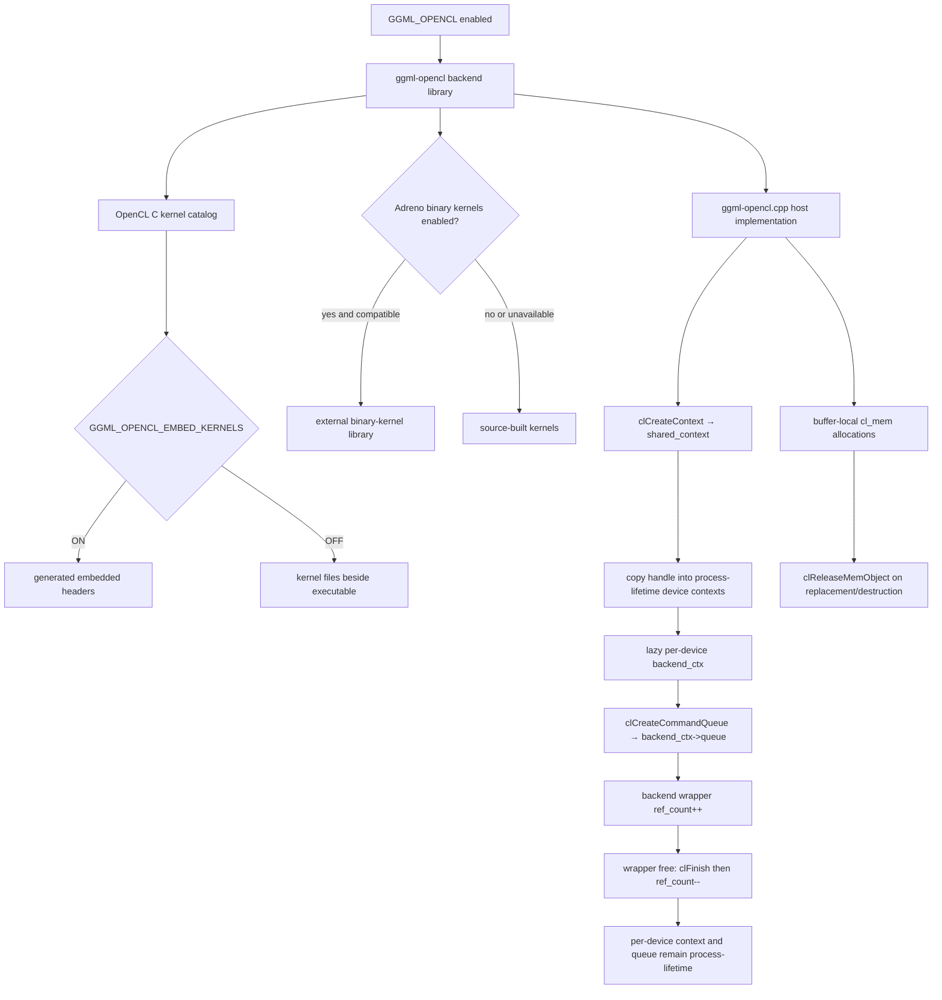

# OpenCL build and buffer lifetimes

> **Evidence scope:** llama.cpp `e3546c7948e3af463d0b401e6421d5a4c2faf565`. This page includes a bounded classification of the exact pinned lifecycle-call report and the complete source file preserved by GitHub Actions.

## Five-minute view

The pinned OpenCL backend is not one precompiled GPU program. CMake builds a backend library around one large host-side implementation file and a catalog of OpenCL C kernels. Depending on configuration, those kernels are embedded into the backend binary or copied beside the executable. An optional Adreno binary-kernel library can replace selected source kernels when compatible binaries are available.

The complete pinned source now resolves the central ownership question. Device discovery creates one `shared_context`, copies that handle into every supported `ggml_backend_opencl_device_context`, and stores those device contexts in a static vector whose source comment explicitly says the devices and contexts live as long as the process. Each device lazily creates one `ggml_backend_opencl_context`, stores it permanently in `dev_ctx->backend_ctx`, and creates one queue in that context. Individual backend wrappers only increment and decrement `ref_count`; wrapper free calls `clFinish(queue)` first, but does not delete the per-device context or release the queue/context handles.

This makes backend-wrapper destruction structurally independent from the persistent OpenCL owner. It also means deterministic OpenCL handle release is omitted in the pinned translation unit: there is no `clReleaseCommandQueue()` or `clReleaseContext()` path, so final cleanup is left to process/ICD teardown rather than explicit backend code.

## Exact pinned lifecycle inventory

The source-bearing GitHub Actions artifact contains 558 selected direct API calls:

| API | Direct calls | First-pass role |
|---|---:|---|
| `clReleaseMemObject` | 343 | Buffer, sub-buffer, image, temporary, and pooled-view release |
| `clReleaseProgram` | 121 | Mostly release after kernel creation plus compile-failure cleanup |
| `clWaitForEvents` | 51 | Explicit completion for profiling, barriers, copies, kernels, conversions, and readback paths |
| `clReleaseKernel` | 23 | Error/fallback cleanup and rejected optional-kernel candidates |
| `clFinish` | 11 | Shared free path, readback/debug paths, allocation retry, and temporary allocation cleanup |
| `clReleaseEvent` | 6 | Profiling, blocking copy, synchronization, and selected kernel/readback paths |
| `clFlush` | 1 | Cross-device marker publication before a dependent barrier |
| `clCreateContext` | 1 | Creates `shared_context` at pinned line 5545 |
| `clCreateCommandQueue` | 1 | Creates `backend_ctx->queue` at pinned line 5902 |
| `clCreateContextFromType` | 0 | No direct call found by the bounded extractor |
| `clCreateCommandQueueWithProperties` | 0 | No direct call found by the bounded extractor |
| `clRetainContext` | 0 | No direct retain found by the bounded extractor |
| `clRetainCommandQueue` | 0 | No direct retain found by the bounded extractor |
| `clReleaseCommandQueue` | 0 | No direct release found by the bounded extractor |
| `clReleaseContext` | 0 | No direct release found by the bounded extractor |

The artifact also preserves the complete `ggml-opencl.cpp` used to generate the report and a two-entry SHA-256 manifest. The report and source hashes were independently recomputed after download and matched the manifest.

## Verified ownership chain

1. `shared_context` is a local variable in OpenCL device registration.
2. One `clCreateContext()` creates it for the selected platform and all candidate device IDs.
3. The same handle is copied into each supported `ggml_backend_opencl_device_context::context`.
4. Those device contexts are owned by `g_ggml_backend_opencl_dev_ctxs`, a static vector of `unique_ptr` objects.
5. The adjacent source comment states that the registered devices and their contexts live as long as the process.
6. `ggml_cl_init()` lazily allocates one `ggml_backend_opencl_context` per device and stores the raw pointer in `dev_ctx->backend_ctx`.
7. `ggml_cl_init()` sets `ref_count = 0`; `ggml_backend_opencl_device_init()` increments it for each backend wrapper.
8. `ggml_cl_free()` calls `ctx->free()`. That method performs `clFinish(queue)`, decrements `ref_count`, and releases pooled image/sub-buffer views only when the count reaches zero.
9. `ctx->free()` does not delete `ctx`, release its queue, or release its context.
10. The backend capability table advertises `events = false`, and the backend interface has null event-record/event-wait callbacks; no scheduler-owned OpenCL event object must survive wrapper destruction.

## Other verified findings

- The top-level build registers OpenCL through `ggml_add_backend(OpenCL)`.
- The OpenCL subdirectory creates `ggml-opencl` from `ggml-opencl.cpp` and the public header, and links the discovered OpenCL libraries.
- Python is required because embedded kernels are converted into generated headers.
- `GGML_OPENCL_EMBED_KERNELS` controls whether kernel sources become generated headers or are copied to the runtime output directory.
- The pinned kernel catalog includes elementwise operations, normalization, RoPE, convolution, attention, quantized matrix-vector/matrix-matrix kernels, and MoE-specific sorting, reorder, combine, and `MUL_MAT_ID` variants.
- `GGML_OPENCL_USE_ADRENO_KERNELS` selects Adreno-oriented source kernels. `GGML_OPENCL_USE_ADRENO_BIN_KERNELS` enables an optional external binary-kernel library.
- `ggml_cl_buffer` owns one `cl_mem`, releases it in its destructor, and releases an older allocation before replacement.
- Cross-device synchronization enqueues marker events on peer queues, calls `clFlush()` on those queues, enqueues a destination barrier with the collected wait list, and releases the event references.
- Several temporary conversion/readback paths wait for completion before releasing temporary memory objects.
- Program objects are commonly released after kernel creation; kernels retain the required program state under the OpenCL object model.

## Interpretation

- The pinned backend uses a deliberate process-lifetime host-object design: static device contexts retain the OpenCL context and the lazily created per-device backend context, queue, programs, and kernels after individual backend wrappers disappear.
- Because wrapper free calls `clFinish(queue)`, work on that device queue completes before its wrapper reference is dropped and before final-reference pool cleanup.
- Buffer destruction after wrapper destruction remains structurally valid in this design because the OpenCL context and per-device owner persist, and buffer deleters operate on buffer-local `cl_mem` handles.
- This is not equivalent to deterministic cleanup. The absence of explicit queue/context release means tools may report process-lifetime OpenCL resources, and repeated library load/unload inside one process is not proven clean.
- The design also avoids scheduler-event lifetime concerns by advertising no OpenCL events, but enqueue-then-release paths still require classification where host storage or wrapper-local state may be involved.

## Historical

- OpenCL device support, kernel names, Adreno compiler compatibility, and binary-library coverage are revision-sensitive.
- The first generated report covered completion and release calls only. Later extraction located direct creation, and the source-bearing artifact finally exposed declarations and process-lifetime ownership.
- Earlier documentation classified queue/context ownership as unresolved because connector rendering truncated the large translation unit.

## Open questions

- Does the optional Adreno binary-kernel loader retain a dynamic-library handle, and when is that handle closed relative to kernel destruction?
- Which enqueue-then-release sites rely solely on OpenCL command-retention semantics, and which also destroy host or wrapper state that requires explicit completion?
- Should upstream add deterministic process-exit or registry teardown for queues, contexts, programs, kernels, and the lazily allocated backend contexts?
- Are repeated registration/unregistration or shared-library unload scenarios supported, or is one-process lifetime an intentional hard contract?
- Which optional CPU extra-buffer types can coexist with OpenCL placement, and are their deleters independent of the ordinary CPU backend wrapper?

## Source map

Pinned primary sources:

- [`ggml/src/CMakeLists.txt`](https://github.com/ggml-org/llama.cpp/blob/e3546c7948e3af463d0b401e6421d5a4c2faf565/ggml/src/CMakeLists.txt)
- [`ggml/src/ggml-opencl/CMakeLists.txt`](https://github.com/ggml-org/llama.cpp/blob/e3546c7948e3af463d0b401e6421d5a4c2faf565/ggml/src/ggml-opencl/CMakeLists.txt)
- [`ggml/src/ggml-opencl/ggml-opencl.cpp`](https://github.com/ggml-org/llama.cpp/blob/e3546c7948e3af463d0b401e6421d5a4c2faf565/ggml/src/ggml-opencl/ggml-opencl.cpp)
- [`docs/backend/OPENCL.md`](https://github.com/ggml-org/llama.cpp/blob/e3546c7948e3af463d0b401e6421d5a4c2faf565/docs/backend/OPENCL.md)
- GitHub Actions artifact `opencl-lifecycle-pinned-e3546c7` from run `29392658206`, artifact ID `8333854723`.

## Teardown classification

> **Backend-wrapper order supported; deterministic process-exit release omitted.** Each backend-wrapper free explicitly finishes the per-device queue before decrementing the wrapper reference count. The queue, context, programs, kernels, and lazily allocated per-device backend context remain reachable through static process-lifetime device state, and OpenCL scheduler events are unsupported. Buffer-local `cl_mem` deleters therefore do not depend on the destroyed wrapper. However, the pinned translation unit contains no explicit command-queue/context release or per-device backend-context deletion path, so complete deterministic cleanup and library-unload safety remain unverified.

## Next reading

- [Backend scheduler Pass A](backend-scheduler-pass-a.md)
- [Graph construction and MoE](../ggml/graph-construction-and-moe.md)
- [CPU backend teardown](cpu-backend-teardown.md)
- [Model and context teardown order](model-context-teardown-order.md)
