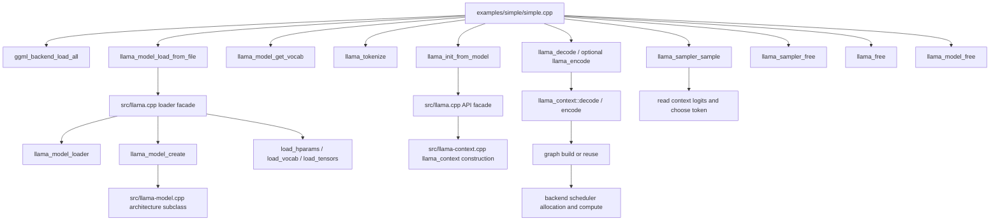

# Public API and minimal example map

This page is the first file-by-file **Pass A** artifact. It maps the pinned `examples/simple/simple.cpp` program to the public declarations in `include/llama.h` and to the main implementation boundaries in `src/llama.cpp`, `src/llama-model.cpp`, and `src/llama-context.cpp`.

> **Evidence scope:** llama.cpp revision [`e3546c7948e3af463d0b401e6421d5a4c2faf565`](https://github.com/ggml-org/llama.cpp/tree/e3546c7948e3af463d0b401e6421d5a4c2faf565). Newer upstream behavior must be reviewed separately.

## Five-minute view

The minimal example is an application-level owner of three long-lived objects:

1. `llama_model`: persistent vocabulary, hyperparameters, weight tensor metadata, mappings, and backend buffers;
2. `llama_context`: mutable inference state, scheduler resources, memory modules, graph state, and outputs;
3. `llama_sampler`: sampling policy and sampler-local state.

The example loads backend registrations, creates the model, obtains the vocabulary, tokenizes the prompt, creates the context and sampler, evaluates a prompt batch, repeatedly samples one token and feeds it back, then destroys objects in dependency order.



## File relationship inventory

| File | Role in this slice | Important symbols | Calls or delegates to | Ownership and teardown |
|---|---|---|---|---|
| [`examples/simple/simple.cpp`](https://github.com/ggml-org/llama.cpp/blob/e3546c7948e3af463d0b401e6421d5a4c2faf565/examples/simple/simple.cpp) | Minimal application and lifetime coordinator | `main`, `ggml_backend_load_all`, `llama_model_load_from_file`, `llama_init_from_model`, `llama_decode`, sampler APIs | Public C API in `llama.h`; backend registration API | Owns returned model, context, and sampler pointers; frees sampler, then context, then model |
| [`include/llama.h`](https://github.com/ggml-org/llama.cpp/blob/e3546c7948e3af463d0b401e6421d5a4c2faf565/include/llama.h) | Stable public C-facing contract and opaque object declarations | `llama_model`, `llama_context`, parameter structs, tokenization, batch, encode/decode, output, sampler, and free functions | Implemented across `src/llama.cpp` and subsystem files | Declares creation/free pairs; callers retain responsibility for returned opaque pointers |
| [`src/llama.cpp`](https://github.com/ggml-org/llama.cpp/blob/e3546c7948e3af463d0b401e6421d5a4c2faf565/src/llama.cpp) | Public API facade and model-loading orchestration | `llama_model_load_from_file`, `llama_init_from_model`, `llama_decode`, `llama_free`, `llama_model_free`, default-parameter helpers | Model loader, model factory, context methods, vocabulary, sampler, GGML/backend APIs | Converts exceptions and internal failures into public return values; transfers successful objects to the caller |
| [`src/llama-model.cpp`](https://github.com/ggml-org/llama.cpp/blob/e3546c7948e3af463d0b401e6421d5a4c2faf565/src/llama-model.cpp) | Persistent model implementation and architecture dispatch | `llama_model_create`, architecture subclasses, tensor loading, `build_graph`, `create_memory` | GGUF/model loader, backend buffer selection, architecture graph builders | Model owns persistent tensor storage, mappings/buffers, vocabulary, and architecture state |
| [`src/llama-context.cpp`](https://github.com/ggml-org/llama.cpp/blob/e3546c7948e3af463d0b401e6421d5a4c2faf565/src/llama-context.cpp) | Mutable runtime and evaluation implementation | `llama_context` construction, `encode`, `decode`, output management, graph build/reuse, scheduler execution | `llama_model::build_graph`, memory modules, backend scheduler, thread pools | Context references but does not own the model; it owns mutable runtime resources and must be destroyed first |

## Application call sequence

### 1. Backend discovery

The example calls `ggml_backend_load_all()` before model creation. This loads available backend registrations so model-device selection and buffer-type discovery can see compiled or dynamically loadable CPU, GPU, accelerator, and RPC implementations.

This is discovery, not model allocation. Actual device selection and tensor placement occur during model loading.

### 2. Model parameter creation and loading

`llama_model_default_params()` creates a parameter value. The example modifies `n_gpu_layers`, then calls `llama_model_load_from_file()`.

The pinned loader path performs these major steps:

```text
public API
  -> construct llama_model_loader
  -> create architecture-specific llama_model
  -> discover/select model devices
  -> load hyperparameters
  -> load vocabulary
  -> register and place tensors
  -> allocate, map, read, copy, or upload tensor data
  -> return caller-owned llama_model *
```

On failure, the public function returns `nullptr`; temporary C++ owners inside the loader path release partially constructed state.

### 3. Vocabulary reference and tokenization

`llama_model_get_vocab(model)` returns a vocabulary reference associated with the model. The example does not free it independently.

The two-pass tokenization pattern is:

1. call `llama_tokenize(..., nullptr, 0, ...)` and use the negative return value as the required capacity;
2. allocate the token vector;
3. call again to fill it.

The example treats a negative second-call result as failure.

### 4. Context creation

The example obtains `llama_context_default_params()`, sets context and batch limits, and calls `llama_init_from_model(model, params)`.

The returned context is mutable and depends on the model. It owns execution-time state such as memory modules, scheduler/backend resources, graph state, outputs, and performance counters, while retaining a non-owning model reference.

Therefore:

```text
valid lifetime: model created -> context created -> context freed -> model freed
invalid lifetime: model freed while context still references it
```

### 5. Sampler construction

The example creates a sampler chain and adds a greedy sampler. The sampler is a separately owned object. Sampling reads logits or candidates associated with the context, but the sampler chain itself must be freed with `llama_sampler_free()`.

### 6. Batch preparation

`llama_batch_get_one()` creates a lightweight batch view over caller-provided token storage. The example keeps the underlying `std::vector<llama_token>` or single `new_token_id` alive while the corresponding encode/decode call executes.

This convenience batch is not an independent deep copy of every pointed-to input array.

### 7. Optional encoder path

For encoder-decoder models, the example first calls `llama_encode(ctx, batch)`, obtains a decoder-start token, and replaces the batch with that one-token decoder input.

For decoder-only models, it proceeds directly to `llama_decode()` with the prompt batch.

### 8. Decode and sampling loop

Each loop iteration performs:

```text
current batch
  -> llama_decode
  -> context validates/prepares inputs and mutable memory
  -> build a graph or reuse a compatible graph allocation
  -> scheduler assigns backends, copies dependencies, and executes splits
  -> synchronize as required for output visibility
  -> sampler reads the selected logits row
  -> produce one token
  -> convert token to text
  -> create the next one-token batch
```

The first decode is prompt processing; later one-token calls are autoregressive decode. They use the same public API but may differ greatly in graph shape, memory traffic, kernel sizes, and reuse compatibility.

### 9. Output conversion and stopping

`llama_sampler_sample(smpl, ctx, -1)` selects from the last output row. The example checks `llama_vocab_is_eog()` before converting the token to a byte piece with `llama_token_to_piece()`.

A token ID and its rendered byte sequence are different abstractions. The vocabulary performs that conversion.

### 10. Teardown

The example destroys resources in this order:

```text
llama_sampler_free(smpl)
llama_free(ctx)
llama_model_free(model)
```

This order respects the context-to-model reference. Backend registrations loaded globally are not equivalent to per-model or per-context resources; the example does not call a global backend shutdown routine.

## Ownership and synchronization table

| Object or data | Owner in the example | Borrowed by | Synchronization implication | Release |
|---|---|---|---|---|
| `llama_model *` | Application | Context, vocabulary accessors, sampler/output helpers indirectly | Model loading may synchronize uploads before returning; later contexts may enqueue work using its buffers | `llama_model_free()` after all contexts |
| `const llama_vocab *` | Model | Tokenization, EOG checks, piece conversion | Read-only use does not imply a separate lifetime | Released with model |
| Prompt token vector | Application | `llama_batch_get_one()` batch view | Must remain valid through the encode/decode call using it | Automatic vector destruction |
| `llama_context *` | Application | Decode/encode and sampler calls | Output access may require queued backend work to become host-visible; context methods enforce required boundaries | `llama_free()` before model |
| `llama_sampler *` | Application | Sampling loop | Sampling depends on valid context outputs; sampler-local mutation is not a global thread-safety guarantee | `llama_sampler_free()` |
| `llama_batch` | Application value containing views | Context during one API call | Input pointers must remain valid until the call no longer consumes them | No matching free for `llama_batch_get_one()` |
| `new_token_id` | Stack variable | One-token batch view | Must remain alive during the next decode | Automatic |

## Error-path map

The minimal example exits immediately on most failures. That makes it readable, but early returns after successful model or context creation do not consistently release previously created resources before process exit.

Important public failure signals in this path include:

- `nullptr` from model or context creation;
- negative tokenization or token-to-piece results;
- non-zero encode/decode return values;
- end-of-generation as a normal stop condition rather than an error.

For a long-lived application, wrap model, context, and sampler pointers in RAII owners or a single cleanup path. Process termination will reclaim address-space resources, but explicit destruction is necessary for reusable libraries, repeated model loads, tests, and deterministic backend teardown.

## Backend assumptions exposed by the example

The example is backend-neutral at the API surface. `n_gpu_layers` is a placement request, not a guarantee that a particular GPU backend exists or that every requested layer is offloaded.

The same loop can exercise materially different paths:

- CPU tensors aliasing mmap-backed GGUF ranges;
- explicitly allocated CPU buffers populated by reads or copies;
- shared or unified accelerator-visible buffers;
- discrete accelerator uploads and scheduler dependency copies;
- multiple backend graph splits with events and synchronization.

The public call sequence remains similar while ownership, residency, copying, queueing, and kernel execution differ underneath.

## Verified

- The pinned minimal example loads backend registrations, creates model/context/sampler objects, tokenizes in two passes, optionally encodes, repeatedly decodes and samples, and frees sampler, context, then model.
- `llama_model_get_vocab()` supplies a model-associated vocabulary reference; the example does not own it separately.
- `llama_batch_get_one()` is used as a caller-backed batch view for both the prompt tokens and the sampled token.
- Model loading separates backend/device discovery, architecture-specific model construction, metadata/vocabulary loading, and tensor loading.
- `llama_context` depends on but does not own `llama_model`; context destruction must precede model destruction.

## Interpretation

- `examples/simple/simple.cpp` is best treated as an ownership and control-flow skeleton, not as a complete production resource-management template.
- The public API deliberately hides architecture and backend details; understanding performance requires following each facade into model, context, scheduler, memory, and backend implementations.
- Prefill and one-token decode share `llama_decode()` but should be documented and measured as distinct runtime phases.

## Historical

- Public entry points, parameter fields, sampler APIs, architecture dispatch, and backend initialization conventions evolve. This inventory describes the pinned revision only.
- Older llama.cpp examples often used different initialization and batch APIs; those should not be mixed into this baseline without explicit version labels.

## Open questions

- What is the strongest public statement of thread safety for sharing one model across contexts and invoking contexts concurrently?
- Which output accessors guarantee synchronization internally, and which require an explicit synchronize call in specialized integrations?
- Should the minimal example be revised upstream to use RAII cleanup for every early-return path?
- Which backend registrations or global caches, if any, require explicit process-level shutdown in embedded applications at this revision?
- How do the encoder and decoder memory-module ownership paths differ for every supported encoder-decoder architecture?

## Next file group

Continue Pass A with the model/GGUF loader group:

```text
src/llama-model-loader.cpp
src/llama-model-loader.h
src/llama-model.cpp
src/llama-model.h
src/llama-mmap.cpp
src/llama-mmap.h
ggml/src/gguf.cpp
```

The next artifact should record exact construction order, file/mapping ownership, tensor-offset indexing, buffer population paths, cancellation/error cleanup, and the handoff from loader-owned resources to `llama_model`.