# Repository map

> **Status:** Initial map. Directory contents and branch differences still need automated full-ref indexing.

```mermaid
flowchart TB
    ROOT[llama.cpp repository]
    ROOT --> API[include/
Public C API]
    ROOT --> SRC[src/
Core llama runtime]
    ROOT --> GGML[ggml/
Tensor, graph, allocator, backends]
    ROOT --> EX[examples/
Minimal and application examples]
    ROOT --> TOOLS[tools/
Server, bench, quantize, conversion utilities]
    ROOT --> CONV[conversion + convert scripts
HF/model to GGUF]
    ROOT --> TESTS[tests/
Correctness and regression tests]
    ROOT --> DOCS[docs/
Build, backend, development docs]

    SRC --> MODEL[llama-model.*
Model objects and architecture dispatch]
    SRC --> CTX[llama-context.*
Runtime context and decode orchestration]
    SRC --> LOAD[llama-model-loader.*
GGUF metadata and tensor loading]
    SRC --> MEM[llama-memory* / cache modules
Sequence-state memory]

    GGML --> CORE[ggml.c / headers
Tensor and operation core]
    GGML --> ALLOC[ggml-alloc.*
Graph allocation]
    GGML --> SCHED[ggml-backend.cpp
Backend abstraction and scheduler]
    GGML --> CPU[ggml-cpu
Thread pool and CPU kernels]
    GGML --> ACCEL[CUDA / Metal / Vulkan / SYCL / ...]
```

## Layer boundaries

| Layer | Primary responsibility | Representative entry points |
|---|---|---|
| Application | Configure and drive inference | `examples/simple/simple.cpp`, tools and server front ends |
| Public llama API | Stable C-facing model/context/token/sampler API | `include/llama.h`, interface functions in `src/llama.cpp` |
| Model runtime | Architecture data, loading, graph construction | `llama-model.*`, architecture subclasses, model loader |
| Context runtime | Batches, memory state, graph lifecycle, outputs | `llama-context.*` |
| GGML core | Tensor metadata, operations, graph representation | `ggml/include/ggml.h`, core implementation |
| Backend scheduler | Placement, graph splits, allocation, copies | `ggml/src/ggml-backend.cpp` |
| Backend implementation | Buffers, queues, operation support, kernels | CPU and accelerator directories |
| OS/runtime | Files, mappings, virtual memory, threads, drivers | platform and backend-dependent |

## Important caution

The source tree is not a strict stack. Backend registration uses interfaces and function pointers; model architecture dispatch uses polymorphism; graph construction crosses model, context, memory, and GGML helpers. A directory map therefore cannot replace a runtime call trace.

## Next indexing work

- Enumerate every source file at the pinned commit.
- Export all branches/tags and compare high-change subsystems.
- Group symbols by layer and public/private visibility.
- Identify generated, vendored, test-only, and deprecated code.
- Build include and call-hint graphs, then review them manually.
