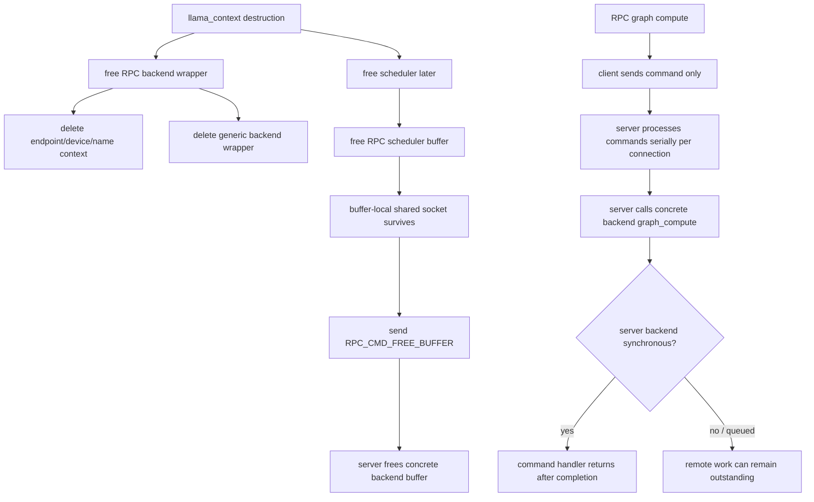

# RPC backend teardown and remote lifetime

> **Pinned baseline:** llama.cpp `e3546c7948e3af463d0b401e6421d5a4c2faf565`

## Result

> **Backend-before-scheduler destruction is structurally safe for the ordinary pinned RPC client objects, but remote work completion and buffer release remain conditional on the server backend.**

The client backend wrapper owns only endpoint/device/name metadata. Scheduler-owned RPC buffers retain their own shared socket and can still send `RPC_CMD_FREE_BUFFER` after the backend wrapper has been deleted. The RPC layer, however, does not add a universal remote synchronization boundary: graph requests are fire-and-forget at the protocol level, and the server calls its concrete backend's graph-compute entry point without following it with `ggml_backend_synchronize()`.

## Verified

### The client backend wrapper does not own the socket

`ggml_backend_rpc_context` contains only `endpoint`, `device`, and `name`. `ggml_backend_rpc_free()` deletes that small context and then the generic backend wrapper; it performs no network operation and no synchronization.

Source:

- [`ggml/src/ggml-rpc/ggml-rpc.cpp` — RPC context and free path](https://github.com/ggml-org/llama.cpp/blob/e3546c7948e3af463d0b401e6421d5a4c2faf565/ggml/src/ggml-rpc/ggml-rpc.cpp#L220-L230)
- [`ggml_backend_rpc_free()` and no-op synchronize](https://github.com/ggml-org/llama.cpp/blob/e3546c7948e3af463d0b401e6421d5a4c2faf565/ggml/src/ggml-rpc/ggml-rpc.cpp#L645-L654)

### RPC scheduler buffers keep the transport alive independently

Each RPC buffer context owns a `std::shared_ptr<socket_t>`, a cached base pointer, and the remote buffer handle. Allocation stores the socket in the buffer-local context. Buffer destruction sends `RPC_CMD_FREE_BUFFER` through that retained socket and deletes the local context only after the server acknowledges the command.

Source:

- [`ggml_backend_rpc_buffer_context`](https://github.com/ggml-org/llama.cpp/blob/e3546c7948e3af463d0b401e6421d5a4c2faf565/ggml/src/ggml-rpc/ggml-rpc.cpp#L226-L230)
- [`ggml_backend_rpc_buffer_free_buffer()`](https://github.com/ggml-org/llama.cpp/blob/e3546c7948e3af463d0b401e6421d5a4c2faf565/ggml/src/ggml-rpc/ggml-rpc.cpp#L384-L390)
- [RPC buffer allocation retains the socket](https://github.com/ggml-org/llama.cpp/blob/e3546c7948e3af463d0b401e6421d5a4c2faf565/ggml/src/ggml-rpc/ggml-rpc.cpp#L552-L568)

### Buffer types and device registrations outlive individual backends

RPC buffer types are cached in a function-static map and intentionally never freed. The endpoint/device metadata required to allocate later buffers therefore does not depend on a particular backend wrapper.

Source:

- [`ggml_backend_rpc_buffer_type()` static lifetime](https://github.com/ggml-org/llama.cpp/blob/e3546c7948e3af463d0b401e6421d5a4c2faf565/ggml/src/ggml-rpc/ggml-rpc.cpp#L741-L773)

### Client graph compute is protocol-asynchronous

`ggml_backend_rpc_graph_compute()` serializes a graph or sends a recompute request, calls the request-only overload of `send_rpc_cmd()`, and returns success. That overload writes the command and payload but receives no completion response. The RPC backend advertises no async tensor methods or events, while its synchronize callback is explicitly a no-op.

Source:

- [request-only `send_rpc_cmd()`](https://github.com/ggml-org/llama.cpp/blob/e3546c7948e3af463d0b401e6421d5a4c2faf565/ggml/src/ggml-rpc/ggml-rpc.cpp#L292-L305)
- [`ggml_backend_rpc_graph_compute()`](https://github.com/ggml-org/llama.cpp/blob/e3546c7948e3af463d0b401e6421d5a4c2faf565/ggml/src/ggml-rpc/ggml-rpc.cpp#L698-L720)
- [RPC backend interface](https://github.com/ggml-org/llama.cpp/blob/e3546c7948e3af463d0b401e6421d5a4c2faf565/ggml/src/ggml-rpc/ggml-rpc.cpp#L722-L739)

### The server serializes commands per connection, but does not universally wait for device completion

A client connection is handled by one receive/dispatch loop. The server does not read the next command until the current handler returns, so command handling is ordered on that connection. For graph commands, the handler calls `ggml_backend_graph_compute()` on the selected concrete backend and then returns without a generic `ggml_backend_synchronize()` call or completion reply.

Source:

- [`rpc_server::graph_compute()`](https://github.com/ggml-org/llama.cpp/blob/e3546c7948e3af463d0b401e6421d5a4c2faf565/ggml/src/ggml-rpc/ggml-rpc.cpp#L1325-L1393)
- [per-connection command loop and graph cases](https://github.com/ggml-org/llama.cpp/blob/e3546c7948e3af463d0b401e6421d5a4c2faf565/ggml/src/ggml-rpc/ggml-rpc.cpp#L1430-L1700)

### Remote allocation cleanup is session-scoped

The server tracks every allocated concrete backend buffer in a set. An explicit free command releases one buffer and erases it. If the connection ends first, the `rpc_server` destructor releases every buffer still registered for that client session.

Source:

- [`rpc_server::free_buffer()`](https://github.com/ggml-org/llama.cpp/blob/e3546c7948e3af463d0b401e6421d5a4c2faf565/ggml/src/ggml-rpc/ggml-rpc.cpp#L970-L981)
- [`rpc_server::~rpc_server()`](https://github.com/ggml-org/llama.cpp/blob/e3546c7948e3af463d0b401e6421d5a4c2faf565/ggml/src/ggml-rpc/ggml-rpc.cpp#L1424-L1428)

### Socket lifetime follows shared ownership

Sockets are cached as weak pointers per endpoint. Buffer contexts hold strong references. When the final strong reference disappears, `socket_t` destruction closes the TCP socket and releases optional RDMA resources.

Source:

- [`get_socket()` weak cache](https://github.com/ggml-org/llama.cpp/blob/e3546c7948e3af463d0b401e6421d5a4c2faf565/ggml/src/ggml-rpc/ggml-rpc.cpp#L351-L381)
- [`socket_t` ownership contract](https://github.com/ggml-org/llama.cpp/blob/e3546c7948e3af463d0b401e6421d5a4c2faf565/ggml/src/ggml-rpc/transport.h#L9-L33)
- [transport destructor closes socket and RDMA state](https://github.com/ggml-org/llama.cpp/blob/e3546c7948e3af463d0b401e6421d5a4c2faf565/ggml/src/ggml-rpc/transport.cpp#L118-L152)

## Interpretation

The ordinary client-side member order is structurally sound:

1. deleting the RPC backend wrapper does not invalidate scheduler RPC buffers;
2. those buffers own the socket required for later remote-release commands;
3. static buffer-type/device registration survives individual backend deletion.

The completion contract is weaker than the interface suggests. RPC exposes a no-op synchronize callback because it declares no client-side asynchronous operations, yet graph compute is only synchronous with respect to sending bytes. Whether remote compute has actually finished when the call returns depends on the concrete backend running inside the server.

Consequently, later `RPC_CMD_FREE_BUFFER` commands are ordered after the graph command in the server loop, but ordering is not the same as completion when the server backend queues accelerator work. Safety then inherits the server backend's own behavior during graph execution and buffer destruction.

## Historical

The pinned protocol uses request-only graph commands and a single command loop per client connection. Transport negotiation, RDMA support, graph reuse, error handling, and completion acknowledgements are revision-sensitive; newer RPC implementations must be evaluated separately.

## Open questions

- Should graph compute and recompute return an explicit completion/status response after server-side synchronization?
- Should `ggml_backend_rpc_synchronize()` send a real RPC command that calls `ggml_backend_synchronize()` on the server backend?
- Can a queued CUDA/SYCL server graph still reference a remote buffer when a following `RPC_CMD_FREE_BUFFER` destroys it?
- Do all concrete server buffer deleters establish a sufficient completion boundary, or are regression tests needed for immediate graph-compute → client teardown?
- How are connection loss and malformed-response aborts expected to interact with graceful application cleanup?
- Is sharing one socket across multiple client-side backend/buffer users externally serialized? `get_socket()` shares the connection, but the inspected send/receive helpers do not add a per-socket request mutex.

## Practical rule

Treat RPC teardown as a distributed synchronization problem, not only a local C++ ownership problem. Until remote synchronization is made explicit and tested, avoid destroying an RPC context immediately after submitting work that may execute asynchronously on the server accelerator.
