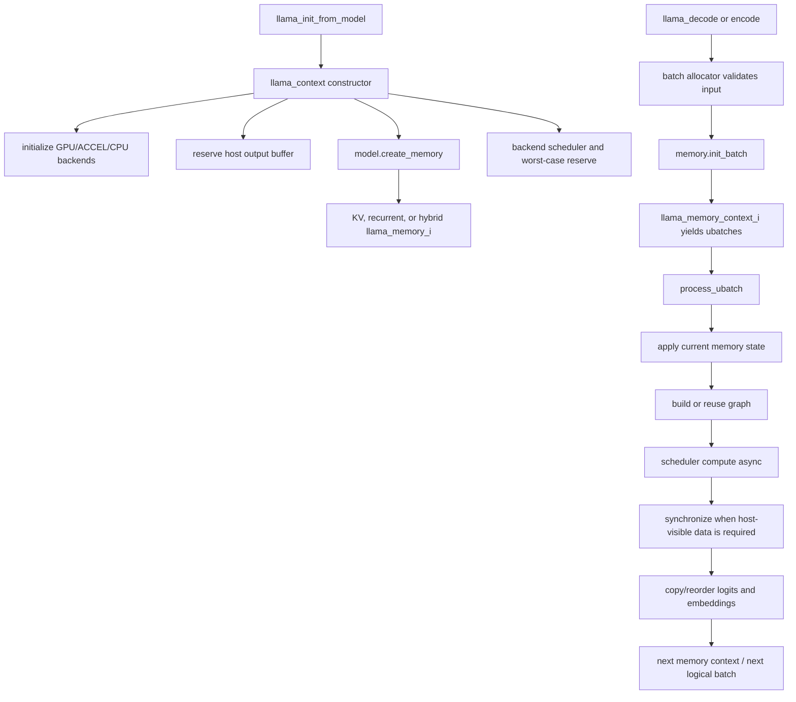

# Runtime context and memory — file-by-file Pass A

> **Evidence scope:** llama.cpp revision [`e3546c7948e3af463d0b401e6421d5a4c2faf565`](https://github.com/ggml-org/llama.cpp/tree/e3546c7948e3af463d0b401e6421d5a4c2faf565). Newer implementations may differ.

This page inventories the runtime-context and memory boundary: how a loaded `llama_model` becomes mutable inference state, how a logical batch is split into memory-aware microbatches, where KV/recurrent state lives, and which synchronization boundaries make outputs and state safe to reuse.

## Five-minute flow



The central design is a two-level memory abstraction:

- `llama_memory_i` owns persistent context memory and sequence operations;
- `llama_memory_context_i` is a temporary per-batch or per-update plan that exposes one `llama_ubatch` at a time and applies only the state associated with that microbatch.

## Files and responsibilities

| File | Primary responsibility | Important objects and entry points | Ownership / synchronization notes |
|---|---|---|---|
| [`src/llama-context.h`](https://github.com/ggml-org/llama.cpp/blob/e3546c7948e3af463d0b401e6421d5a4c2faf565/src/llama-context.h) | Runtime object schema and API | `llama_context`, `process_ubatch()`, `encode()`, `decode()`, `graph_compute()`, state I/O | Context references the model but owns scheduler, backend instances, memory module, output buffer, graph-result caches, and optional device copies of sequence memory. |
| [`src/llama-context.cpp`](https://github.com/ggml-org/llama.cpp/blob/e3546c7948e3af463d0b401e6421d5a4c2faf565/src/llama-context.cpp) | Construction, batch execution, output extraction, synchronization, teardown | constructor, `sched_reserve()`, `process_ubatch()`, `decode()`, `synchronize()`, output/state APIs | Initializes all participating backends, creates memory through the model, reserves worst-case compute graphs, submits asynchronous graph work, and synchronizes before host reads or destructive reuse. |
| [`src/llama-memory.h`](https://github.com/ggml-org/llama.cpp/blob/e3546c7948e3af463d0b401e6421d5a4c2faf565/src/llama-memory.h) | Common memory interfaces | `llama_memory_i`, `llama_memory_context_i`, `llama_memory_status` | The interface requires mutations to pass through `apply()`; sequence operations and state serialization are virtual and memory-type-specific. |
| [`src/llama-memory.cpp`](https://github.com/ggml-org/llama.cpp/blob/e3546c7948e3af463d0b401e6421d5a4c2faf565/src/llama-memory.cpp) | Shared status helpers and common glue | status combination/failure helpers | Hybrid memory can combine statuses while retaining explicit prepare-versus-compute failure information. |
| [`src/llama-kv-cache.h`](https://github.com/ggml-org/llama.cpp/blob/e3546c7948e3af463d0b401e6421d5a4c2faf565/src/llama-kv-cache.h) and `.cpp` | Attention KV storage, cell metadata, slot planning, shifts/copies, state I/O | `llama_kv_cache`, `llama_kv_cache_context`, `prepare()`, `find_slot()`, `apply_ubatch()`, `update()` | Owns GGML contexts plus backend buffers per cache storage class; metadata and tensor payloads have different lifetimes and clearing semantics. |
| [`src/llama-memory-recurrent.h`](https://github.com/ggml-org/llama.cpp/blob/e3546c7948e3af463d0b401e6421d5a4c2faf565/src/llama-memory-recurrent.h) and `.cpp` | Recurrent state for architectures that do not use only attention KV | recurrent memory object and batch context | State is sequence-oriented rather than a token-indexed K/V ring; exact tensors and update graphs are architecture-dependent. |
| Model-specific memory files such as `llama-kv-cache-iswa.*` and `llama-kv-cache-dsv4.*` | Hybrid or specialized memory behavior | implementations of the same interfaces | A single context can coordinate multiple memory forms; do not assume every architecture uses the ordinary KV cache unchanged. |

## Construction and ownership

`llama_context` stores `const llama_model & model`: it does not own the model. The model must outlive the context.

The context owns or controls these runtime resources:

| Resource | Member / abstraction | Lifetime |
|---|---|---|
| Runtime backends | `backends`, `backend_cpu` | Context construction through destruction |
| Backend scheduler and compute allocation | `sched`, backend buffer-type lists, expected sizes | Re-reservable; owned by context |
| Persistent inference memory | `llama_memory_ptr memory` | Created through `model.create_memory()`; context-owned |
| Output storage | `buf_output`, host views for logits/embeddings | Reallocated by output reservation; valid until subsequent operations resize or overwrite it |
| Graph metadata/cache | `gf_res_prev`, `gf_res_reserve` | Reused across compatible calls; context-owned |
| Batch allocator | `balloc` | Reused to avoid repeated host allocations |
| Thread pools | raw `threadpool` pointers | Attached resources are referenced, not necessarily owned by the context |
| Per-sequence saved device memory | `mem_storage` | Context-owned backend buffers used by state save/load paths |

The constructor normalizes context and batch parameters, initializes model devices plus accelerator and CPU backends, records supported `set_n_threads` hooks, reserves output storage, and asks the model to create the architecture-appropriate memory implementation. It then prepares backend buffer types and scheduler reservation state.

## Batch-to-memory execution contract

The memory interface makes batch preparation explicit:

```text
logical llama_batch
  -> llama_batch_allocr
  -> memory.init_batch(...)
  -> llama_memory_context_i
       - current ubatch
       - placement/update metadata
       - status
       - next()
       - apply()
  -> process_ubatch(...)
  -> graph compute
```

`llama_memory_context_i::apply()` is the designated mutation point. This prevents graph construction from silently committing cache metadata before the associated microbatch is actually accepted for execution.

A memory context can report:

- success;
- no pending update;
- failure while preparing memory state;
- failure while computing a memory update graph.

That distinction matters for rollback and diagnostics: inability to find KV slots is not the same failure as a backend error while shifting or copying existing state.

## Ordinary KV cache

`llama_kv_cache` combines two categories of state:

1. **Metadata:** cells, sequence ownership, positions, ring-search heads, layer maps, and pending stream-copy descriptions.
2. **Tensor payloads:** K/V tensors allocated in backend buffers, grouped with owning GGML contexts in `ctxs_bufs`.

`prepare()` finds storage for the generated ubatches. Each `slot_info` maps token positions to concrete cache-cell indices and streams. `apply_ubatch()` commits the ubatch metadata to those cells. During graph construction, `get_k()` and `get_v()` expose views of existing state, while `cpy_k()` and `cpy_v()` add graph operations that store newly computed tensors.

Pending shifts and sequence copies are not ordinary host `memcpy` operations. `init_update()` can construct a memory-update context whose graph performs required transformations on the backend that owns the cache tensors. Completion must be synchronized before a conflicting reuse or host-visible state operation.

## Recurrent and hybrid memory

The common interface exists because not every model is accurately represented by a conventional attention KV ring.

- Recurrent models preserve per-sequence hidden state and update it after each accepted microbatch.
- Hybrid architectures may combine ordinary attention KV, sliding-window variants, recurrent state, or architecture-specific caches.
- `llama_memory_status_combine()` supports composed memory contexts without erasing which component failed.

The graph builder therefore consumes a `llama_memory_context_i` rather than directly depending on one concrete cache class. Architecture code can request the views, inputs, and update operations appropriate to its memory type.

## Sequence mutation and state I/O

The public sequence operations delegate to the active `llama_memory_i` implementation:

- remove a position range;
- copy one sequence range to another;
- keep one sequence and discard others;
- add or divide positions;
- query minimum and maximum positions;
- clear metadata, optionally clearing tensor data too.

State serialization is also memory-polymorphic. The context writes general runtime data and then asks the active memory object to serialize either all sequences or a selected sequence. Device-resident memory may require temporary backend buffers or synchronization before bytes are exposed to host I/O.

## Threads and synchronization

The context may reference separate thread pools for single-token and batched work. `set_n_threads()` forwards counts only to backends that expose the optional backend procedure. This means thread configuration is backend capability, not a universal direct control over every accelerator.

Important boundaries are:

1. scheduler allocation or copy-ring reuse may wait on prior events;
2. memory-update graphs must complete before conflicting metadata/data reuse;
3. `synchronize()` makes queued backend work complete for host-visible output/state access;
4. output extraction may issue backend-to-host copies and must respect their completion;
5. destruction must release scheduler and backend resources only after pending use has ended.

An API or backend function containing `async` indicates submission semantics, not proof that the application can immediately read results.

## Reset and teardown

A logical reset has layers:

- clearing sequence/cell metadata;
- optionally zeroing or discarding backing tensor data;
- invalidating graph reuse when shape, adapters, attention mode, samplers, or memory configuration changes;
- releasing output views and cached graph results;
- destroying scheduler before the backend objects it references;
- destroying context-owned memory buffers while the required backends remain valid.

The declaration order in `llama_context` is relevant because C++ destroys members in reverse declaration order. The pinned source should be checked again whenever members move: scheduler, graph results, backend buffers, memory implementations, and backend instances can contain cross-references that impose a destruction dependency.

## Backend and OS variants

| Variant | Runtime-memory consequence |
|---|---|
| CPU-only | KV/recurrent tensors and activations are host-addressable, but asynchronous thread-pool work can still require synchronization. |
| GPU offload | Persistent model weights may be on one device while context memory or individual graph operations use another; scheduler copies can bridge them. |
| Unified/shared memory | Addressability does not prove coherence or completion. Queue/event ordering still matters. |
| Mmap-backed model weights | Model pages remain an OS-managed lifetime separate from context-owned KV/recurrent buffers. Page faults during compute do not make the KV cache mmap-backed. |
| Multi-backend | Memory views, graph inputs, and outputs may cross backend boundaries through scheduler-managed copies. |

## Truth labels

### Verified

- `llama_context` holds a non-owning model reference and owns its mutable memory module, scheduler, backend instances, output buffer, graph-result caches, and batch allocator.
- The constructor initializes GPU/device, accelerator, and CPU backends, then creates the memory implementation through `model.create_memory()`.
- `llama_memory_i` defines batch preparation, full-cache simulation, pending-update preparation, sequence operations, memory accounting, and state I/O.
- `llama_memory_context_i::apply()` is the intended mutation point for the current microbatch.
- `llama_kv_cache` owns backend-buffer-backed K/V tensors and separate cell/sequence metadata.
- KV slot planning maps each token in an ubatch to concrete cell indices before graph execution.

### Interpretation

- The memory context acts like a small transaction plan: prepare candidate state, apply it for the current ubatch, compute, then advance.
- Context memory is best treated as a polymorphic subsystem rather than as a field named “KV cache”; recurrent and hybrid implementations change both storage and update semantics.
- A successful graph submission is not equivalent to committed host-visible output or safely serializable state.

### Historical

- Memory interfaces, unified/multi-stream KV behavior, specialized caches, graph reuse, and output/sampler integration are revision-sensitive. This inventory describes the pinned baseline only.

### Open questions

- Enumerate every concrete `llama_memory_i` subclass at the pinned revision and map each model architecture to its selected implementation.
- Trace exact constructor and destructor order for scheduler, memory, graph-result, output-buffer, and backend members with failure-injection tests.
- Establish the strongest upstream contract for concurrent calls on one context and for sharing one model across contexts.
- Measure KV/recurrent allocation, update-graph cost, scheduler copy bytes, event waits, and host state-save synchronization on CPU-only and offloaded runs.
- Document specialized iSWA and DeepSeek-V4 cache layouts in separate bounded pages.

## Related pages

- [Public API and minimal example](public-api-minimal-example.md)
- [Model and GGUF loader Pass A](model-gguf-loader-pass-a.md)
- [`llama_context` object](../objects/llama-context.md)
- [Memory lifetimes](../foundations/memory-lifetimes.md)
- [Decode and graph reuse](../lifecycle/decode-graph-reuse.md)
- [Backend scheduler execution](../lifecycle/backend-scheduler-execution.md)
