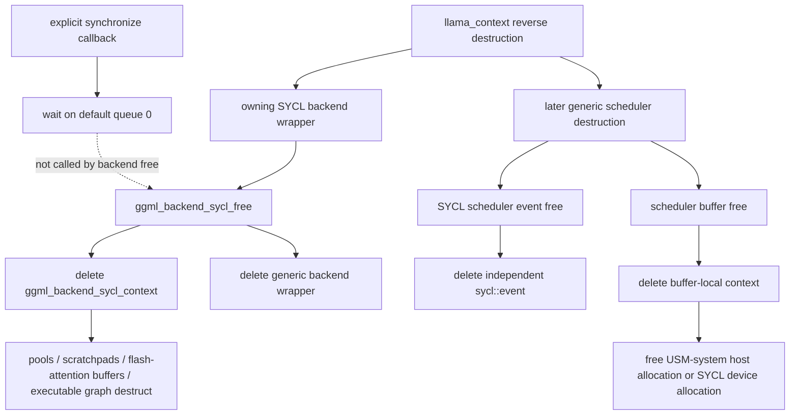

# SYCL backend teardown

This page audits the ordinary SYCL backend at llama.cpp revision [`e3546c7948e3af463d0b401e6421d5a4c2faf565`](https://github.com/ggml-org/llama.cpp/tree/e3546c7948e3af463d0b401e6421d5a4c2faf565). It asks whether the pinned `llama_context` member order can destroy an individual SYCL backend wrapper before the generic scheduler without invalidating queued work, scheduler events, or scheduler buffers.

## Classification

> **Backend-before-scheduler destruction is structurally independent for ordinary SYCL scheduler events and buffers, but queued-work completion is conditional at the pinned revision.**

The event and buffer deleters do not require the deleted per-backend context. However, `ggml_backend_sycl_free()` deletes the context without first waiting for its queue, while graph execution and asynchronous tensor transfers enqueue work. An explicit `ggml_backend_synchronize()` before context destruction is therefore the clearest safe application boundary.

## Teardown map



## Verified

### Backend free does not establish a queue-completion boundary

[`ggml_backend_sycl_free()`](https://github.com/ggml-org/llama.cpp/blob/e3546c7948e3af463d0b401e6421d5a4c2faf565/ggml/src/ggml-sycl/ggml-sycl.cpp) obtains the per-backend context, deletes it, and then deletes the generic backend wrapper. It contains no explicit queue `wait()` or `wait_and_throw()` call.

The SYCL backend does expose [`ggml_backend_sycl_synchronize()`](https://github.com/ggml-org/llama.cpp/blob/e3546c7948e3af463d0b401e6421d5a4c2faf565/ggml/src/ggml-sycl/ggml-sycl.cpp), which waits on `sycl_ctx->stream(sycl_ctx->device, 0)`. That callback is available to callers, but backend free does not invoke it.

### Compute and asynchronous transfers can still be queued

The backend interface exposes asynchronous tensor set/get functions. Those functions submit `queue::memcpy()` operations without waiting before returning.

Graph execution walks the GGML nodes and submits SYCL kernels. When command graphs are enabled, the finalized executable graph is submitted with `ext_oneapi_graph()` and graph compute returns success without a host wait. Therefore return from graph compute is not a general host-completion guarantee.

### Context state borrows device-manager queues

`ggml_backend_sycl_context` stores queue pointers in `qptrs`. Its `stream()` helper points entries at `dpct::get_device(device).default_queue()`; the context does not allocate or delete those queue objects. The context also owns lazily created pools, host pools, scratchpad allocations, flash-attention buffers, and optionally an executable command graph through C++ members.

Deleting the context destroys those owned members, but the source contains no explicit destructor that first waits for all work using them.

### Scheduler events are independent objects

A SYCL scheduler event owns a separately allocated `sycl::event`. `ggml_backend_sycl_device_event_free()` ignores the device argument, deletes the `sycl::event`, and then deletes the generic event wrapper. It does not dereference the deleted per-backend `ggml_backend_sycl_context`.

Event record submits an `ext_oneapi_submit_barrier()` to the backend queue and stores the resulting event. Event synchronization calls `sycl::event::wait()`.

### Ordinary scheduler buffers retain buffer-local state

An ordinary SYCL buffer owns `ggml_backend_sycl_buffer_context`, which stores:

- device id;
- allocation pointer;
- pointer to the persistent default queue;
- tensor-extra allocations;
- whether the allocation uses USM system memory.

Its destructor frees an aligned host allocation for USM-system mode or calls `ggml_sycl_free_device(dev_ptr, *stream)` for device memory, then releases tensor extras. The free path does not use the deleted per-backend context.

SYCL buffer-type objects are function-static arrays. Their contexts retain device ids and pointers to device-manager default queues, so individual backend-wrapper deletion does not remove the buffer-type object.

### Split buffers also retain their own release state

The split-buffer context owns tensor-extra records and queue pointers. Its destructor calls `release_extra_gpu()` for each tensor extra. This is likewise structurally independent of an individual backend wrapper, although completion before resource release still depends on the concrete queue/event behavior.

## Interpretation

The lifetime result has two separate dimensions:

1. **Object reachability:** later scheduler event and buffer deleters retain enough device-level or buffer-local state to run after the backend wrapper is gone.
2. **Queued-work completion:** the pinned backend-free function does not itself prove that queued kernels, copies, command graphs, pool allocations, and tensor-extra resources are no longer in use.

The first property is verified. The second remains conditional. This makes ordinary SYCL closer to the audited CUDA result than to Metal or Vulkan, whose backend free paths explicitly synchronize before releasing context-owned resources.

## Historical

SYCL queue ownership, command-graph support, asynchronous allocation extensions, Level Zero integration, and buffer implementations are revision- and compiler-dependent. This classification applies only to the pinned revision and ordinary paths inspected here.

## Open questions

- Does destruction of the oneAPI/DPC++ pool, command-graph, or USM allocation objects implicitly wait for outstanding commands on every supported runtime, and is that behavior a documented portable contract?
- Does waiting only on `stream(device, 0)` cover every queue used by multi-device, split-buffer, DNNL, flash-attention, and optional communication paths?
- Should backend free explicitly call `wait_and_throw()` on every referenced device-manager queue before member destruction?
- Are there regression tests that submit asynchronous SYCL work and immediately destroy `llama_context`?
- Do optional host-buffer and split-buffer paths require stronger ordering than the ordinary buffer path?

## Practical rule

Before destroying a context that used SYCL asynchronously, establish an explicit completion boundary:

```cpp
llama_synchronize(ctx);
llama_free(ctx);
```

This does not replace backend-specific lifetime testing, but it avoids relying on implicit queue or allocation destructor behavior.

## Source map

| Concern | Pinned source |
|---|---|
| backend free, async copies, synchronize, graph compute, events | [`ggml/src/ggml-sycl/ggml-sycl.cpp`](https://github.com/ggml-org/llama.cpp/blob/e3546c7948e3af463d0b401e6421d5a4c2faf565/ggml/src/ggml-sycl/ggml-sycl.cpp) |
| context queue pointers, pools, scratchpads, flash-attention buffers, command graph | [`ggml/src/ggml-sycl/common.hpp`](https://github.com/ggml-org/llama.cpp/blob/e3546c7948e3af463d0b401e6421d5a4c2faf565/ggml/src/ggml-sycl/common.hpp) |
| generic scheduler destruction dependencies | [Scheduler core teardown](scheduler-teardown-core.md) |
| context member destruction order | [Model and context teardown order](model-context-teardown-order.md) |
