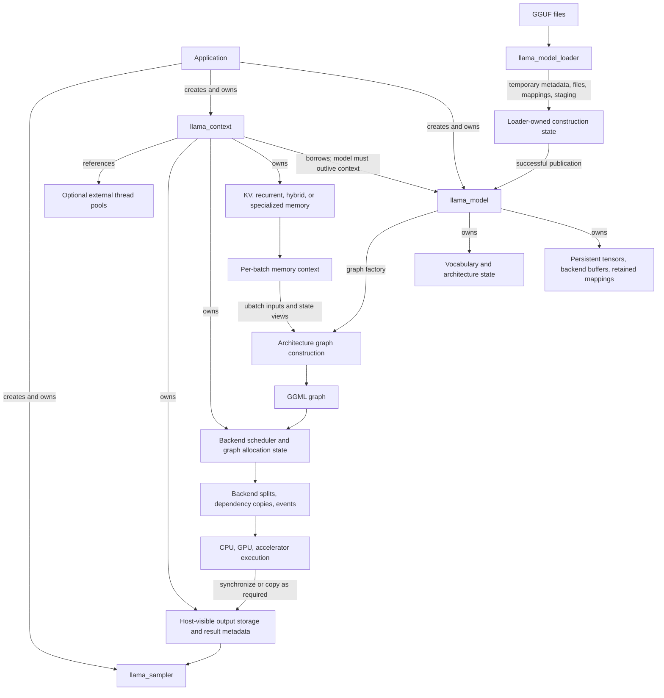

# System ownership and execution map

This page synthesizes the public API, model/GGUF loader, `llama_model`, `llama_context`, and polymorphic memory documentation into one source-pinned relationship map.

> **Evidence scope:** llama.cpp revision [`e3546c7948e3af463d0b401e6421d5a4c2faf565`](https://github.com/ggml-org/llama.cpp/tree/e3546c7948e3af463d0b401e6421d5a4c2faf565). Newer upstream behavior must be documented separately.

## Five-minute view

llama.cpp crosses several ownership domains during one inference session:

1. the application owns the returned model, context, and sampler handles;
2. a temporary loader parses GGUF metadata, indexes source tensors, allocates destination storage, and publishes successful results into `llama_model`;
3. `llama_model` owns persistent architecture, vocabulary, weight tensors, backend buffers, and retained mappings;
4. `llama_context` borrows the model and owns mutable runtime state, scheduler resources, outputs, and a polymorphic memory implementation;
5. each encode or decode prepares a logical batch, obtains temporary memory-planning state, builds or reuses a graph allocation, submits scheduler work, commits memory changes at the defined boundary, and exposes outputs after required synchronization;
6. teardown proceeds from dependent mutable objects back toward persistent model storage.



## Ownership is not the same as access

A pointer or tensor reference does not establish ownership. The important boundaries are:

| Resource | Primary owner | Common borrowers | Publication or validity boundary | Release boundary |
|---|---|---|---|---|
| GGUF file handles and parse contexts during loading | `llama_model_loader` | GGUF parser, tensor indexer | Metadata and tensor descriptors validated | Loader destruction or successful transfer of retained resources |
| Source mappings created during loading | Loader initially; selected mappings transfer to `llama_model` | Tensor population and mapped host-pointer buffers | Mapping exists; physical pages may still be absent | Model destruction for retained mappings; loader cleanup otherwise |
| Persistent model tensors and backend buffers | `llama_model` | Context graphs and backends | Tensor bytes populated and pending uploads synchronized | `llama_model` destruction after all contexts |
| Vocabulary and hyperparameters | `llama_model` | Tokenization, graph builders, context, sampler helpers | Model loading completed | Model destruction |
| `llama_model` reference inside context | Application owns model; context borrows it | Context methods and graph builders | Model remains alive | Context must be destroyed before model |
| KV/recurrent/hybrid memory | `llama_context` through `llama_memory_i` | Per-batch memory context and graph builder | Allocation initialized; updates become valid at memory apply/compute boundaries | Context destruction or explicit reset/mutation |
| Per-batch memory plan | Temporary memory-context object | Graph construction and ubatch loop | `apply()` commits the current planned mutation | End of batch/update operation |
| Graph metadata and activation allocation | Context/scheduler-managed runtime state | Scheduler and backends | Compatible graph allocated or reused | Reallocation, context destruction, or scheduler teardown |
| Scheduler copy destinations and events | Scheduler | Backend split execution | Prior use completed before ring slot reuse | Scheduler destruction |
| Output buffers and result indexes | Context | Output accessors and sampler | Required backend work copied/synchronized to visible storage | Next output reconfiguration or context destruction |
| Attached thread pools | External caller unless explicitly created internally | CPU backend execution | Pool remains valid while attached | External owner after detachment/context teardown |

## Construction path

### 1. Public API and loader transaction

```text
llama_model_load_from_file()
  -> construct llama_model_loader
  -> parse first GGUF with no_alloc = true
  -> discover and validate split files
  -> build unified tensor-name -> source descriptor index
  -> create architecture-specific llama_model
  -> load hyperparameters and vocabulary
  -> declare destination tensors
  -> select devices and backend buffer types
  -> allocate destination buffers
  -> map, read, alias, copy, or upload tensor bytes
  -> synchronize pending staging uploads
  -> transfer retained mappings and buffers into llama_model
  -> return caller-owned llama_model *
```

The loader is a transaction boundary: temporary parse, file, mapping, staging, and partially allocated state must not become persistent model state until construction succeeds.

### 2. Model publication

After successful loading, `llama_model` is the persistent owner of:

- architecture and hyperparameters;
- vocabulary;
- per-layer weight-role records;
- destination tensor metadata;
- backend buffers;
- mappings needed by mapped tensor storage;
- architecture-specific graph and memory factories.

A model can be reused by more than one separately created context, but this ownership fact alone is not a complete thread-safety guarantee.

### 3. Context construction

```text
llama_init_from_model(model, params)
  -> construct llama_context with a non-owning model reference
  -> initialize runtime backend instances and control hooks
  -> create backend scheduler
  -> reserve or initialize output storage
  -> model.create_memory(...)
  -> create graph-result caches and reusable batch state
  -> return caller-owned llama_context *
```

Context construction does not copy the whole model. It creates mutable execution state that references model-owned weights and backend storage.

## Decode and encode execution path

```mermaid
sequenceDiagram
    participant A as Application
    participant C as llama_context
    participant M as llama_memory_i
    participant MC as memory context
    participant G as model graph builder
    participant S as backend scheduler
    participant B as backend(s)

    A->>C: llama_decode(batch) / llama_encode(batch)
    C->>C: validate and normalize logical batch
    C->>M: init_batch / init_update
    M-->>C: temporary memory context
    loop each ubatch
        C->>MC: next ubatch and state views
        C->>G: build graph or select compatible reuse path
        G-->>C: GGML graph over model weights and runtime state
        C->>MC: apply planned mutation boundary
        C->>S: allocate/reuse graph and submit
        S->>S: backend assignment, splits, dependency copies
        S->>B: asynchronous or synchronous execution
        B-->>S: completion events/status
    end
    C->>S: synchronize/copy outputs when required
    S-->>C: host-visible results
    C-->>A: status; output accessors become usable
```

### Mutation boundary

`llama_memory_context_i::apply()` separates planning from committed mutation. Before that point, slot selection or recurrent-state preparation can be treated as candidate state for the current ubatch. Graph execution may then write new K/V or recurrent values into backend-backed storage.

This boundary matters for failures: a rejected batch, allocation failure, or graph-build failure should not be described as though all planned memory changes were already durable.

### Graph build and reuse

Architecture code creates GGML operation tensors and dependency edges over:

- model-owned weight tensors;
- current input tensors;
- memory-state views;
- temporary activations;
- output tensors.

A compatible reuse path can preserve graph topology and scheduler allocation. It does not preserve token values, outputs, or the semantic validity of prior backend copies. Each decode still supplies new inputs and updates mutable memory.

### Scheduler and backend boundary

The scheduler is an execution planner and owner of scheduling resources, not the owner of persistent model weights. It:

- assigns graph nodes to backends;
- partitions the graph into executable splits;
- creates or reuses dependency-copy destinations;
- coordinates events and fallback synchronization;
- submits backend graph work;
- ensures resources are not reused while prior queued work still depends on them.

Backend behavior differs:

- CPU execution generally consumes host-addressable tensors directly and uses configured thread pools;
- mmap-backed CPU tensors can fault pages into RAM on first access;
- shared or unified buffers can reduce explicit copies without proving physical residency, coherence, or completion;
- discrete accelerators require valid uploaded model data and may require cross-backend activation copies;
- asynchronous submission requires later synchronization before host-visible outputs, state serialization, conflicting mutation, or teardown.

## Memory and operating-system boundaries

The following states must remain separate:

```text
logical ownership
!= virtual mapping
!= physical page residency
!= destination buffer allocation
!= destination data validity
!= queued command completion
```

Examples:

- `llama_model` can own a valid mmap range while some file pages are not resident in RAM;
- a scheduler copy destination can be allocated but still contain stale data from an earlier copy-ring generation;
- a GPU tensor buffer can exist before an upload event has completed;
- context output storage can be allocated before the current decode result is host-visible.

Consequently, RSS or a logical cache-hit counter is not a per-tensor proof of residency or backend-copy validity.

## Prefill, decode, and memory-update variants

| Path | Shared structure | Material differences |
|---|---|---|
| Prompt prefill | Public `llama_decode`, context memory, graph builder, scheduler | Larger batches, broader attention work, different graph dimensions, larger activation traffic |
| One-token decode | Same public API and persistent owners | Small graph dimensions, repeated memory growth/update, stronger sensitivity to launch/copy/page-fault overhead |
| Encoder execution | Context and scheduler machinery | Architecture-specific encoder graph, output and decoder-start handling |
| KV memory update | Memory interface and scheduler | May build a dedicated shift/copy graph before ordinary inference |
| Recurrent memory | Same polymorphic memory boundary | State tensors and update semantics differ from an attention KV ring |
| Hybrid or iSWA memory | Same context-level interface | Multiple memory regions or policies can coexist and have architecture-specific reuse rules |
| CPU-only | Same model/context API | Host buffers, mmap faults, CPU thread scheduling, no device transfer for ordinary ops |
| Partial GPU offload | Same model/context API | Persistent placement split, scheduler graph splits, cross-backend dependency copies |
| Multi-backend | Same scheduler abstraction | More copy edges, event dependencies, compatibility checks, and teardown ordering |

## Output visibility and sampling

A successful graph submission is not automatically equivalent to a host-visible result. Before sampling or state export, llama.cpp must satisfy the relevant backend boundary through synchronization, an explicit backend-to-host copy, or an API path that performs that work internally.

The sampler is separately owned by the application. It consumes context output data but does not own the model, context, or output buffers.

## Teardown dependency order

The safe application-level order is:

```text
stop new work
-> ensure queued work no longer uses temporary application buffers
-> free sampler
-> free llama_context
     -> finish or synchronize pending backend use as required
     -> release outputs and graph-result state
     -> release scheduler copies/events and scheduler allocation
     -> release KV/recurrent/hybrid memory buffers
     -> release context-owned backend instances
-> free llama_model
     -> release persistent backend buffers
     -> unmap retained GGUF ranges
     -> release vocabulary and architecture state
```

C++ member destruction occurs in reverse declaration order, so exact member ordering must be verified before making stronger claims about internal teardown dependencies. The dependency rule that is already clear is that no context or queued context work may continue using a destroyed model.

## Cross-subsystem invariants

1. The model must outlive every context that references it.
2. Caller-backed batch arrays must remain valid for the API call that consumes them.
3. Temporary loader resources transfer to the model only on successful publication.
4. A valid virtual address does not imply physical page residency.
5. A buffer allocation does not imply current data validity.
6. Asynchronous submission does not imply host visibility or safe resource reuse.
7. Memory planning and memory mutation are separate phases.
8. Graph reuse preserves compatible structure/allocation, not prior inputs or outputs.
9. Scheduler-owned copies and events must outlive the queued work that uses them.
10. Context teardown must precede model teardown.

## Source map

- [`examples/simple/simple.cpp`](https://github.com/ggml-org/llama.cpp/blob/e3546c7948e3af463d0b401e6421d5a4c2faf565/examples/simple/simple.cpp)
- [`include/llama.h`](https://github.com/ggml-org/llama.cpp/blob/e3546c7948e3af463d0b401e6421d5a4c2faf565/include/llama.h)
- [`src/llama.cpp`](https://github.com/ggml-org/llama.cpp/blob/e3546c7948e3af463d0b401e6421d5a4c2faf565/src/llama.cpp)
- [`src/llama-model-loader.cpp`](https://github.com/ggml-org/llama.cpp/blob/e3546c7948e3af463d0b401e6421d5a4c2faf565/src/llama-model-loader.cpp)
- [`src/llama-model.cpp`](https://github.com/ggml-org/llama.cpp/blob/e3546c7948e3af463d0b401e6421d5a4c2faf565/src/llama-model.cpp)
- [`src/llama-context.cpp`](https://github.com/ggml-org/llama.cpp/blob/e3546c7948e3af463d0b401e6421d5a4c2faf565/src/llama-context.cpp)
- [`src/llama-memory.h`](https://github.com/ggml-org/llama.cpp/blob/e3546c7948e3af463d0b401e6421d5a4c2faf565/src/llama-memory.h)
- [`src/llama-kv-cache.cpp`](https://github.com/ggml-org/llama.cpp/blob/e3546c7948e3af463d0b401e6421d5a4c2faf565/src/llama-kv-cache.cpp)
- [`ggml/src/ggml-backend.cpp`](https://github.com/ggml-org/llama.cpp/blob/e3546c7948e3af463d0b401e6421d5a4c2faf565/ggml/src/ggml-backend.cpp)

## Related project pages

- [Public API and minimal example](public-api-minimal-example.md)
- [Model and GGUF loader Pass A](model-gguf-loader-pass-a.md)
- [Runtime context and memory Pass A](runtime-context-memory-pass-a.md)
- [`llama_model`](../objects/llama-model.md)
- [`llama_context`](../objects/llama-context.md)
- [GGUF file anatomy](../foundations/gguf-file-anatomy.md)
- [Model tensor placement](../foundations/model-tensor-placement.md)
- [Memory lifetimes](../foundations/memory-lifetimes.md)
- [Graph construction and MoE](../ggml/graph-construction-and-moe.md)
- [Backend scheduler execution](../lifecycle/backend-scheduler-execution.md)

## Verified

- The public example owns model, context, and sampler handles and destroys the context before the model.
- Successful model loading transfers persistent tensor buffers and required mappings into `llama_model`.
- `llama_context` stores a non-owning model reference and owns mutable runtime state including memory and scheduler resources.
- The memory interface separates persistent memory ownership from temporary per-batch planning and exposes `apply()` as the mutation boundary.
- Graph execution can span multiple backends and require scheduler-managed copies, events, and synchronization.
- Mapped model storage, context-owned sequence memory, graph activations, scheduler copies, and outputs have distinct owners and lifetimes.

## Interpretation

- `llama_model_loader` is best understood as a transactional publisher from parsed file state into a reusable loaded-model object.
- `llama_context` is a mutable execution session around a borrowed model, not a second copy of the model.
- The scheduler is an execution planner and owner of scheduling resources, not the persistent owner of weights or sequence memory.
- The per-batch memory context behaves like a transaction plan: prepare candidate state, apply the current ubatch, execute, then advance.
- Most memory-debugging mistakes come from conflating ownership, addressability, residency, data validity, and completion.

## Historical

- Public API fields, model factories, memory implementations, graph-reuse predicates, scheduler split/copy behavior, and backend synchronization evolve quickly.
- The exact architecture-to-memory mapping and backend-copy implementation must be rechecked when moving away from the pinned revision.
- Older examples and scheduler discussions can explain design history but must not silently replace baseline behavior.

## Open questions

- What exact declaration and reverse-destruction order governs model mappings, buffers, context scheduler state, memory, graph results, outputs, and backend instances?
- Which public or maintainer-authored contract defines safe model sharing across contexts and concurrent access to one context?
- Which output and state APIs synchronize internally at the pinned revision?
- How does every concrete `llama_memory_i` implementation map to supported architectures?
- Which scheduler graph-copy destinations remain valid across reused graphs, and what invalidates them?
- What runtime instrumentation best separates page faults, direct reads, uploads, dependency copies, event waits, memory-update graphs, and output synchronization?

## Next increment

Trace backend scheduler internals file by file: graph assignment, split creation, copy-ring allocation, destination validity, events, asynchronous submission, fallback synchronization, graph-allocation reuse, and teardown across CPU and accelerator backends.
