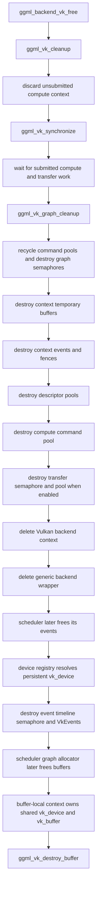

# Vulkan backend teardown

This page finishes the pinned Vulkan teardown audit started in [Vulkan command lifetimes](vulkan-command-lifetime.md). It follows queued work from backend destruction through context cleanup, scheduler event destruction, and allocator-backed buffer release.

> **Pinned source:** llama.cpp [`e3546c7948e3af463d0b401e6421d5a4c2faf565`](https://github.com/ggml-org/llama.cpp/commit/e3546c7948e3af463d0b401e6421d5a4c2faf565)

## Classification

> **Backend-before-scheduler destruction is verified safe for the ordinary pinned Vulkan backend resources inspected here.**
>
> `ggml_backend_vk_free()` calls `ggml_vk_cleanup()`, and cleanup explicitly synchronizes submitted compute and transfer work before destroying context-owned pools, synchronization objects, and temporary buffers. Scheduler events and Vulkan buffers retain device-level or buffer-local ownership that remains valid after the individual backend wrapper and backend context are deleted.

This is a source-level lifetime classification, not a claim that arbitrary application-owned Vulkan resources may be destroyed without their own synchronization.

## Teardown map

## Verified

### Backend free establishes a completion boundary

`ggml_backend_vk_free()` does not merely delete the wrapper. It calls `ggml_vk_cleanup(ctx)` first, then deletes the backend context and wrapper. The cleanup path resets the current unsubmitted compute context, calls `ggml_vk_synchronize(ctx)` to wait for pending submitted work, and only then enters graph cleanup and resource destruction. [Source](https://github.com/ggml-org/llama.cpp/blob/e3546c7948e3af463d0b401e6421d5a4c2faf565/ggml/src/ggml-vulkan/ggml-vulkan.cpp#L15106-L15152) [backend entry](https://github.com/ggml-org/llama.cpp/blob/e3546c7948e3af463d0b401e6421d5a4c2faf565/ggml/src/ggml-vulkan/ggml-vulkan.cpp#L15437-L15445)

The distinction between unsubmitted and submitted work matters:

- resetting `compute_ctx` discards command recording that was never submitted;
- `ggml_vk_synchronize()` covers work that has already reached Vulkan queues;
- resource destruction occurs after that completion boundary.

### Context-owned destruction order is explicit

After synchronization, cleanup performs these major steps in source order:

1. graph cleanup recycles completed compute and transfer command pools;
2. graph-local binary and timeline semaphores are destroyed;
3. preallocated scratch and staging buffers are destroyed;
4. context-owned Vulkan events are destroyed;
5. the ordinary and “almost ready” fences are destroyed;
6. descriptor pools are destroyed and descriptor bookkeeping is cleared;
7. the compute command pool is destroyed;
8. when the asynchronous transfer queue is active, its semaphore and command pool are destroyed.

[Source](https://github.com/ggml-org/llama.cpp/blob/e3546c7948e3af463d0b401e6421d5a4c2faf565/ggml/src/ggml-vulkan/ggml-vulkan.cpp#L15068-L15152)

The performance query pool is created and replaced in graph compute when performance logging is enabled. The inspected cleanup body does not contain an explicit `destroyQueryPool(ctx->query_pool)` call. [Creation path](https://github.com/ggml-org/llama.cpp/blob/e3546c7948e3af463d0b401e6421d5a4c2faf565/ggml/src/ggml-vulkan/ggml-vulkan.cpp#L16271-L16289)

### Scheduler events do not depend on the deleted backend context

Vulkan scheduler events are created through the backend device interface. Each event owns:

- a timeline semaphore;
- zero or more reusable/submitted `VkEvent` objects;
- bookkeeping for the command buffer associated with its latest record.

The event free callback resolves the Vulkan device through the persistent backend-device context, destroys the event-owned timeline semaphore and Vulkan events, and then deletes the event wrappers. It does not dereference an individual `ggml_backend_vk_context`. [Source](https://github.com/ggml-org/llama.cpp/blob/e3546c7948e3af463d0b401e6421d5a4c2faf565/ggml/src/ggml-vulkan/ggml-vulkan.cpp#L17761-L17801)

Backend-device objects are stored in a function-static vector created by the registry, so deleting one backend wrapper does not delete the device object used later by scheduler event destruction. [Source](https://github.com/ggml-org/llama.cpp/blob/e3546c7948e3af463d0b401e6421d5a4c2faf565/ggml/src/ggml-vulkan/ggml-vulkan.cpp#L17909-L17940)

### Scheduler buffers retain their own device lifetime

A Vulkan buffer allocation constructs a buffer-local context from a shared `vk_device` and the allocated `vk_buffer`. Its free callback calls `ggml_vk_destroy_buffer(ctx->dev_buffer)` and deletes that buffer-local context. The path does not require the deleted backend context or backend wrapper. [Allocation](https://github.com/ggml-org/llama.cpp/blob/e3546c7948e3af463d0b401e6421d5a4c2faf565/ggml/src/ggml-vulkan/ggml-vulkan.cpp#L15316-L15330) [free](https://github.com/ggml-org/llama.cpp/blob/e3546c7948e3af463d0b401e6421d5a4c2faf565/ggml/src/ggml-vulkan/ggml-vulkan.cpp#L15182-L15187)

Because the buffer context retains a shared device object, scheduler graph-allocation buffers remain destructible after the individual backend context has been released.

### Event recording is asynchronous, but backend cleanup waits

`ggml_backend_vk_event_record()` submits a command buffer, sets `submit_pending`, records the command-buffer generation, and resets the current compute context. The backend interface exposes `ggml_vk_synchronize` as its synchronization callback. [Event record](https://github.com/ggml-org/llama.cpp/blob/e3546c7948e3af463d0b401e6421d5a4c2faf565/ggml/src/ggml-vulkan/ggml-vulkan.cpp#L16910-L16946) [interface](https://github.com/ggml-org/llama.cpp/blob/e3546c7948e3af463d0b401e6421d5a4c2faf565/ggml/src/ggml-vulkan/ggml-vulkan.cpp#L16962-L16979)

The asynchronous nature of recording therefore does not weaken the teardown classification: backend cleanup invokes the completion boundary before destroying context-owned submission state.

## Interpretation

- Vulkan is closer to the pinned Metal teardown contract than the pinned CUDA-family contract: backend free itself explicitly calls the backend synchronization routine before releasing context-owned queue resources.
- The scheduler’s later event and buffer deleters are structurally independent of the deleted per-backend context because they retain device-registry or buffer-local state.
- Destroying a scheduler event without synchronizing that event individually is safe here only because backend cleanup has already waited for backend-submitted work before the scheduler is destroyed.

## Historical

- This classification is revision-pinned. Vulkan queue topology, transfer-queue policy, event implementation, command-pool ownership, and registry lifetime may change.
- Later llama.cpp revisions must be re-audited rather than inheriting this result.

## Open questions

- Is the performance query pool intentionally device-lifetime state, automatically managed elsewhere, or missing an explicit destruction call in this pinned cleanup path?
- Do validation-layer or sanitizer tests exercise immediate `llama_context` destruction after asynchronous Vulkan submission?
- Should an upstream regression test encode the backend-before-scheduler order currently implied by `llama_context` member declaration order?
- How do device-registry and `vk_instance` process-exit teardown paths release persistent pipelines, allocators, host mappings, and the logical Vulkan device?

## Practical rule

Even though the ordinary pinned Vulkan backend establishes its own cleanup synchronization, application code should still use an explicit inference completion boundary before destroying shared or externally managed resources. Backend cleanup protects backend-owned teardown; it cannot prove completion for unrelated Vulkan work submitted by the application.
