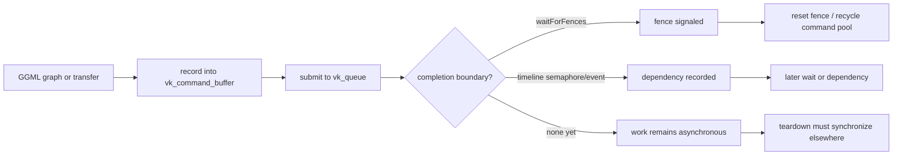

# Vulkan command and synchronization lifetimes

> Baseline: llama.cpp `e3546c7948e3af463d0b401e6421d5a4c2faf565`

This page covers one bounded part of Vulkan teardown: how command pools, command buffers, fences, semaphores, events, and synchronous transfer helpers establish or fail to establish completion boundaries. It does **not** yet claim a complete backend-before-scheduler safety classification.

## Five-minute model

A Vulkan object being host-owned does not mean GPU work using it has completed. The pinned backend explicitly comments that command-pool reset requires completed command buffers, and its synchronous read/copy/memset helpers submit work, wait on a device fence, reset that fence, and only then recycle command-pool state.

## Verified

### Command pools are split by owner and queue

`vk_command_pool` stores a Vulkan command pool, a stable deque of command-buffer records, and a borrowed queue pointer. The source states that instances exist for each `(context, queue)` pair and each `(device, queue)` pair. Each command-buffer record carries an `in_use` bit and a use counter.

This means command-buffer storage is not one global pool: lifetime and reuse are tied to the owning context/device and queue.

### Pool cleanup requires completed work

`ggml_vk_command_pool_cleanup()` calls `resetCommandPool()` and then marks all tracked command buffers as no longer in use. The implementation explicitly says that command buffers must be done before this reset.

Therefore, pool cleanup is a **reuse action after completion**, not a synchronization mechanism by itself.

### Synchronous host-visible operations use an explicit fence boundary

The pinned synchronous buffer-read, same-device copy, and GPU memset paths follow this pattern:

1. create a temporary command context;
2. begin and record commands;
3. end and submit to a queue with the device fence;
4. call `waitForFences(..., UINT64_MAX)`;
5. reset the fence;
6. clean reusable command pools.

The read path performs deferred host `memcpy` operations only after the fence wait.

### Context-local synchronization primitives are reused

The backend grows context-owned vectors of binary semaphores, timeline semaphores, and Vulkan events on demand. Per-run indices select reusable entries. This is pooled synchronization state, not one newly allocated object per operation forever.

### Graph compute is submission-oriented

`ggml_backend_vk_graph_compute()` prepares transfer work and records compute command buffers. It is structured around command submission rather than CPU-side kernel completion. A successful return from graph compute therefore should not be interpreted as proof that all device work is complete unless the specific path establishes a wait.

## Interpretation

- A Vulkan fence wait is the clearest host completion boundary in the inspected synchronous helper paths.
- Timeline semaphores and events express device-side ordering and reusable dependencies; their existence alone does not prove host completion.
- Command-pool reset safety depends on an earlier wait or another guarantee that every command buffer from that pool has completed.
- Backend teardown must distinguish context-owned command pools and synchronization objects from device-owned pools and shared device state.

## Historical

The exact pool topology, queue sharing, event/semaphore strategy, and submission batching are revision-sensitive. Newer llama.cpp revisions must be documented separately rather than silently applied to this baseline.

## Open questions

- What exact function performs final Vulkan backend synchronization before the backend context is deleted?
- Does backend free wait for every compute and transfer queue, including work represented by timeline semaphores?
- In what order are context command pools, query pools, descriptor pools, semaphores, events, and buffers destroyed?
- Do scheduler-owned Vulkan events and buffers retain a device object independently of the backend wrapper?
- Can scheduler destruction safely occur after the Vulkan backend wrapper is destroyed at this pinned revision?

## Source map

Pinned file inspected:

- `ggml/src/ggml-vulkan/ggml-vulkan.cpp`
  - `vk_command_buffer`
  - `vk_command_pool`
  - `vk_queue`
  - `ggml_vk_create_binary_semaphore()`
  - `ggml_vk_create_timeline_semaphore()`
  - `ggml_vk_create_event()`
  - `ggml_vk_command_pool_cleanup()`
  - synchronous buffer read/copy/memset helpers
  - `ggml_backend_vk_graph_compute()`

## Practical teardown rule

Until the remaining free-chain audit resolves the open questions, applications should establish an explicit backend/context synchronization boundary before destroying a context that may have submitted Vulkan work. This is conservative guidance, not a claim that the pinned destructor is unsafe.
