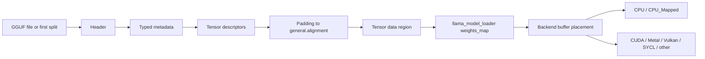

# GGUF file anatomy and loader entry

> **Pinned implementation baseline:** llama.cpp [`e3546c7948e3af463d0b401e6421d5a4c2faf565`](https://github.com/ggml-org/llama.cpp/tree/e3546c7948e3af463d0b401e6421d5a4c2faf565)
>
> **Format reference:** the official [`ggml-org/ggml` GGUF specification](https://github.com/ggml-org/ggml/blob/master/docs/gguf.md). The specification evolves independently of the pinned llama.cpp revision, so implementation claims below remain pinned.

## Five-minute explanation

A GGUF model is not only a flat array of weights. It is a self-describing binary container with four conceptual regions:

1. a fixed header that identifies the format version and counts metadata entries and tensors;
2. typed key/value metadata, including architecture, hyperparameters, tokenizer data, alignment, and split-file information;
3. tensor descriptors containing names, dimensions, GGML types, and offsets;
4. an aligned tensor-data region containing the encoded tensor bytes.

llama.cpp first parses the metadata and tensor descriptors without allocating tensor payload storage. It then builds a unified map from tensor name to `(source file, file offset, tensor metadata)`. Later model construction decides which backend buffer type should hold each tensor and whether bytes can remain mmap-backed or must be read/uploaded into another buffer.



## Canonical upstream figure

The official GGUF specification publishes the canonical GGUF v3 file-structure diagram and attributes it to **@mishig25**:


*Canonical GGUF v3 diagram by [@mishig25](https://github.com/mishig25), referenced from the official [GGUF specification](https://github.com/ggml-org/ggml/blob/master/docs/gguf.md#file-structure). The project links to the upstream asset rather than redistributing it.*

## Physical layout

The exact field encodings are specified upstream, but the load-relevant structure is:

```text
magic + version
number of tensors
number of metadata key/value pairs
metadata key/value entries
  key string
  value type
  scalar / string / array payload
tensor descriptors
  tensor name
  number of dimensions
  dimensions
  GGML tensor type
  offset relative to tensor-data region
zero padding to general.alignment
tensor data region
```

`general.alignment` controls the start of the tensor-data region and tensor placement. Padding bytes are not tensor payload. A descriptor's offset is relative to the data region, not necessarily to byte zero of the file.

In the pinned loader, `llama_tensor_weight` converts a descriptor-relative tensor offset into an absolute file offset:

```text
gguf_get_data_offset(gguf_ctx)
+ gguf_get_tensor_offset(gguf_ctx, tensor_idx)
= absolute source-file offset
```

It then checks that `offset + ggml_nbytes(tensor)` does not overflow and remains within the source file. This is an early corruption/incomplete-file guard.

## Metadata is typed, not an unstructured header

GGUF metadata values carry explicit types. llama.cpp's loader uses typed accessors and rejects mismatches rather than silently reinterpreting bytes. Important families include:

- `general.architecture`, which selects the architecture-specific loader and graph builder;
- architecture hyperparameters such as layer count, embedding size, attention dimensions, expert counts, and recurrent-state parameters;
- tokenizer model, vocabulary, merges, scores, token types, and special-token IDs;
- `general.alignment`;
- quantization/file-type information;
- split-file metadata such as split count, split number, and total tensor count.

Metadata overrides are validated against the expected boolean, integer, floating-point, or string type before they replace file values.

## Tensor descriptors are metadata, not allocated weights

`gguf_init_from_file(..., no_alloc = true)` creates a GGML context containing tensor metadata objects. At this stage, the descriptor knows the tensor name, shape, type, strides, and byte size, but its final model/backend storage has not yet been allocated and populated.

The pinned `llama_model_loader` walks these metadata tensors and creates `weights_map`, keyed by tensor name. Each entry records:

- the source split index;
- the absolute file offset of the tensor payload;
- the GGML tensor metadata object.

Duplicate tensor names are rejected. The map therefore becomes the loader's unified name-to-source index across one or many GGUF files.

## Split GGUF files

When split metadata reports more than one file, the pinned loader requires loading from split zero. If the caller did not provide an explicit split list, llama.cpp derives the remaining paths from the standard `00001-of-000NN` naming scheme.

For every additional split, the loader:

1. parses metadata with `no_alloc = true`;
2. verifies the split number;
3. opens the source file;
4. indexes each tensor by name, source-file index, and absolute offset;
5. rejects duplicate names across splits;
6. verifies that the final tensor count matches the declared total.

The main file's metadata remains the model-level metadata source. Tensor offsets from each subsidiary GGUF must be interpreted using that subsidiary file's own GGUF context.

## Loader entry and call chain

The bounded call chain for this chapter is:

```text
llama_model_load_from_file_impl(...)
  -> construct llama_model_loader(...)
      -> gguf_init_from_file(..., no_alloc = true)
      -> read general.architecture
      -> create llama_file
      -> walk GGML tensor metadata
      -> build weights_map
      -> discover and parse split files
      -> validate file version, counts, names, offsets, and bounds
  -> model.load_arch(loader)
  -> model.load_hparams(loader)
  -> model.load_vocab(loader)
  -> model.load_tensors(loader)
      -> create destination tensor metadata
      -> choose backend buffer types
      -> initialize mappings and/or copy/upload tensor bytes
```

The first half answers **what tensors exist and where their bytes live in the GGUF files**. The architecture/model-loading half answers **what those tensors mean and where execution should access them**.

## mmap, reads, uploads, and ownership

`use_mmap` does not mean every model tensor is copied into anonymous RAM during model construction. For compatible CPU-mapped placement, a backend buffer can refer to the file mapping. Accessing a mapped virtual address can later trigger page faults; the kernel resolves those faults by locating file-backed pages and making them resident in physical memory/page cache.

For accelerator placement or incompatible buffer types, tensor bytes may instead be read from the file/mapping and copied or uploaded into backend-owned buffers. The source mapping and destination buffer then have different lifetimes and residency rules.

The important ownership split is:

| Object or bytes | Typical owner | Important caveat |
|---|---|---|
| GGUF metadata context | `llama_model_loader` during loading | Describes file contents; not the final execution storage |
| Open GGUF files | loader/model-loading path | Split files remain distinct sources |
| mmap virtual mappings | loader/model mapping objects | Virtual mapping does not prove physical residency |
| File-backed physical pages | operating system page cache/RAM | May fault in, remain cached, or be reclaimed independently |
| GGML tensor metadata | loader/model contexts | Shape/type/name metadata is separate from payload ownership |
| CPU-mapped tensor payload | external/mapped backend buffer | Often aliases GGUF-backed virtual memory |
| Accelerator tensor payload | backend buffer | Usually requires explicit transfer and backend synchronization |

Therefore, “the model is loaded” can mean several different milestones: metadata parsed, virtual mappings established, destination buffers allocated, uploads completed, or pages physically faulted into RAM. Documentation and measurements must state which milestone they mean.

## Backend consequences

- **CPU / CPU_Mapped:** tensors may remain directly addressable from host virtual memory. First or later accesses can fault if pages are not resident.
- **CUDA, Vulkan, SYCL, Metal, and other accelerators:** selected tensors may be placed in device, shared, host-registered, or unified-memory buffer types. Placement and copy behavior are backend-specific.
- **Partial offload:** some tensors remain CPU/mmap-backed while others are copied to accelerator buffers; there is no single model-wide residency state.
- **Direct I/O:** in the pinned loader, available direct I/O disables mmap for that file path. If direct I/O is requested but unavailable, the loader falls back to mmap and reopens the file normally.

## Truth labels

### Verified

- The official GGUF specification defines a self-describing, typed, mmap-compatible format with aligned tensor data.
- The pinned loader calls `gguf_init_from_file` with `no_alloc = true` before final tensor storage is created.
- `llama_tensor_weight` stores the source-file index and computes an absolute tensor payload offset from the GGUF data-region offset plus the descriptor offset.
- Duplicate tensor names, out-of-bounds tensor ranges, invalid split numbering, split-count mismatches, and total-tensor-count mismatches are rejected.
- Split tensors are unified into one name-indexed `weights_map` while retaining their source-file index.
- mmap virtual addressability does not guarantee physical page residency.

### Interpretation

- `weights_map` is the bridge between format parsing and backend-aware model construction: it separates “where the bytes are in the files” from “where execution will consume them.”
- GGUF's descriptor/data separation is what makes metadata-first loading, mmap-backed CPU placement, and selective accelerator upload practical.
- “Load time” is ambiguous unless metadata parsing, mapping, allocation, transfer, and first-touch page faults are measured separately.

### Historical

- GGUF replaced older GGML, GGMF, and GGJT model-file formats with typed extensible metadata.
- The pinned loader recognizes GGUF file versions 1, 2, and 3 and labels v3 as the latest for that revision.
- Newer GGUF metadata keys, tensor types, naming conventions, and split behavior may postdate the pinned llama.cpp baseline.

### Open question

- Document the exact `model.load_tensors()` buffer-selection and data-transfer branches for each supported backend.
- Trace `init_mappings()` and `load_all_data()` line by line, including prefetch behavior, `mlock`, direct I/O, and progress accounting.
- Verify big-endian behavior against a concrete file and the pinned parser.
- Add runtime evidence separating metadata parse time, mmap setup, major/minor faults, storage reads, upload time, and backend synchronization.
- Determine whether future split formats permit metadata distribution patterns that differ from the pinned first-split model.

## Pinned source map

| Area | Pinned source |
|---|---|
| Loader data structures and tensor source offsets | [`src/llama-model-loader.h`](https://github.com/ggml-org/llama.cpp/blob/e3546c7948e3af463d0b401e6421d5a4c2faf565/src/llama-model-loader.h) |
| GGUF parsing, split discovery, typed metadata access | [`src/llama-model-loader.cpp`](https://github.com/ggml-org/llama.cpp/blob/e3546c7948e3af463d0b401e6421d5a4c2faf565/src/llama-model-loader.cpp) |
| Architecture metadata names | [`src/llama-arch.h`](https://github.com/ggml-org/llama.cpp/blob/e3546c7948e3af463d0b401e6421d5a4c2faf565/src/llama-arch.h) |
| Model construction and tensor placement | [`src/llama-model.cpp`](https://github.com/ggml-org/llama.cpp/blob/e3546c7948e3af463d0b401e6421d5a4c2faf565/src/llama-model.cpp) |
| File mappings and locking | [`src/llama-mmap.cpp`](https://github.com/ggml-org/llama.cpp/blob/e3546c7948e3af463d0b401e6421d5a4c2faf565/src/llama-mmap.cpp) |
| Official format specification | [`ggml-org/ggml/docs/gguf.md`](https://github.com/ggml-org/ggml/blob/master/docs/gguf.md) |

## Next reading

Continue with the architecture-specific tensor-creation and backend-placement phase, then the memory-lifetime chapter that follows file pages from GGUF storage through mappings, page faults, backend copies, execution, and teardown.
