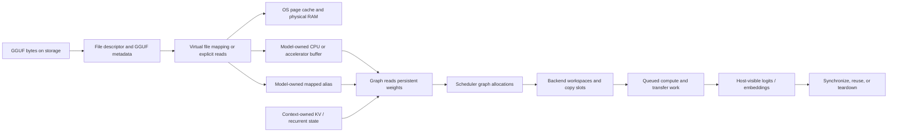

# Memory lifetimes: storage, mappings, buffers, state, and execution

> **Evidence scope — Verified:** llama.cpp commit [`e3546c7948e3af463d0b401e6421d5a4c2faf565`](https://github.com/ggml-org/llama.cpp/tree/e3546c7948e3af463d0b401e6421d5a4c2faf565). This chapter combines previously pinned loader, model, context, graph, scheduler, and backend findings. Later revisions must be documented separately.

Memory in llama.cpp is not one cache and does not have one lifetime. A single decode can touch persistent bytes in a GGUF file, file-backed virtual mappings, OS page-cache pages, model-owned backend buffers, context-owned KV or recurrent state, scheduler-owned graph allocations, temporary transfer staging, backend queues and events, and host-visible outputs.

The key question is therefore not only **“where is the tensor?”** but also:

1. who owns the address or buffer;
2. what physical storage backs it;
3. when bytes become resident or valid;
4. which queue or thread may still use them;
5. what action makes them reusable or reclaimable.

## Five-minute model



A mapping creates a virtual-address relationship to file bytes. It does not prove those bytes are currently in RAM. A backend buffer creates a storage object with backend-specific visibility and transfer rules. A graph tensor may be metadata, an alias, a persistent weight, a mutable memory tensor, or a temporary activation. Completion is a synchronization property, not an ownership property.

## Ownership and lifetime atlas

| Resource | Typical owner | Backing storage | Becomes valid or resident when | Reuse or release boundary |
|---|---|---|---|---|
| GGUF file bytes | Filesystem / application file | Persistent storage | Already stored | File deletion or replacement; independent of process lifetime |
| GGUF metadata context | `llama_model_loader` during loading | Host allocations | Parsing succeeds | Loader destruction after model construction |
| File descriptor | Loader / mapping object | Kernel file object | File open succeeds | Close after reads or when mapping setup no longer needs it |
| Virtual mapping | Loader first; retained mappings transferred to `llama_model` when required | File-backed virtual-address range | `mmap` succeeds | Mapping object destruction / `munmap`; physical pages may be reclaimed earlier |
| File-backed physical pages | OS page cache | RAM | Demand fault, readahead, or prefetch brings pages in | Kernel reclaim; mapping can remain valid after pages leave RAM |
| Model tensor metadata | `llama_model` GGML contexts | Host metadata allocations | Tensor descriptors are created | Model destruction |
| Mapped model buffer alias | `llama_model` | Mapping-backed host pointer | Mapping exists; individual pages become resident on access | Model/mapping destruction; OS can reclaim clean pages before then |
| Explicit CPU model buffer | `llama_model` | Host or backend CPU allocation | Read/copy completes | Model destruction |
| Accelerator model buffer | `llama_model` | Device, shared, unified, or backend-managed memory | Upload/copy completion according to backend semantics | Model destruction after outstanding use is complete |
| Mutable KV cache | `llama_context` through `llama_memory_i` | Backend buffers selected for memory tensors | Allocation and writes by encode/decode | Context destruction, reset, sequence removal, shift, or reuse |
| Recurrent state | `llama_context` through architecture-selected memory | Backend buffers | State update completes | Context destruction or architecture-specific reset/reuse |
| Hybrid memory | `llama_context` | Combination of KV and recurrent modules | Each component is allocated and updated | Component-specific reset and context teardown |
| Graph tensor metadata | Graph-result / GGML context owned by context-side graph machinery | Host metadata | Graph construction or compatible reuse | Graph-result replacement or context teardown |
| Activation allocation | Backend scheduler | Scheduler compute buffers | `ggml_backend_sched_alloc_graph()` binds graph tensors | Reused by a compatible graph/copy slot or released with scheduler |
| Scheduler destination copy | Backend scheduler copy ring | Destination backend buffer | Copy completes or dependency ordering makes it consumable | Slot reuse only after its prior event/work is complete |
| Transfer staging | Loader or backend copy implementation | Pinned host, temporary host, or backend staging memory | Source bytes filled and transfer submitted/completed as required | Event synchronization or blocking-copy return, then staging destruction/reuse |
| Backend workspace | Backend implementation / scheduler-selected buffer | Backend-specific temporary storage | Backend allocation and command preparation | Backend-specific reuse after queued work completes |
| Logits and embeddings | `llama_context` | Host output buffer plus possible backend source tensors | Output copy and required synchronization complete | Reordered/resized on later calls; released with context |
| CPU thread pools | Caller; borrowed by context | Host threads and queues | Attached and selected for graph execution | Caller controls lifetime; must outlive attachment/use |
| Backend events and queues | Scheduler/backend | Driver/runtime objects | Commands and events are recorded | Reuse or destruction only after ordering requirements are satisfied |

## Storage is not residency

### Mapping

**Verified:** the model loader can retain file mappings in the model when backend buffers directly wrap mapped host ranges. The virtual address remains meaningful while the mapping lives.

**Interpretation:** a successful mapping establishes addressability, not physical residency. The first CPU read or host-to-device transfer can still fault pages into RAM.

### Page faults and page cache

For a file-backed mapping, a missing page normally follows this conceptual path:

```text
CPU or DMA preparation reads mapped address
  -> page-table entry is absent or not present
  -> page fault enters the kernel
  -> kernel locates or reads the file page
  -> page enters the page cache / physical RAM
  -> page table is updated
  -> instruction retries
```

Minor and major fault counters do not directly identify which model tensor faulted. A major fault usually indicates storage I/O was required; a minor fault can install a mapping to an already resident page or handle another non-I/O condition.

### RSS

RSS is a process-level residency snapshot, not a model-cache truth table. It can include mapped model pages, anonymous allocations, allocator arenas, thread stacks, backend mappings, and shared pages under accounting rules that vary by platform. A drop in RSS does not prove a specific expert was evicted, and a stable RSS does not prove future accesses will be fault-free.

### Prefetch and advice

`madvise(MADV_WILLNEED)` or backend prefetch can improve the probability that bytes are ready before use. It is not a permanent pin. `MADV_DONTNEED` is a reclaim hint whose exact effect depends on mapping type, kernel, page state, and platform. Neither call creates an application-owned copy.

## Persistent model memory

The model owns the persistent representation used across contexts:

- architecture and vocabulary state;
- GGML weight-tensor metadata;
- CPU, mapped, shared, or accelerator buffers;
- mappings retained because model buffers alias mapped file ranges;
- device placement information.

A model tensor can take one of several data paths:

```text
GGUF descriptor
  -> mapped host-pointer alias
  -> mapped source copied/uploaded into another backend buffer
  -> direct file read into CPU/backend-visible storage
  -> staged asynchronous upload
  -> synchronous temporary-buffer upload
```

Only the first path is accurately described as zero-copy with respect to model payload bytes. Partial offload commonly mixes paths within one model.

The model must outlive every context that references it. Freeing a context does not unload the model weights; freeing the model must not occur while a context or queued backend work still uses those weights.

## Context-owned mutable memory

`llama_context` owns the runtime state that changes across inference calls. Construction asks the model to create an architecture-compatible `llama_memory_i` implementation.

### KV memory

Transformer attention commonly stores keys and values from previous positions. Its important lifetime properties are:

- persistent across decode tokens within the context;
- mutable when tokens are appended, shifted, copied, removed, or rolled back;
- separate from immutable model weights;
- allocated in backend buffers chosen for the context and architecture;
- potentially much larger during long contexts than one token's activation set.

### Recurrent memory

Recurrent architectures retain state tensors rather than a conventional full KV history. The state is still context-owned and mutable, but its shape, update rules, and rollback behavior differ from KV memory.

### Hybrid memory

Some architectures combine memory modules. “The KV cache” is therefore not a universal name for all persistent sequence state. Documentation and instrumentation should identify the concrete memory implementation and its per-layer components.

## Graph metadata, activations, and reuse

GGUF stores weights, not an executable computation graph. Architecture code creates GGML operation tensors whose `src[]` references encode dependencies. Graph expansion discovers nodes and leaves.

Graph construction creates metadata and topology. Scheduler allocation then binds tensors needing storage into backend compute buffers. These lifetimes differ:

- persistent weight tensor storage remains model-owned;
- mutable memory storage remains context-owned;
- graph tensor metadata belongs to graph-result contexts;
- temporary activations and dependency copies are scheduler allocations;
- backend workspaces may be internal and invisible at the graph level.

Graph reuse preserves compatible topology and allocation. It does not preserve old input values or guarantee that every backend command from the previous invocation has completed. Under pipeline parallelism, synchronization may be required before rewriting inputs that queued work can still read.

## Scheduler copies, slots, and staging

A multi-backend graph may require a tensor produced or stored on one backend to become available on another. The scheduler can allocate destination copies and rotate through copy slots.

The critical lifetime rule is:

```text
slot contents are reusable
only after work that reads or writes that slot is complete
```

The scheduler first prefers backend-supported asynchronous transfer. If that is unavailable, the generic fallback synchronizes as required and performs a blocking transfer. An API name containing `async` does not prove host-visible overlap; actual behavior depends on the backend implementation, source and destination buffer types, queue selection, and event support.

Loader staging buffers follow a similar rule. Pinned host buffers used for asynchronous uploads cannot be overwritten or freed until the recorded transfer event has completed.

## CPU, GPU, and accelerator differences

### CPU-only mapped execution

- Weight tensors may directly alias mapped GGUF ranges.
- CPU reads can trigger demand faults.
- The OS page cache mediates file-backed residency.
- CPU thread-pool execution reads persistent weights, mutable memory, and scheduler activations.

### Discrete accelerator offload

- Persistent weights are usually copied or uploaded to device-owned memory.
- Mapped source pages may fault while preparing the upload.
- Device buffers can remain resident independently of later OS reclaim of source pages.
- Queues, streams, events, and staging-buffer lifetimes determine safe reuse.

### Shared or unified memory

Shared physical memory does not erase ownership or synchronization boundaries. A pointer may be physically accessible to both host and device while still requiring backend-specific coherence, command completion, or buffer-type compatibility. “Unified” must not be treated as synonymous with “synchronous,” “zero-copy,” or “host-visible now.”

## Prefill versus decode

| Dimension | Prefill | Decode |
|---|---|---|
| Tokens per graph | Usually many | Usually one or a small micro-batch |
| Activation pressure | Larger | Smaller per invocation |
| KV/recurrent mutation | Bulk initialization/update | Incremental update |
| Weight-page access | Can fault or upload many ranges quickly | Repeated access can benefit from existing residency but is not guaranteed |
| CPU threading | Batch thread settings often selected | Decode thread settings often selected |
| Copy/compute overlap | More opportunity and more temporary pressure | Shorter critical path; synchronization overhead can dominate |
| Graph reuse | Reservation/build establishes shapes | Often benefits from compatible reuse |
| Output volume | Multiple rows may be retained | Commonly one next-token row |

These are typical tendencies, not universal guarantees. Architecture, batching, output selection, backend placement, and pipeline settings can change them.

## Synchronization and host visibility

Ownership answers who releases a resource. Synchronization answers when it is safe to read, overwrite, reuse, or release it.

Host-visible output getters synchronize where required before exposing logits or embeddings. Scheduler copy-ring reuse waits on prior events. Pipeline graph reuse may synchronize before rewriting inputs. Loader upload staging waits before destruction. Backend teardown must ultimately respect outstanding work, even when the context destructor body does not contain a standalone explicit final synchronization call.

## Teardown order

A safe conceptual order is:

```text
stop submitting new work
  -> complete or cancel application use
  -> synchronize completion-sensitive backend work
  -> destroy llama_context
       -> mutable memory
       -> graph results and scheduler allocations
       -> outputs, adapters, and backend instances
  -> destroy llama_model
       -> persistent backend buffers
       -> retained mappings
       -> tensor metadata and vocabulary state
  -> OS reclaims remaining process mappings and pages
```

The model must remain alive until all referencing contexts are destroyed. A file-backed page may be reclaimed before either object is destroyed, while the virtual mapping remains valid. Conversely, clean pages can remain in the system page cache after process teardown; that does not mean the process still owns them.

## What to measure at runtime

A useful trace should distinguish:

1. GGUF parsing time and metadata allocations;
2. mapping setup and virtual mapped bytes;
3. explicit read bytes;
4. mapped-alias bytes;
5. synchronous and asynchronous upload bytes;
6. major/minor faults and storage reads during loading, prefill, and decode;
7. model-buffer bytes by backend and buffer type;
8. KV/recurrent bytes by layer and backend;
9. scheduler activation, copy-ring, and workspace peaks;
10. staging-buffer bytes and event-wait time;
11. RSS, PSS where available, and device-memory counters;
12. time to first access, first token, steady-state decode, synchronization, and teardown.

No single metric is sufficient. Logical cache state, virtual mappings, RSS, page residency, block I/O, device allocation, and command completion describe different layers.

## Truth labels

### Verified

- Model weight storage and retained mappings are model-owned; contexts reference the model.
- Contexts own mutable memory, schedulers, runtime backends, graph results, and host-facing outputs.
- Scheduler graph allocation is distinct from model tensor placement.
- Mmap can either back execution directly or act as a source for a copy/upload.
- Output access and several reuse paths require synchronization.

### Interpretation

- The most useful mental model is a stack of overlapping lifetimes, not one global cache.
- “Resident,” “allocated,” “mapped,” “valid,” and “complete” should be separate trace fields.
- Expert caching built over mapped GGUF pages should distinguish logical admission from OS residency and from backend-copy validity.

### Historical

- Exact memory implementations, buffer types, graph-reuse predicates, transfer APIs, and backend synchronization behavior evolve rapidly. Claims on this page describe the pinned revision and the project’s already reviewed backend chapters.

### Open questions

- Which exact `llama_memory_i` implementations are selected for every supported architecture at the pinned revision?
- Which backend destructors guarantee implicit synchronization, and where is that contract documented?
- How do mapped RSS/PSS and device-memory accounting differ on Linux, Android, macOS, Windows, and each accelerator runtime?
- Which first-token pages are touched by each architecture, quantization type, and offload configuration?
- Can generated runtime overlays correlate graph tensors, file offsets, page faults, backend copies, and queue events without excessive observer overhead?

## Source map

| Topic | Pinned project chapter or upstream source |
|---|---|
| GGUF layout, descriptors, mappings | [GGUF file anatomy](gguf-file-anatomy.md) |
| Layer placement, mapped aliases, reads, staging, uploads | [Model tensor placement](model-tensor-placement.md) |
| Persistent model ownership and graph factory | [`llama_model`](../objects/llama-model.md) |
| Mutable memory, scheduler, outputs, threading, teardown | [`llama_context`](../objects/llama-context.md) |
| Graph construction and reuse | [GGML graph construction and MoE](../ggml/graph-construction-and-moe.md) |
| Scheduler allocations, splits, copies, events | [Backend scheduler execution](../lifecycle/backend-scheduler-execution.md) |
| Blocking copy fallback | [Generic copy fallback](../lifecycle/generic-copy-fallback.md) |
| Backend buffer compatibility | [Buffer compatibility](../lifecycle/buffer-compatibility.md) |
| CPU/CUDA/Metal/Vulkan/SYCL details | Backend-specific pages under [Inference lifecycle](../lifecycle/end-to-end.md) |

## Next reading

Continue with [`llama_model`](../objects/llama-model.md), [`llama_context`](../objects/llama-context.md), and [Backend scheduler execution](../lifecycle/backend-scheduler-execution.md). The next implementation increment should connect the interactive memory cards to sections of this atlas and then add runtime overlays.