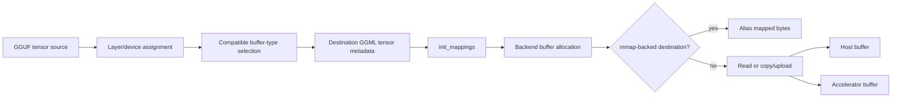

# Model tensor placement and data transfer

> **Pinned implementation baseline:** llama.cpp [`e3546c7948e3af463d0b401e6421d5a4c2faf565`](https://github.com/ggml-org/llama.cpp/tree/e3546c7948e3af463d0b401e6421d5a4c2faf565)
>
> This page continues [GGUF file anatomy and loader entry](gguf-file-anatomy.md). The earlier page answers where tensor bytes live in GGUF files; this page answers how llama.cpp chooses runtime storage and populates it.

## Five-minute explanation

Loading model tensors is not one operation. The pinned path performs six distinct jobs:

1. assign input, repeating, and output layers to CPU or accelerator devices;
2. build an ordered list of candidate buffer types for each device;
3. create architecture-specific weight tensors in one GGML metadata context per selected buffer type;
4. establish file mappings when mmap is enabled;
5. allocate either file-backed host-addressable buffers or independent backend buffers;
6. alias, read, copy, or asynchronously upload each tensor into its selected storage.



The important distinction is between **source bytes** and **destination storage**. A tensor may execute directly from a GGUF-backed mapping, or the same bytes may be copied into CPU, pinned-host, shared, unified, or device-local backend memory.

## Exact pinned call chain

```text
llama_model_load_from_file_impl(...)
  -> model.load_tensors(loader)
      -> make_cpu_buft_list(...)
      -> make_gpu_buft_list(...) for each requested device
      -> calculate device split points
      -> assign input/repeating/output layers
      -> load_arch_tensors(loader)
          -> create_tensor(...)
              -> select_weight_buft(...)
              -> create one GGML context per chosen buffer type
              -> duplicate source tensor metadata into that context
      -> done_getting_tensors()
      -> init_mappings(prefetch = true, ...)
      -> allocate backend buffers
          -> optional buffer_from_host_ptr over mapped file ranges
          -> otherwise allocate context tensors from chosen buffer type
      -> load_all_data(...) once per buffer-type context
          -> alias mmap bytes, copy from mmap, direct-read to host,
             synchronous staging upload, or asynchronous pinned upload
      -> retain mappings needed by model-backed buffers
```

## 1. Device and layer assignment

`load_tensors()` first builds candidate buffer lists.

### CPU candidate order

The pinned `make_cpu_buft_list()` considers, in order:

1. accelerator-class buffer types exposed as CPU-usable candidates;
2. the first available accelerator host-buffer type, unless host buffers are disabled;
3. optional CPU-extra buffer types;
4. the ordinary CPU buffer type.

This is a preference list, not a guarantee. A later compatibility test can reject the first candidate for a particular tensor and operation.

### Accelerator candidate order

For each requested accelerator device, `make_gpu_buft_list()` adds:

1. an optional row-split buffer type when row splitting is requested;
2. the device default buffer type;
3. device-specific extra buffer types;
4. the CPU candidate list as fallback.

### Layer placement

The input layer is kept on CPU. Repeating and output layers are assigned according to `n_gpu_layers` and normalized device split points. If no explicit tensor split is supplied, free device memory is used to derive the split. Devices that report no memory fall back to host-memory figures for this calculation.

**Verified:** placement begins at the layer/device level, but final storage is selected per tensor after checking operation and buffer compatibility.

## 2. Per-tensor buffer selection

Architecture-specific code calls `create_tensor()` for every expected weight. The loader looks up the source tensor metadata, determines the operation that will consume it, and chooses a compatible backend buffer type.

The decision considers:

- input, output, or repeating-layer role;
- assigned layer device;
- expected GGML operation, such as `MUL_MAT`, `MUL_MAT_ID`, or `GET_ROWS`;
- backend support for that tensor type, shape, and operation;
- explicit tensor-buffer overrides;
- fallback candidates when the preferred buffer type is incompatible.

Bias tensors are tested against addition operations rather than the weight's primary operation. Unused tensors can be skipped. Duplicate/tied tensors can reuse an already-created tensor in the same buffer-type context.

When mmap is enabled, a selected accelerator host-buffer type is replaced with the ordinary CPU buffer type. The source warns that forcing CPU tensor overrides while mmap remains enabled may perform poorly.

### Why one GGML context per buffer type?

`ctx_map` groups destination tensor metadata by selected `ggml_backend_buffer_type_t`. This lets llama.cpp allocate all tensors in a context using the same storage policy while still preserving one logical model spanning many buffer types and devices.

## 3. Mapping initialization and prefetch

After all architecture tensors are declared, `init_mappings(true, ...)` creates one `llama_mmap` per GGUF split when mmap is enabled.

For each file it:

- detects CPU NUMA state through the CPU backend when available;
- constructs a mapping with the prefetch argument set to `-1` because `prefetch` is true;
- initializes a used-range tracker for later trimming;
- optionally creates an `mlock` object rooted at the mapping base;
- adds every source tensor byte size to `size_data` for global progress accounting.

`get_mapping_range()` later computes the smallest contiguous source range needed by one destination GGML context in one split file. This prevents a backend buffer created from a host pointer from necessarily covering the entire GGUF mapping.

**Interpretation:** mapping the file and prefetching it are load-time hints and virtual-memory setup. They do not establish a permanent per-tensor physical-residency guarantee.

## 4. Destination buffer creation

For each buffer-type context, llama.cpp checks the device properties and then chooses between two allocation families.

### File-backed host-pointer buffer

This path requires all of the following:

- mmap enabled;
- mmap-buffer use enabled;
- the device advertises `buffer_from_host_ptr`;
- the selected buffer type is that device's default buffer type.

For each GGUF split that contributes tensors to the context, llama.cpp computes the required mapped range and calls `ggml_backend_dev_buffer_from_host_ptr()` on that range. The buffer therefore wraps existing mapped host memory rather than allocating independent payload storage.

The source calls out Metal on Apple Silicon: mapping only the relevant tensor range permits partial offload when the entire model would exceed a Metal buffer limit even though it fits in system RAM.

### Independently allocated backend buffer

Otherwise, llama.cpp allocates a backend buffer for the context. With normal allocation it calls `ggml_backend_alloc_ctx_tensors_from_buft()`. Host-visible allocated buffers can optionally be locked. Every resulting buffer is marked `GGML_BACKEND_BUFFER_USAGE_WEIGHTS`, which helps the scheduler prefer execution near the stored weights.

## 5. Five data-population paths

`load_all_data()` iterates tensors in one buffer-type context and uses one of the following paths.

| Source mode | Destination | Pinned behavior |
|---|---|---|
| mmap | host-pointer-backed mapped buffer | `ggml_backend_tensor_alloc()` associates the tensor with its exact mapped address; no payload memcpy is required |
| mmap | separately allocated buffer | `ggml_backend_tensor_set()` copies/uploads from the mapped source address |
| non-mmap | host buffer | seek to the tensor offset and `read_raw()` directly into `cur->data` |
| non-mmap | non-host buffer with async capability | aligned file reads into a ring of four pinned host buffers, then `ggml_backend_tensor_set_async()` plus events |
| non-mmap | non-host buffer without async path | read the whole tensor into a temporary host vector, then call synchronous `ggml_backend_tensor_set()` |

### mmap alias path

When a mapped backend buffer exists and the tensor has no data pointer yet, llama.cpp allocates the tensor inside that buffer at the mapped source address. It also expands the optional lock range and tracks the minimum/maximum mapped bytes actually used.

### mmap copy/upload path

If a tensor already has independently allocated storage, the mapping remains the source and `ggml_backend_tensor_set()` transfers the bytes into that storage. Thus mmap can still be involved even when execution does not read directly from mapped GGUF pages.

### Direct host read path

Without mmap, host buffers are populated by seeking to each source tensor offset and reading directly into the allocated tensor address.

### Asynchronous accelerator upload path

The asynchronous path is disabled when mmap or tensor validation is enabled. It additionally requires the selected destination to be the device default buffer type and the device to advertise asynchronous operations, host buffers, and events.

The loader creates four host staging buffers and four events. For each accelerator tensor it:

1. aligns file offsets and read boundaries to the file's required alignment;
2. waits before reusing a staging slot;
3. reads an aligned chunk into pinned host memory;
4. removes leading/trailing alignment padding from the logical tensor slice;
5. submits `ggml_backend_tensor_set_async()`;
6. records an event and advances around the four-buffer ring.

All events are synchronized before temporary staging buffers and the upload backend are destroyed.

### Synchronous staging fallback

If asynchronous upload is unavailable, the loader resizes a temporary byte vector to the full tensor size, reads the tensor into it, and performs a blocking backend tensor set.

## 6. Progress, cancellation, and validation

`init_mappings()` computes `size_data` as the sum of source tensor byte sizes. `load_all_data()` increments `size_done` after every tensor and calls the user progress callback before loading the next one.

A false callback result cancels loading. At final completion, the callback is invoked with `1.0` and cancellation is still honored so allocations can unwind cleanly.

Optional row-data validation changes behavior:

- mmap tensors can be validated asynchronously against mapped bytes;
- directly read host tensors can also be validated asynchronously;
- synchronous staging validates the temporary read buffer;
- enabling validation disables the pinned asynchronous upload optimization.

## 7. Mapping trimming and lifetime

After all contexts have been loaded, llama.cpp waits for upload events, frees temporary staging resources, joins validation futures, and checks failures.

For mmap loads, unused mapping fragments before the first used byte and after the last used byte are unmapped. Mappings that back model buffers are then moved from the loader into `llama_model`, extending their lifetime to match the model.

This yields three different lifetimes:

| Resource | Lifetime |
|---|---|
| temporary read vectors, pinned upload buffers, upload backend, events | only during `load_all_data()` |
| independent CPU or accelerator weight buffers | model lifetime |
| mmap objects needed by mapped model buffers | moved into and owned by the model |

## Placement decision table

| Situation | Source | Destination storage | Copy during loading? | Later page faults possible? |
|---|---|---|---|---|
| CPU/default buffer can wrap host pointer | GGUF mmap | mapped backend buffer | No payload copy | Yes |
| mmap source with independent CPU buffer | GGUF mmap | allocated host buffer | Yes | Source can fault during copy |
| mmap source with accelerator buffer | GGUF mmap | backend/device buffer | Yes/upload | Source can fault during upload |
| non-mmap host destination | file reads | allocated host buffer | File read directly into destination | Not for GGUF mapping; destination is resident subject to OS policy |
| non-mmap accelerator with async support | aligned file reads | accelerator buffer via pinned ring | Yes, chunked asynchronous upload | No GGUF mmap faults |
| non-mmap accelerator fallback | file read into temporary vector | accelerator buffer | Yes, whole-tensor staging then set | No GGUF mmap faults |

## Measurement plan

A useful runtime trace should report separate intervals and counters for:

1. GGUF metadata parsing and split discovery;
2. architecture tensor declaration and buffer selection;
3. mmap creation and prefetch request;
4. backend buffer allocation;
5. bytes aliased versus copied/uploaded per buffer type;
6. file-read bytes and direct-I/O alignment overhead;
7. upload queue time, event waits, and final synchronization;
8. major/minor page faults during loading and first inference;
9. progress-callback time and cancellation point;
10. peak RSS, mapped virtual size, backend allocations, and temporary staging memory.

Do not report all of these as one undifferentiated “model load time.”

## Truth labels

### Verified

- The input layer remains on CPU; repeating and output layers are placed using `n_gpu_layers` and normalized device split points.
- Final buffer selection is per tensor and validates the consuming operation against candidate backend buffer types.
- Destination tensor metadata is grouped into one GGML context per chosen buffer type.
- `init_mappings(true, ...)` creates mappings before backend buffers are populated and computes total tensor bytes for progress.
- Mmap can lead either to direct aliasing or to a copy/upload into independent storage.
- Non-mmap accelerator loading has an optional four-slot pinned-buffer/event upload path and a synchronous whole-tensor fallback.
- Temporary upload resources are synchronized and freed before `load_all_data()` returns.
- Mappings retained by mapped model buffers are transferred into model ownership.

### Interpretation

- The loader is best understood as a placement compiler: architecture declarations and backend capabilities are combined into concrete storage choices.
- “Zero-copy model loading” only describes the mapped alias branch; it is not a model-wide property under partial offload or incompatible buffer types.
- Prefetch can shift I/O and faults earlier, but it does not convert file-backed mappings into permanently pinned anonymous memory.

### Historical

- Buffer capabilities, host-pointer wrapping, asynchronous upload prerequisites, and device split behavior can change after the pinned revision.
- Later backends may introduce additional placement or upload paths not represented here.

### Open question

- Quantify which current backends enter the host-pointer alias branch for representative CPU-only, Metal, CUDA, Vulkan, and SYCL configurations.
- Measure whether prefetch improves first-token latency or merely advances I/O under memory pressure.
- Trace direct-I/O constructor fallback and platform-specific alignment behavior with runtime evidence.
- Determine how tensor-buffer overrides interact with partial offload and scheduler placement in real models.
- Add an interactive per-tensor placement visualizer driven by generated source metadata and runtime traces.

## Pinned source map

| Area | Pinned source |
|---|---|
| Device candidate lists, layer placement, buffer allocation, load dispatch | [`src/llama-model.cpp`](https://github.com/ggml-org/llama.cpp/blob/e3546c7948e3af463d0b401e6421d5a4c2faf565/src/llama-model.cpp) |
| Per-tensor compatibility, mapping initialization, reads, uploads, progress, trimming | [`src/llama-model-loader.cpp`](https://github.com/ggml-org/llama.cpp/blob/e3546c7948e3af463d0b401e6421d5a4c2faf565/src/llama-model-loader.cpp) |
| Loader state, maps, progress callback, mapping APIs | [`src/llama-model-loader.h`](https://github.com/ggml-org/llama.cpp/blob/e3546c7948e3af463d0b401e6421d5a4c2faf565/src/llama-model-loader.h) |
| Platform mmap, prefetch, locking, fragment unmapping | [`src/llama-mmap.cpp`](https://github.com/ggml-org/llama.cpp/blob/e3546c7948e3af463d0b401e6421d5a4c2faf565/src/llama-mmap.cpp) |
| Backend buffer and event interfaces | [`ggml/src/ggml-backend.cpp`](https://github.com/ggml-org/llama.cpp/blob/e3546c7948e3af463d0b401e6421d5a4c2faf565/ggml/src/ggml-backend.cpp) |

## Next reading

Continue with GGML graph construction: how architecture builders create operation tensors, how source edges are expanded into `ggml_cgraph`, how allocation is planned, and when graph topology is reused across decode calls.
