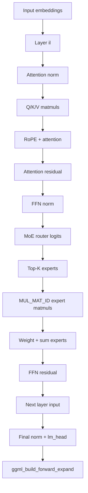
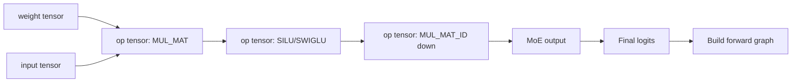

# GGML graph construction, MoE routing, and per-layer cache design

> **Status:** Source-guided explanation using the current upstream layout at commit `6b4dc2116a92c5c8f2782bfe51fabe5ee66fb5ef`, plus baseline documentation policy from the site. The exact file layout differs from the earlier pinned baseline because newer upstream moved architecture code into `src/models/`.

This chapter answers the question: **how do model layers stored in GGUF become a GGML compute graph, how often is that graph rebuilt, where can router logits be edited, and how does this inform a per-layer LRU expert cache?**

## Short answer

GGUF stores model weights as named tensors plus metadata. llama.cpp loads those tensors into `llama_model` layer structures. During inference, the architecture-specific graph builder walks the model layer-by-layer and calls GGML operations such as `ggml_mul_mat`, `ggml_add`, `ggml_soft_max`, `ggml_argsort_top_k`, and `ggml_mul_mat_id`. These calls create **output tensors that represent graph nodes**; they do not immediately execute kernels. The final output tensor is passed to `ggml_build_forward_expand()`, which expands dependencies into the `ggml_cgraph`.

The graph is **not always destroyed and rebuilt every token**. `llama_context::process_ubatch()` first asks whether the previous graph result can be reused. If the graph topology and input tensor compatibility checks pass, the old graph structure is reused and only input tensor data is updated. If reuse fails, llama.cpp resets the graph result, resets the scheduler, rebuilds the architecture graph, allocates it through the backend scheduler, then sets inputs and computes.

For MoE, router logits are usually built inside `build_moe_ffn()`. In the current upstream path, `logits = build_lora_mm(gate_inp, cur)` produces `[n_expert, n_tokens]`; then the code applies a gating function, optional bias/group masking, `ggml_argsort_top_k()`, expert-weight gathering, and finally expert-specific `ggml_mul_mat_id()` calls. The best patch points depend on what you want:

- edit **router logits before probabilities**: patch after `logits` is created and before `softmax/sigmoid`;
- edit **selection scores only** while preserving weights: patch `selection_probs` before `ggml_argsort_top_k()`;
- override selected experts explicitly: feed `selected_experts_in` into `build_moe_ffn()` or add an architecture/runtime path for it;
- implement **cache-aware routing**: bias `selection_probs`, not necessarily the final weights.

For a **per-layer LRU expert cache**, the clean conceptual key is `(layer_id, expert_id)`, not “whole graph node.” The graph gives you selected experts per layer, but the cache should track the model weight ranges or backend tensor ranges for that layer’s expert tensors. Admission/eviction should happen around the MoE layer boundary or before the `MUL_MAT_ID` kernels consume expert tensors.

---

## 1. How layers are stored in GGUF

GGUF is a file container with:

1. a header and counts;
2. typed key/value metadata;
3. tensor descriptors, including names, types, shapes, and offsets;
4. alignment padding;
5. raw tensor data.

The important idea is that **GGUF does not store a compute graph**. It stores enough metadata and tensor bytes for llama.cpp to reconstruct model objects and later build the compute graph. The graph is created by C++ code, not serialized as “layer nodes” in GGUF.

For a transformer model, tensor names encode the role and layer index. A MoE layer typically has dense attention tensors plus router and expert tensors. In current upstream OLMoE, the tensor loading code declares:

```text
tok_embd
output_norm
output
for each layer i:
  attn_norm
  q/k/v/o attention tensors
  q/k norm tensors
  ffn_norm
  ffn_gate_inp          router weight
  ffn_gate_exps         expert gate weights
  ffn_down_exps         expert down weights
  ffn_up_exps           expert up weights
```

The current OLMoE loader creates `ffn_gate_inp` with shape `{n_embd, n_expert}` and expert matrices with a third dimension `n_expert`, such as `{n_embd, n_ff, n_expert}` or `{n_ff, n_embd, n_expert}`.

```mermaid
flowchart TD
    A[GGUF tensor descriptors] --> B[name: blk.0.ffn_gate_inp.weight]
    A --> C[name: blk.0.ffn_up_exps.weight]
    A --> D[name: blk.0.ffn_gate_exps.weight]
    A --> E[name: blk.0.ffn_down_exps.weight]
    B --> F[llama_layer[0].ffn_gate_inp]
    C --> G[llama_layer[0].ffn_up_exps]
    D --> H[llama_layer[0].ffn_gate_exps]
    E --> I[llama_layer[0].ffn_down_exps]
    F --> J[Graph builder consumes tensor pointers]
    G --> J
    H --> J
    I --> J
```

**Verified:** In current upstream OLMoE, `load_arch_tensors()` loops over `n_layer`, creates attention tensors, creates `ffn_gate_inp`, checks `n_expert` and `n_expert_used`, then creates `ffn_gate_exps`, `ffn_down_exps`, and `ffn_up_exps` as MoE branch tensors.

---

## 2. How one model layer becomes GGML graph nodes

Architecture-specific `build_arch_graph()` returns a graph-context object. The graph constructor then walks through layers. In OLMoE, the graph constructor:

1. builds input embeddings;
2. builds position and attention inputs;
3. loops over every layer;
4. builds attention norm;
5. builds Q, K, V projections;
6. applies Q/K norm and RoPE;
7. builds attention;
8. adds residual;
9. builds FFN norm;
10. calls `build_moe_ffn()`;
11. adds residual;
12. feeds output into the next layer;
13. applies final norm and output projection;
14. calls `ggml_build_forward_expand(gf, cur)` on the final logits tensor.



The key mental model:

```cpp
cur = ggml_add(ctx0, cur, ffn_inp);
```

does **not** mean “execute addition now.” It creates a new tensor object whose operation is `ADD` and whose sources are the previous tensors. Later, graph expansion and backend execution decide how it runs.

---

## 3. How the graph is expanded

At the end of the architecture graph, the builder calls `ggml_build_forward_expand(gf, cur)`. That expands from the final output tensor backwards through its `src[]` dependencies and inserts the needed nodes into the computation graph.

MoE is a special case where `build_moe_ffn()` also calls `ggml_build_forward_expand()` on intermediate tensors such as weights and expert outputs. This is done so top-k MoE and expert views are inserted in the correct order before later aggregation.



**Practical implication:** if you want to add a new routing operation, you usually insert a new tensor-producing operation into the graph builder before graph expansion, not after compute starts.

---

## 4. Is `c_graph` killed every token?

No, not unconditionally.

During decode, `llama_context::decode()` initializes batch/memory state, calls `sched_reserve()`, prepares memory, splits into microbatches, and calls `process_ubatch()` for each microbatch.

`process_ubatch()` does this:

```text
apply memory context
res = previous graph result
params = graph_params(res, ubatch, memory, graph type)
if graph reuse is enabled and res->can_reuse(params):
    optionally synchronize for pipeline parallel input safety
    reuse graph
else:
    reset graph result
    reset backend scheduler
    set eval callback
    gf = model.build_graph(params)
    ggml_backend_sched_alloc_graph(sched, gf)
set input data on graph input tensors
compute graph through scheduler
```

So there are two different things:

| Thing | Reused? | Meaning |
|---|---:|---|
| graph topology | often, when compatible | same nodes and edges can be reused |
| graph input data | updated every ubatch | tokens, positions, masks, KV indices, output ids, etc. |
| activations/intermediate values | recomputed every ubatch | runtime values are not reused as old outputs |
| scheduler allocation | reused when graph compatible | avoids reallocation/re-splitting |
| graph rebuilt | when compatibility fails | topology or input layout changed |

`llm_graph_result::can_reuse()` first checks whether graph parameters allow reuse, then asks every registered graph input whether it can be reused. The comments state that reuse is allowed only if the resulting graph would be identical, in which case input tensor memory contexts can be updated and the graph reused.

**Important:** reuse does not mean the model “skips computation.” It only avoids rebuilding/reallocating the graph structure. The graph still computes for the new token or microbatch.

---

## 5. Where router logits enter top-k

In current upstream `build_moe_ffn()`:

```text
cur                 = normalized layer hidden state
logits              = gate_inp @ cur                  [n_expert, n_tokens]
probs               = softmax/sigmoid/etc(logits)
selection_probs     = probs or biased/masked probs
selected_experts    = argsort_top_k(selection_probs)
weights             = get_rows(probs, selected_experts)
up/gate/down expert = mul_mat_id(expert_weights, cur, selected_experts)
moe_out             = weighted sum across selected experts
```

There are three important graph tensors:

| Tensor | Role | Best patch use |
|---|---|---|
| `logits` / `ffn_moe_logits` | raw router scores before gating | modify router math before softmax/sigmoid |
| `selection_probs` | scores used for top-k selection | cache-aware routing bias without changing true expert weights |
| `selected_experts` / `ffn_moe_topk` | chosen expert IDs | direct override or instrumentation |

### How to edit router input or logits

You have four realistic choices.

#### Option A — insert a graph op after router logits

Patch `build_moe_ffn()` after:

```cpp
logits = build_lora_mm(gate_inp, cur);
cb(logits, "ffn_moe_logits", il);
```

Add something like:

```cpp
if (cache_bias_tensor != nullptr) {
    logits = ggml_add(ctx0, logits, cache_bias_tensor);
    cb(logits, "ffn_moe_logits_cache_biased", il);
}
```

This changes probabilities and selected experts.

#### Option B — bias selection only

Patch after `selection_probs = probs`, before `ggml_argsort_top_k()`:

```cpp
selection_probs = ggml_add(ctx0, selection_probs, cache_selection_bias);
cb(selection_probs, "ffn_moe_selection_cache_biased", il);
```

This preserves `probs` for final weights but changes top-k selection. This is usually the better cache-aware routing experiment.

#### Option C — provide `selected_experts_in`

`build_moe_ffn()` already has an optional `selected_experts_in`. If non-null, the code skips internal `ggml_argsort_top_k()` and uses your selected expert IDs. That is the cleanest hook for testing externally predicted or cache-constrained experts, but you need to plumb a graph input tensor into the architecture builder.

#### Option D — change the hidden state entering the router

Patch the `cur` tensor before `build_moe_ffn()` receives it, or inside `build_moe_ffn()` before `build_lora_mm(gate_inp, cur)`. This is more invasive because it changes both router decisions and potentially expert computation if you reuse the same `cur` for experts.

---

## 6. How to implement per-layer LRU instead of one global graph cache

First, do **not** think of this as caching the whole `ggml_cgraph`. The graph is the recipe. The expensive MoE object you want to manage is the expert weight residency/readiness for each layer.

### Cache key

Use:

```cpp
struct expert_key {
    int layer;
    int expert;
};
```

### Cache state

Each layer has its own LRU queue:

```cpp
struct layer_cache {
    size_t budget_bytes;
    size_t resident_bytes;
    std::list<expert_key> lru;
    std::unordered_map<int, expert_state> experts;
};
```

Each expert state tracks the byte ranges or backend tensors for that expert in that layer:

```text
(layer, expert)
  -> ffn_gate_exps slice/range
  -> ffn_up_exps slice/range
  -> ffn_down_exps slice/range
  -> optional scale/bias tensors
  -> resident/logical state
  -> in-flight/in-use flag
  -> last token/ubatch touched
```

### Where to observe expert use

The best semantic location is after `selected_experts` is known for a layer and before `build_lora_mm_id()` consumes expert tensors. In current `build_moe_ffn()`, selected experts are created by:

```cpp
selected_experts = ggml_argsort_top_k(ctx0, selection_probs, n_expert_used);
```

But there is a catch: `selected_experts` is a GGML tensor. Its values are not known on the CPU until graph execution computes it. That means there are two design families.

### Design 1 — pre-execution routing-aware cache

If you want to prefetch before expert matmuls, you need selected experts before compute reaches `MUL_MAT_ID`. Options:

- compute router top-k earlier in a separate small graph;
- add backend-side callback/inspection after top-k and before expert matmul;
- use previous-token/layer prediction;
- bias routing toward already resident experts using a graph input tensor.

This is more complex but can hide I/O.

### Design 2 — post-execution accounting cache

Let the normal graph compute top-k and execute. Then log selected experts and update per-layer LRU after the graph or after the MoE node. This is simpler and good for measurement, but it does not prefetch the same token’s experts early enough.

### Per-layer admission policy

For layer `L`:

```text
for expert E selected by layer L:
    if layer_cache[L].contains(E):
        touch E as MRU
    else:
        while resident_bytes[L] + size(E) > budget[L]:
            evict oldest non-in-use expert from layer L
        admit E
        prefetch or mark resident for E's gate/up/down slices
```

This avoids one hot layer evicting every other layer’s useful experts. It also matches MoE structure: each layer has its own router distribution and locality pattern.

### Why per-layer LRU is conceptually better for MoE

A global LRU sees a flat stream:

```text
(L0,E7), (L0,E4), ..., (L1,E2), ..., (L15,E9)
```

But MoE reuse is layer-local. Expert 7 in layer 0 is not interchangeable with expert 7 in layer 10. A per-layer budget protects each layer’s working set.

### What to cache for mmap + madvise

For your current madvise-style cache, the state does not hold copied bytes. It holds source ranges and logical residency:

```text
expert_key -> file-backed byte ranges -> madvise(WILLNEED/DONTNEED)
```

For an explicit RAM cache, the state would instead hold owned anonymous buffers and the graph/kernel path must read from those buffers rather than the original mmap pointer.

---

## 7. Recommended next implementation plan

1. **Add source instrumentation first**
   - Log each MoE layer’s `selected_experts` tensor values after compute.
   - Group by layer.
   - Compute per-layer locality, reuse distance, hit rate, and thrashing.

2. **Build the per-layer cache metadata**
   - `std::vector<layer_cache> caches(n_layer)`.
   - Track `(layer, expert)` ranges for gate/up/down tensors.
   - Add per-layer budget and LRU lists.

3. **Start with post-execution accounting**
   - Verify selected experts and layer-local locality.
   - Compare global LRU versus per-layer LRU offline.

4. **Move toward pre-execution control**
   - Option A: previous-token/layer prefetch.
   - Option B: cache-aware selection bias through `selection_probs`.
   - Option C: two-stage router graph before expert graph.

5. **Only then decide mmap/madvise versus explicit copy**
   - madvise cache controls OS page-cache hints for GGUF-backed ranges.
   - explicit cache controls owned RAM but requires redirecting the expert weight pointer path.

## 8. The mental model to keep

```text
GGUF file
  stores named tensor bytes and metadata
        ↓
llama_model loader
  creates layer objects pointing to runtime tensor storage
        ↓
architecture graph builder
  loops over layers and creates GGML op tensors
        ↓
ggml_build_forward_expand
  turns output tensor dependencies into c_graph nodes
        ↓
process_ubatch
  reuses graph if topology/input layout compatible, otherwise rebuilds
        ↓
scheduler
  assigns nodes to backends, allocates buffers, inserts copies/events
        ↓
backend kernels
  compute router top-k, expert matmuls, attention, output logits
```

For your cache project, the key transition is:

```text
router scores -> selected_experts tensor -> MUL_MAT_ID expert tensors
```

That is where cache-aware routing, expert logging, prefetch, and per-layer LRU all attach.
