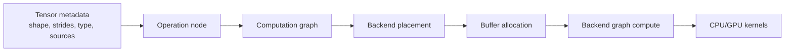

# What GGML is

GGML is the lower-level tensor, operation, graph, allocation, and backend substrate used by llama.cpp. It supplies data structures and execution interfaces; llama.cpp supplies model semantics, tokenization, model-specific graph construction, sequence-state management, and generation orchestration.

## A useful mental model

### Tensor

A GGML tensor describes dimensions, byte strides, element type, operation, source tensors, optional view relationships, and eventually a backing buffer/data address. The metadata and the bytes are related but not identical concepts.

### Operation

Building a model graph mostly creates tensors whose `op` and `src[]` fields describe computation. The call that creates an operation generally does not immediately execute its kernel.

### Graph

A graph is the reachable operation structure selected for evaluation. Graph construction, allocation, placement, and execution are separate phases, even when high-level code makes them appear continuous.

### Backend

A backend provides device and buffer abstractions, tensor transfers, graph execution, synchronization, events, and operation support checks. The scheduler can divide one graph into backend-specific splits and insert transfer dependencies.

## GGML versus llama.cpp

| Question | Primarily answered by |
|---|---|
| What tensors and operations exist? | GGML core |
| What does a Llama/Qwen/DeepSeek layer mean? | llama.cpp architecture implementation |
| Where should a node execute? | Model placement rules + GGML backend scheduler |
| How are graph buffers allocated? | GGML allocator/backend buffers |
| What sequence positions are cached? | llama.cpp context and memory modules |
| How does a CPU matmul use threads? | GGML CPU backend and thread pool |
| How is the next token selected? | llama.cpp sampler API/implementations |

## Research questions for this chapter

- Which parts of GGML remain C, which are C++, and why?
- How do views affect allocation and backend placement?
- How does graph expansion determine node ordering?
- What is guaranteed by the backend interface versus assumed by the scheduler?
- How are quantized types represented and dispatched to kernels?
- Which operation properties are static and which depend on runtime tensor data?
