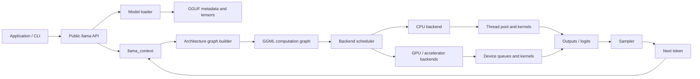

# How.to.llama.cpp

  
SOURCE-GUIDED SYSTEMS DOCUMENTATION

  <h2>Follow one token through llama.cpp.</h2>
  
From a GGUF file on storage, through virtual memory, GGML graph construction, backend scheduling, kernels, logits, and sampling.

  
<strong>Initial pinned baseline:</strong> <code>e3546c7948e3</code>

## Start with the interactive foundations map

The [interactive llama.cpp system map](foundations/interactive-system-map.md) is now the primary foundations entry point. It includes clickable system layers and tabs for:

- the full architecture stack;
- the end-to-end code path;
- memory allocation, mapping, page faults, ownership, and teardown;
- GGUF loading and GGML graph construction;
- backend execution and synchronization;
- file-by-file subsystem groups.

Hover over a layer for a brief explanation and click it for symbols, source files, ownership, and synchronization details.

## The map

## Reading modes

=== "Interactive foundations"

    Start with the [clickable system map](foundations/interactive-system-map.md), then follow its pinned source links and tabs.

=== "Five-minute overview"

    Read [Brief end to end](lifecycle/end-to-end.md) and use the [interactive inference workflow](interactive/inference-workflow.md).

=== "Source deep dive"

    Start at the [repository map](architecture/repository-map.md), then follow source links, file groups, and the generated index.

=== "Systems foundations"

    Begin with [What GGML is](ggml/what-is-ggml.md), followed by GGUF, memory, graph construction, scheduling, concurrency, and backend chapters.

## Evidence convention

!!! success "Verified"
    The behavior is directly visible in the pinned source or official documentation.

!!! info "Interpretation"
    The explanation connects several verified implementation facts. It is useful, but is not itself a source comment or formal guarantee.

!!! warning "Historical"
    The material describes an older commit, branch, PR, or reverted design.

!!! question "Open question"
    The behavior still needs source, test, maintainer, or runtime confirmation.

## Current status

- [x] Pin an initial source baseline.
- [x] Trace the public example through model load, context creation, decode, and sampling.
- [x] Build a clickable tabbed foundations explorer.
- [x] Build a focused inference workflow.
- [x] Create source-mirror and indexing automation.
- [ ] Complete the full repository inventory against every upstream ref.
- [ ] Deep-trace GGUF, `llama_context`, graph construction, memory lifetimes, and file-by-file subsystem composition.
- [ ] Add architecture, backend, and runtime-measured interactive variants.
