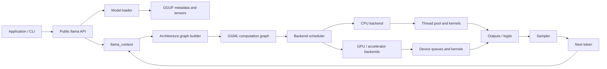

# How.to.llama.cpp

  
SOURCE-GUIDED SYSTEMS DOCUMENTATION

  <h2>Follow one token through llama.cpp.</h2>
  
From a GGUF file on storage, through virtual memory, GGML graph construction, backend scheduling, kernels, logits, and sampling.

  
<strong>Initial pinned baseline:</strong> <code>e3546c7948e3</code>

## The map

## Reading modes

=== "Five-minute overview"

    Read [Brief end to end](lifecycle/end-to-end.md) and use the [interactive workflow](interactive/inference-workflow.md).

=== "Source deep dive"

    Start at the [repository map](architecture/repository-map.md), then follow source links and the generated index.

=== "Systems foundations"

    Begin with [What GGML is](ggml/what-is-ggml.md), followed by memory, scheduling, concurrency, and backend chapters as they are added.

## Evidence convention

!!! success "Verified"
    The behavior is directly visible in the pinned source or official documentation.

!!! info "Interpretation"
    The explanation connects several verified implementation facts. It is useful, but is not itself a source comment or formal guarantee.

!!! warning "Historical"
    The material describes an older commit, branch, PR, or reverted design.

!!! question "Open question"
    The behavior still needs source, test, maintainer, or runtime confirmation.

## Current status

- [x] Pin an initial source baseline.
- [x] Trace the public example through model load, context creation, decode, and sampling.
- [x] Create a Mermaid overview.
- [x] Build the first clickable inference explorer.
- [x] Create source-mirror and indexing automation.
- [ ] Complete the full repository inventory against every upstream ref.
- [ ] Deep-trace context construction, graph reuse, and scheduler allocation.
- [ ] Add backend-by-backend chapters and runtime experiments.
