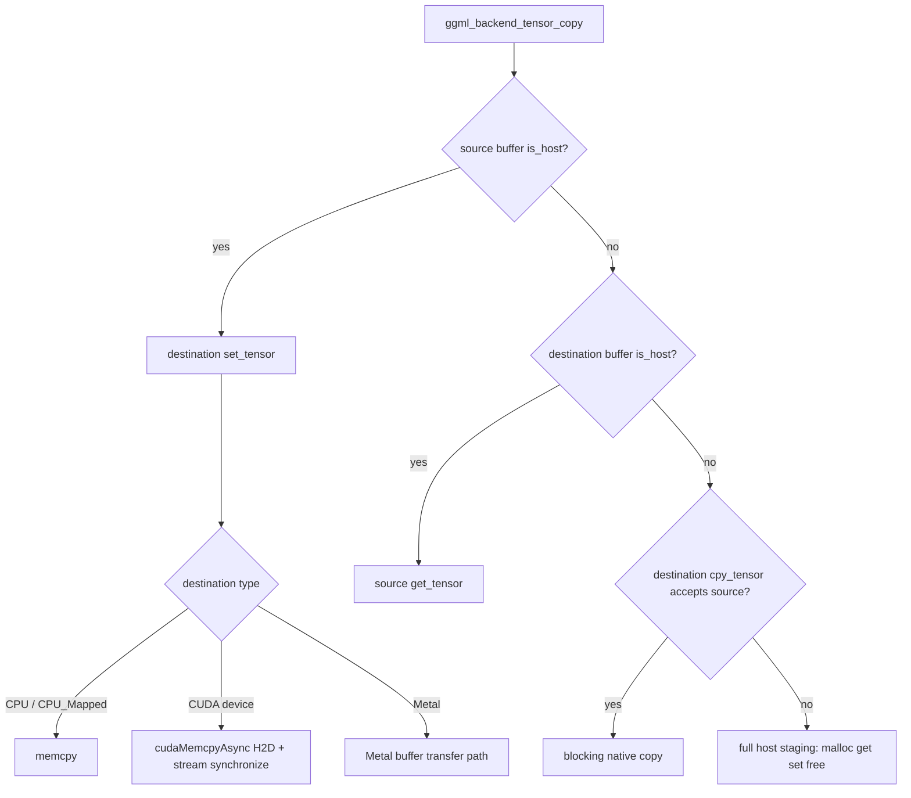

# Buffer compatibility: CPU, mmap, CUDA, and Metal

> **Source baseline:** llama.cpp commit [`e3546c7948e3af463d0b401e6421d5a4c2faf565`](https://github.com/ggml-org/llama.cpp/commit/e3546c7948e3af463d0b401e6421d5a4c2faf565)
>
> This page documents concrete buffer-level `is_host`, `set_tensor`, `get_tensor`, and blocking `cpy_tensor` behavior. It complements the generic fallback page; it does not describe scheduler-level asynchronous copy negotiation.

## Five-minute explanation

A GGML backend and a GGML buffer are different layers. The scheduler asks backends to execute graphs, but the actual bytes live in buffers. Each buffer type decides:

- whether its storage is directly host-visible;
- how host bytes are written into it;
- how bytes are read back to the host;
- whether it can directly consume another backend buffer without generic host staging.

At the pinned revision:

- CPU and `CPU_Mapped` buffers are host-visible. Their blocking operations are ordinary `memcpy()` calls.
- CUDA device buffers are not host-visible. Their set/get operations issue CUDA copies and immediately synchronize; their blocking direct-copy callback accepts only CUDA device sources.
- CUDA host buffers are host-visible, so the generic copy helper treats their pointer as ordinary host input even though allocation may be CUDA-pinned.
- Metal buffers expose backend-native asynchronous operations at the backend interface, while the generic blocking path reaches their concrete buffer set/get behavior after synchronization. Shared/private storage affects addressability and transfer cost, not whether earlier GPU work has completed.

The practical consequence is that “no generic `malloc()` staging” does not mean zero-copy. CPU/mmap → CUDA avoids the emergency heap buffer, but still performs a blocking host-to-device transfer and may fault mmap pages into RAM first.

## Layered call path



## CPU and CPU_Mapped buffers

### Verified

The generic CPU buffer owns aligned process memory. `set_tensor` and `get_tensor` are direct `memcpy()` operations, and its direct `cpy_tensor` callback accepts any source buffer whose type reports `is_host == true`.

`CPU_Mapped` uses the same tensor operations but wraps an external aligned pointer. Its buffer does not free the pointer because ownership remains outside the buffer wrapper. The type still reports `is_host == true`.

This is the mechanism used to expose already-existing host mappings, including model data backed by an mmap-managed pointer, as GGML buffers. The GGML copy layer sees a valid host pointer; the operating system may still need to resolve file-backed page faults when those bytes are first touched.

### Ownership

| Buffer | Allocation owner | Buffer free behavior | Host-visible | Blocking operation |
|---|---|---|---:|---|
| CPU | GGML CPU buffer | aligned allocation is freed | Yes | `memcpy()` |
| CPU_Mapped | external mapping/owner | pointer is not freed | Yes | `memcpy()` through mapped pointer |

### Interpretation

`CPU_Mapped` means mapped into the process address space, not guaranteed resident in physical RAM. Its direct pointer removes a userspace staging allocation but does not remove page faults, page-cache reads, reclaim, or storage latency.

## CUDA device buffers

### Verified

CUDA device buffer `set_tensor` performs `cudaMemcpyAsync(..., cudaMemcpyHostToDevice, cudaStreamPerThread)` and then immediately calls `cudaStreamSynchronize(cudaStreamPerThread)`.

`get_tensor` performs the corresponding device-to-host asynchronous primitive and then immediately synchronizes the per-thread stream.

The blocking destination-buffer `cpy_tensor` callback:

1. accepts only a CUDA device source buffer;
2. uses device-to-device copy on the same device;
3. uses peer copy for different devices unless `GGML_CUDA_NO_PEER_COPY` is defined;
4. synchronizes the per-thread stream before returning;
5. returns `false` for non-CUDA-device sources.

The CUDA device buffer type leaves `is_host` unset, so the generic helper treats it as not host-visible.

### Completion semantics

Although these functions call CUDA APIs containing `Async`, their buffer-level contract is blocking because each function synchronizes before returning. This is intentionally different from the backend-level CUDA asynchronous copy callback documented elsewhere.

## CUDA host buffers

### Verified

CUDA host buffers are exposed as host-visible buffer types. Therefore, a generic CPU/CUDA-host → CUDA-device copy takes the host-source branch and passes the existing pointer to the CUDA device buffer's blocking `set_tensor` implementation.

### Interpretation

Pinned or CUDA-managed host allocation can improve transfer mechanics, but the generic fallback still synchronizes the involved backends first and the destination buffer call synchronizes before return. It is not scheduler-level overlap.

## Metal shared and private buffers

### Verified

The pinned Metal backend provides asynchronous backend callbacks for set/get/copy and represents transfers with Metal command buffers and blit encoders. Metal-to-Metal asynchronous copies use an event dependency between source and destination contexts. Backend synchronization waits the last relevant command buffer and checks completion status.

The buffer storage mode still matters:

- shared storage can be CPU-addressable on supported systems;
- private storage requires GPU-side transfer operations for host data;
- neither storage mode proves queued command completion.

The generic blocking fallback synchronizes the Metal backend before it invokes the destination buffer operation, so earlier Metal work is complete at that boundary.

### Open question

The exact pinned buffer-level branching for every Metal shared/private source-destination pair still deserves a dedicated source table from `ggml-metal-context.m`, including whether a particular path uses direct CPU access, a temporary shared `MTLBuffer`, or a blit-only path. This page therefore records Metal at the verified capability level and does not claim unsupported zero-copy behavior.

## Source-buffer × destination-buffer matrix

| Source | Destination | Source host-visible? | Destination native blocking `cpy_tensor`? | Generic full-size heap staging? | Effective blocking path |
|---|---|---:|---|---:|---|
| CPU | CPU | Yes | Not needed | No | destination `memcpy()` |
| CPU_Mapped/mmap | CPU | Yes | Not needed | No | destination `memcpy()`; source access may fault pages |
| CPU | CPU_Mapped | Yes | Not needed | No | `memcpy()` into external mapping |
| CPU_Mapped/mmap | CUDA device | Yes | CUDA direct callback would reject, but not reached | No | CUDA H2D copy + stream sync |
| CUDA host | CUDA device | Yes | CUDA direct callback would reject, but not reached | No | CUDA H2D copy + stream sync |
| CUDA device | CPU | No | CPU destination accepts only host-visible source | No, because destination is host-visible | CUDA D2H copy + stream sync into CPU pointer |
| CUDA device | CUDA device, same GPU | No | Yes | No | CUDA D2D + stream sync |
| CUDA device | CUDA device, peer GPU | No | Yes when peer copy enabled | No when accepted | CUDA peer copy + stream sync |
| CUDA device | CUDA device, peer disabled | No | No | Yes | generic host allocation + D2H + H2D |
| CPU/mmap | Metal | Yes | Not needed | No | Metal destination set path after backend synchronization |
| Metal | CPU | No unless concrete Metal type reports host | Not needed because CPU destination is host | No | Metal source get path after synchronization |
| Unsupported device A | Unsupported device B | No | No | Yes | full host staging allocation |

## What `is_host` does and does not mean

### Verified

`is_host` is a buffer-type capability bit implemented by an optional callback. If absent, GGML returns `false`. The generic tensor-copy helper uses it only to decide whether it may directly dereference a tensor pointer on the CPU.

### Interpretation

`is_host == true` means CPU-addressable in this API contract. It does not guarantee:

- physical residency;
- absence of mmap page faults;
- pinned memory;
- cache warmth;
- NUMA locality;
- zero-copy accelerator execution;
- completion of previously queued accelerator work.

## Runtime validation plan

A useful experiment should record each copy boundary with source/destination buffer names, byte count, chosen branch, and elapsed time. For representative prefill and one-token decode runs, collect:

1. minor and major page faults before/after CPU_Mapped → accelerator copies;
2. block-read deltas for file-backed weights;
3. process RSS and `MemAvailable` around generic staging allocations;
4. accelerator timeline markers showing whether transfer overlaps compute;
5. time spent in source synchronization, destination synchronization, set/get/copy, and final graph submission;
6. separate counts for direct native copies versus generic full-host staging.

A minimum trace event should contain:

```text
copy_id, tensor_name, bytes,
source_buffer, destination_buffer,
source_is_host, destination_is_host,
async_accepted, blocking_direct_accepted,
heap_staging_used,
source_sync_us, destination_sync_us, copy_us,
minor_fault_delta, major_fault_delta, rss_delta
```

## Truth-labelled findings

### Verified

- CPU and CPU_Mapped buffer operations use direct `memcpy()`.
- CPU_Mapped wraps but does not own the external pointer.
- CPU and CPU_Mapped report host visibility.
- CUDA device buffers do not report host visibility.
- CUDA device set/get and direct copies synchronize before returning.
- CUDA blocking direct copy accepts CUDA-device sources and supports same-device or peer-device transfer subject to build support.
- Generic host-visible branches avoid the emergency full-tensor heap allocation.

### Interpretation

- Host visibility is an addressability property, not a residency or completion guarantee.
- CPU_Mapped → accelerator copies can expose storage/page-fault cost directly inside a transfer boundary.
- A blocking backend-native copy can avoid heap staging while still introducing a large synchronization bubble.

### Historical

- These findings apply to the pinned baseline. Newer backends may add staging pools, registered-host fast paths, unified-memory specializations, or broader direct-copy compatibility.

### Open question

- Complete concrete Metal shared/private branching.
- Vulkan, SYCL, RPC, CANN, and other backend-specific direct-copy matrices.
- Android is not one GGML buffer backend: actual behavior depends on the compiled CPU, Vulkan, OpenCL, KleidiAI, or vendor accelerator path.
- Runtime evidence for page faults, queue stalls, temporary RSS, and transfer overlap.

## Pinned source map

| Concern | Source |
|---|---|
| Generic `is_host` and destination-copy dispatch | [`ggml-backend.cpp`](https://github.com/ggml-org/llama.cpp/blob/e3546c7948e3af463d0b401e6421d5a4c2faf565/ggml/src/ggml-backend.cpp#L74-L80) |
| Generic tensor-copy decision tree | [`ggml_backend_tensor_copy()`](https://github.com/ggml-org/llama.cpp/blob/e3546c7948e3af463d0b401e6421d5a4c2faf565/ggml/src/ggml-backend.cpp#L477-L498) |
| CPU and CPU_Mapped buffer operations/types | [`ggml-backend.cpp`](https://github.com/ggml-org/llama.cpp/blob/e3546c7948e3af463d0b401e6421d5a4c2faf565/ggml/src/ggml-backend.cpp#L2210-L2369) |
| CUDA device set/get/direct-copy behavior | [`ggml-cuda.cu`](https://github.com/ggml-org/llama.cpp/blob/e3546c7948e3af463d0b401e6421d5a4c2faf565/ggml/src/ggml-cuda/ggml-cuda.cu#L714-L796) |
| Metal backend wrappers | [`ggml-metal.cpp`](https://github.com/ggml-org/llama.cpp/blob/e3546c7948e3af463d0b401e6421d5a4c2faf565/ggml/src/ggml-metal/ggml-metal.cpp) |
| Metal command buffers, blits, and storage | [`ggml-metal-context.m`](https://github.com/ggml-org/llama.cpp/blob/e3546c7948e3af463d0b401e6421d5a4c2faf565/ggml/src/ggml-metal/ggml-metal-context.m) |

## Next investigation

Trace Vulkan and SYCL buffer interfaces next, then extend the matrix with their exact host visibility, direct copy acceptance, synchronization, and staging behavior.