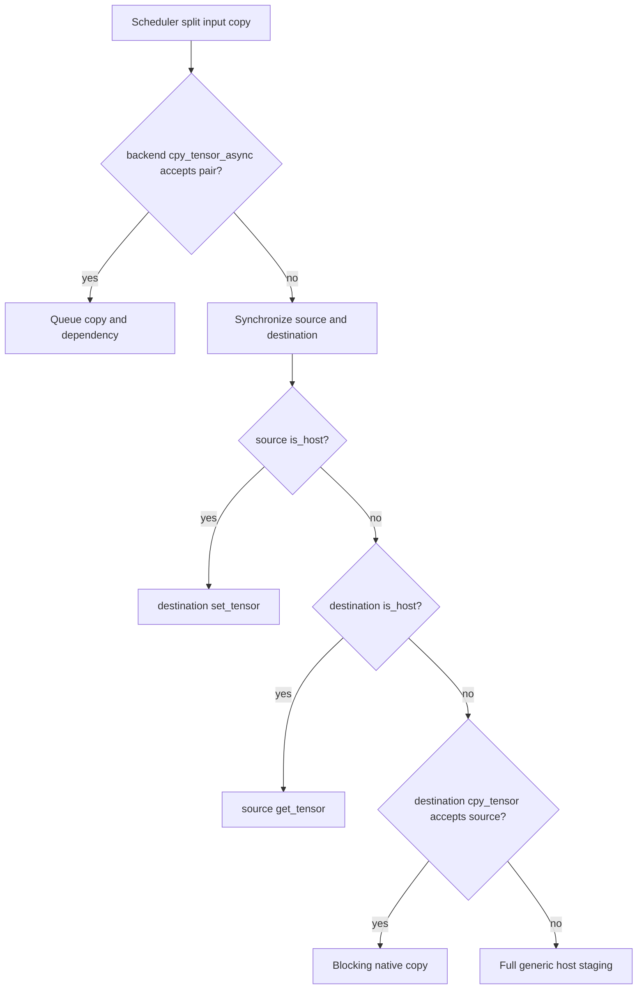

# Buffer compatibility across CPU and accelerator backends

> **Source baseline:** llama.cpp commit [`e3546c7948e3af463d0b401e6421d5a4c2faf565`](https://github.com/ggml-org/llama.cpp/commit/e3546c7948e3af463d0b401e6421d5a4c2faf565)
>
> This page records concrete buffer-level host visibility, blocking copy behavior, scheduler asynchronous-copy acceptance, staging, and completion. The [generic copy fallback](generic-copy-fallback.md) remains the authority for the final `malloc → get → set → free` branch.

## Five-minute explanation

A GGML backend executes graphs, while a GGML buffer type owns or wraps the bytes. Copy behavior depends on both layers:

1. `is_host` decides whether generic GGML code may dereference the tensor pointer directly.
2. `set_tensor` and `get_tensor` define blocking host transfers.
3. destination `cpy_tensor` may provide a backend-native blocking device copy.
4. backend `cpy_tensor_async` may let the scheduler queue a split copy without waiting.
5. when asynchronous copy is absent or rejected, the scheduler synchronizes both backends and uses the generic blocking decision tree.



## Capability summary

| Buffer/backend | Public `is_host` | Blocking host set/get | Blocking native device copy | Scheduler tensor-copy async |
|---|---:|---|---|---|
| CPU | Yes | direct `memcpy()` | accepts host-visible sources | not needed |
| CPU_Mapped / mmap | Yes | direct pointer access; may fault pages | CPU rules | not an accelerator callback |
| CUDA device | No | CUDA copy followed by stream synchronization | same-device and peer CUDA-device sources | enabled for accepted CUDA device pairs |
| CUDA host | Yes | CPU-addressable pinned allocation | host-source branch normally wins | rejected by pinned CUDA device-copy callback |
| Metal | backend/storage dependent | command-buffer transfer paths | Metal-native paths | enabled with event ordering |
| Vulkan device | No | mapped coherent access or staging plus fence | same-device; cross-device host mediation | same-device Vulkan and registered Vulkan host only |
| Vulkan registered host | Yes | CPU interface over registered allocation | host-source branch | accepted by owning Vulkan device |
| SYCL device / split | No | queue copy and wait; non-Windows set adds temporary host copy | Level Zero, SYCL peer, or host-forward | **disabled in pinned interface** |
| SYCL system-USM default buffer | No | same public callbacks as SYCL device buffer | same SYCL device-copy callback | **disabled in pinned interface** |
| SYCL host buffer | Yes | CPU buffer operations | host-source branch | **disabled in pinned interface** |

## Exact source × destination matrix

| Source | Destination | Source host-visible? | Scheduler async accepted? | Blocking direct path | Generic heap staging? | Effective pinned path |
|---|---|---:|---:|---|---:|---|
| CPU | CPU | Yes | not needed | destination `memcpy()` | No | direct copy |
| CPU_Mapped / mmap | CPU | Yes | not needed | destination `memcpy()` | No | direct pointer read; source may page-fault |
| CPU_Mapped / mmap | CUDA device | Yes | No | host-source branch calls CUDA `set_tensor` | No | H2D copy plus stream synchronization |
| CUDA host | CUDA device | Yes | No | host-source branch calls CUDA `set_tensor` | No | H2D copy plus stream synchronization |
| CUDA device | CPU | No | No | host-destination branch calls CUDA `get_tensor` | No | D2H copy plus stream synchronization |
| CUDA device | CUDA device, same GPU | No | Yes | CUDA D2D | No | queued scheduler copy, or blocking D2D plus sync |
| CUDA device | CUDA device, peer GPU | No | Yes when peer enabled | CUDA peer copy | No when accepted | queued or blocking peer copy |
| CUDA device | CUDA device, peer disabled | No | No | rejected | Yes | generic D2H staging then H2D |
| CPU / mmap | Metal | Yes | backend-pair dependent | Metal destination set path | No | fallback synchronization, then Metal transfer |
| Metal | CPU | backend-type dependent | backend-pair dependent | source get path | No because destination is host | synchronized Metal readback |
| CPU / mmap | Vulkan device | Yes | No | Vulkan `set_tensor` | No | mapped write or coherent staging plus fence |
| Vulkan registered host | Vulkan device, same owner | Yes | Yes | host-source branch if blocking | No | queued registered-buffer copy |
| Vulkan device | CPU | No | No | Vulkan `get_tensor` | No | barrier/staging plus fence wait |
| Vulkan device | Vulkan device, same device | No | Yes | native Vulkan copy | No | queued copy, or blocking copy plus fence |
| Vulkan device | Vulkan device, different device | No | No | host-mediated Vulkan blocking path | No generic heap | source staging plus destination write |
| CPU / mmap | SYCL device | Yes | **No: callback is `NULL`** | host-source branch calls SYCL `set_tensor` | No generic heap; **Yes backend temporary staging on non-Windows** | synchronize both backends; `malloc → memcpy(source) → queue H2D.wait → free` |
| SYCL host buffer | SYCL device | Yes | **No** | host-source branch calls SYCL `set_tensor` | No generic heap; backend temporary staging may still occur on non-Windows | synchronized host-to-device set |
| SYCL device | CPU | No | **No** | host-destination branch calls SYCL `get_tensor` | No | queue D2H and wait |
| SYCL device | SYCL device, same device | No | **No** | SYCL direct `cpy_tensor` | No | synchronize both backends, wait device queues, native copy completes before return |
| SYCL device | SYCL device, peer-accessible device | No | **No** | Level Zero or SYCL peer copy | No | both devices waited; peer copy completes before return |
| SYCL device | SYCL device, no peer path | No | **No** | SYCL host-forward fallback | No generic heap; **Yes backend full-size host staging** | wait D2H, wait H2D, free temporary host buffer |
| Unsupported device A | Unsupported device B | No | No | rejected | Yes | generic full-tensor `malloc → get → set → free` |

## SYCL staging must be counted separately

### Verified

The pinned scheduler interface installs no SYCL `cpy_tensor_async` callback, even though a helper exists. Every graph-split tensor copy involving a SYCL destination therefore enters the synchronized generic path.

Two different full-size allocations must not be conflated:

| Staging kind | Allocated by | Trigger | Example |
|---|---|---|---|
| Generic emergency staging | `ggml_backend_tensor_copy()` | neither side host-visible and destination direct copy rejects source | unsupported accelerator A → B |
| SYCL mmap/PVC staging | SYCL `set_tensor` on non-Windows | host-source branch reaches SYCL device write | mmap/CPU → SYCL device |
| SYCL host-forward staging | SYCL direct device copy | no Level Zero or peer-copy path | SYCL device A → B |

Thus `heap_staging_used = false` at the generic layer does **not** prove that no full-tensor host allocation occurred inside the backend.

### Interpretation

The non-Windows mmap-to-SYCL path can combine file-backed page faults, one full host `memcpy()`, temporary RSS equal to the tensor, a host-to-device queue copy, and a queue wait. Same-device and peer-device SYCL copies can avoid host staging, but they remain scheduler-serializing at this pinned revision because the callback registration is absent.

## Completion semantics

| Path | Host-visible completion when function returns? | Potential scheduler overlap? |
|---|---:|---:|
| CPU `memcpy()` | Yes | No asynchronous boundary |
| CUDA blocking set/get/direct copy | Yes | No |
| CUDA accepted scheduler copy | No; queued dependency | Yes |
| Vulkan blocking set/get/direct copy | Yes | No |
| Vulkan accepted scheduler copy | No; fence/event dependency | Yes |
| SYCL blocking set/get/direct copy | Yes | No |
| SYCL backend async set/get | No; stream-zero queue work | Yes for explicit backend calls |
| SYCL scheduler tensor copy | Falls back to blocking completion | **No at pinned revision** |

## Runtime validation schema

A copy trace should distinguish generic staging from backend staging:

```text
copy_id, tensor_name, bytes,
source_buffer, destination_buffer,
source_is_host, destination_is_host,
async_callback_present, async_accepted,
blocking_direct_accepted,
generic_heap_staging_used,
backend_temp_staging_used, backend_host_forward_used,
source_sync_us, destination_sync_us,
submit_us, queue_or_fence_wait_us, copy_total_us,
minor_fault_delta, major_fault_delta,
rss_before, rss_peak, rss_after
```

For SYCL, also record runtime/backend (`Level Zero`, `OpenCL`, other), device pair, system-USM selection, peer-access result, and whether the mmap/PVC workaround branch executed.

## Truth-labelled findings

### Verified

- CPU and CPU_Mapped are host-visible; CPU_Mapped addressability does not guarantee residency.
- CUDA device blocking operations synchronize before return, while accepted scheduler copies queue work and dependencies.
- Vulkan default buffers are not publicly host-visible; registered Vulkan host buffers enable a scheduler fast path.
- Default, split, and optional system-USM SYCL buffers report `is_host == false`.
- SYCL host buffers inherit CPU host visibility.
- The pinned SYCL scheduler `cpy_tensor_async` registration is `NULL`.
- SYCL same-device, peer-device, and host-forward copies therefore execute through a synchronized blocking path.
- Non-Windows SYCL host-to-device writes can allocate backend-specific full-tensor staging even when generic emergency staging is avoided.

### Interpretation

- Host visibility is an addressability contract, not residency, accelerator registration, or completion.
- “No generic heap staging” is insufficient as a performance metric; backend staging must be instrumented separately.
- The missing SYCL scheduler callback is a likely overlap boundary for multi-backend graph splits.

### Historical

These claims apply to the pinned baseline. Newer revisions may register or replace the SYCL callback, remove the mmap workaround, pool staging allocations, add dependency events, or change Level Zero/peer behavior.

### Open questions

- Which later upstream revision first restores scheduler-level SYCL tensor-copy asynchrony.
- Whether current PVC and non-Intel runtimes still require the temporary mmap staging workaround.
- Exact Metal shared/private buffer branches.
- RPC, CANN, OpenCL, and Android-vendor backend matrices.
- Measured page faults, queue stalls, temporary RSS, and overlap.

## Pinned source map

| Concern | Source |
|---|---|
| Generic host visibility and tensor-copy decision tree | [`ggml-backend.cpp`](https://github.com/ggml-org/llama.cpp/blob/e3546c7948e3af463d0b401e6421d5a4c2faf565/ggml/src/ggml-backend.cpp#L74-L80), [`ggml_backend_tensor_copy()`](https://github.com/ggml-org/llama.cpp/blob/e3546c7948e3af463d0b401e6421d5a4c2faf565/ggml/src/ggml-backend.cpp#L477-L498) |
| CPU and CPU_Mapped operations | [`ggml-backend.cpp`](https://github.com/ggml-org/llama.cpp/blob/e3546c7948e3af463d0b401e6421d5a4c2faf565/ggml/src/ggml-backend.cpp#L2210-L2369) |
| CUDA device set/get/direct copy | [`ggml-cuda.cu`](https://github.com/ggml-org/llama.cpp/blob/e3546c7948e3af463d0b401e6421d5a4c2faf565/ggml/src/ggml-cuda/ggml-cuda.cu#L714-L796) |
| Metal wrappers and command-buffer implementation | [`ggml-metal.cpp`](https://github.com/ggml-org/llama.cpp/blob/e3546c7948e3af463d0b401e6421d5a4c2faf565/ggml/src/ggml-metal/ggml-metal.cpp), [`ggml-metal-context.m`](https://github.com/ggml-org/llama.cpp/blob/e3546c7948e3af463d0b401e6421d5a4c2faf565/ggml/src/ggml-metal/ggml-metal-context.m) |
| Vulkan blocking transfers and scheduler acceptance | [`ggml-vulkan.cpp`](https://github.com/ggml-org/llama.cpp/blob/e3546c7948e3af463d0b401e6421d5a4c2faf565/ggml/src/ggml-vulkan/ggml-vulkan.cpp#L7934-L8145), [`#L15360-L15640`](https://github.com/ggml-org/llama.cpp/blob/e3546c7948e3af463d0b401e6421d5a4c2faf565/ggml/src/ggml-vulkan/ggml-vulkan.cpp#L15360-L15640) |
| SYCL allocation and blocking set/get | [`ggml-sycl.cpp`](https://github.com/ggml-org/llama.cpp/blob/e3546c7948e3af463d0b401e6421d5a4c2faf565/ggml/src/ggml-sycl/ggml-sycl.cpp#L480-L500), [`#L585-L628`](https://github.com/ggml-org/llama.cpp/blob/e3546c7948e3af463d0b401e6421d5a4c2faf565/ggml/src/ggml-sycl/ggml-sycl.cpp#L585-L628) |
| SYCL blocking device copy | [`ggml-sycl.cpp`](https://github.com/ggml-org/llama.cpp/blob/e3546c7948e3af463d0b401e6421d5a4c2faf565/ggml/src/ggml-sycl/ggml-sycl.cpp#L641-L742) |
| SYCL host-buffer and backend async set/get | [`ggml-sycl.cpp`](https://github.com/ggml-org/llama.cpp/blob/e3546c7948e3af463d0b401e6421d5a4c2faf565/ggml/src/ggml-sycl/ggml-sycl.cpp#L1411-L1454), [`#L5230-L5307`](https://github.com/ggml-org/llama.cpp/blob/e3546c7948e3af463d0b401e6421d5a4c2faf565/ggml/src/ggml-sycl/ggml-sycl.cpp#L5230-L5307) |
| Disabled SYCL scheduler callback | [`ggml-sycl.cpp`](https://github.com/ggml-org/llama.cpp/blob/e3546c7948e3af463d0b401e6421d5a4c2faf565/ggml/src/ggml-sycl/ggml-sycl.cpp#L5470-L5478) |

## Next investigation

Identify the first later llama.cpp revision that registers or replaces SYCL scheduler tensor-copy asynchrony, then compare its queue, event, dependency, and completion semantics with this pinned baseline.
