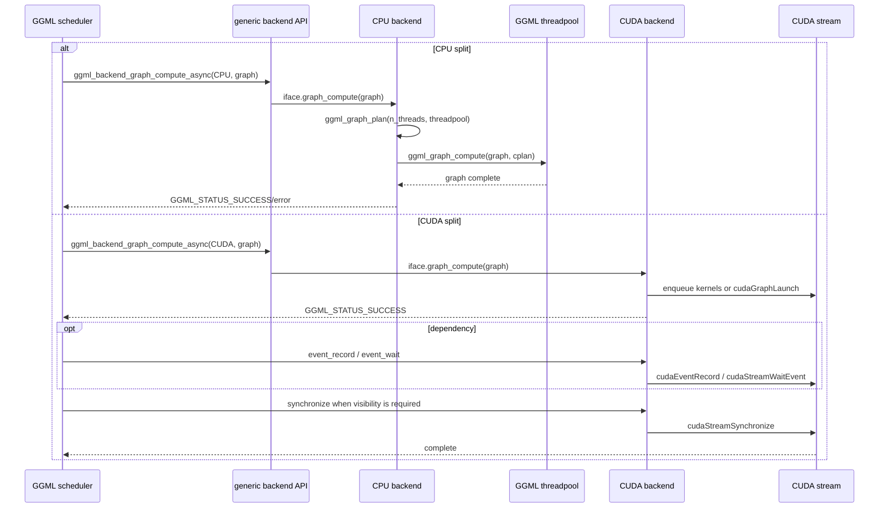

# CPU and CUDA backend execution semantics

> **Source baseline:** llama.cpp commit [`e3546c7948e3af463d0b401e6421d5a4c2faf565`](https://github.com/ggml-org/llama.cpp/commit/e3546c7948e3af463d0b401e6421d5a4c2faf565)
>
> This page compares the concrete CPU and CUDA backend interfaces at the pinned revision. It does not claim that every accelerator backend behaves like CUDA, or that newer revisions preserve the same details.

## Five-minute explanation

The scheduler calls all backends through the same GGML interface, but the word **async** has different practical meaning depending on the concrete backend.

- The pinned **CPU backend** exposes only a graph-compute callback. That callback builds a CPU execution plan and calls `ggml_graph_compute()` directly. It does not provide asynchronous tensor-copy callbacks, backend synchronization, or backend-event callbacks.
- The pinned **CUDA backend** provides asynchronous tensor operations, peer-copy support, stream synchronization, graph submission, and CUDA-event record/wait callbacks. Graph compute queues kernels or launches a captured CUDA graph on a CUDA stream and returns without a device-wide completion wait.

Therefore, `ggml_backend_graph_compute_async()` is an interface-level submission API, not a guarantee that every backend overlaps work with the caller. With CPU it is effectively synchronous; with CUDA it normally queues device work and completion is established later by stream synchronization or event dependencies.

## Concrete call paths



## CPU backend

### Verified: graph compute blocks until CPU work completes

The CPU backend context stores the selected thread count, an optional `ggml_threadpool_t`, reusable work storage, and an abort callback. Its graph callback:

1. calls `ggml_graph_plan(cgraph, n_threads, threadpool)`;
2. grows reusable work memory when the plan requires more space;
3. installs abort and reference-implementation settings in the plan;
4. calls `ggml_graph_compute(cgraph, &cplan)` and returns its status.

Because the callback returns the result of `ggml_graph_compute()` directly, scheduler submission to the CPU backend does not return while that graph is still executing in the CPU threadpool.

Pinned source: [`ggml/src/ggml-cpu/ggml-cpu.cpp`](https://github.com/ggml-org/llama.cpp/blob/e3546c7948e3af463d0b401e6421d5a4c2faf565/ggml/src/ggml-cpu/ggml-cpu.cpp#L99-L212).

### Verified: CPU leaves optional async and event hooks unset

At the pinned revision, the CPU interface sets these callbacks to `NULL`:

- `set_tensor_async` and `get_tensor_async`;
- `set_tensor_2d_async` and `get_tensor_2d_async`;
- `cpy_tensor_async`;
- `synchronize`;
- `event_record` and `event_wait`.

It supplies `graph_compute`, graph-plan creation/free/compute, and ordinary CPU buffer operations. Generic GGML wrappers must therefore use their documented synchronous behavior or scheduler fallback paths when an optional callback is absent.

### Interpretation: the CPU threadpool is internal parallelism, not scheduler asynchrony

CPU graph execution can use multiple worker threads, but the calling scheduler thread waits for the CPU graph computation to finish. Parallel execution *inside* `ggml_graph_compute()` should not be confused with asynchronous submission *across* scheduler calls.

## CUDA backend

### Verified: graph compute queues work on a stream

The CUDA graph callback chooses the device, checks whether CUDA-graph reuse is enabled and compatible, optionally begins stream capture, evaluates or captures the GGML graph, and returns `GGML_STATUS_SUCCESS`.

Ordinary node execution dispatches CUDA kernels and cuBLAS operations onto the backend stream. When a captured CUDA graph is reusable, the backend calls `cudaGraphLaunch(graph->instance, cuda_ctx->stream())`. The graph callback itself does not end with `cudaStreamSynchronize()`.

Pinned source: [`ggml/src/ggml-cuda/ggml-cuda.cu`](https://github.com/ggml-org/llama.cpp/blob/e3546c7948e3af463d0b401e6421d5a4c2faf565/ggml/src/ggml-cuda/ggml-cuda.cu#L3900-L4048).

### Verified: scheduler events map to CUDA stream events

The CUDA backend implements:

- `event_record` with `cudaEventRecord(event, cuda_ctx->stream())`;
- `event_wait` with `cudaStreamWaitEvent(cuda_ctx->stream(), event, 0)` for CUDA backends.

These calls add ordering to the CUDA stream without making the host wait for the event. They are suitable for the scheduler copy-slot reuse fences documented in the preceding chapter.

A non-CUDA branch inside the CUDA event-wait callback is disabled and aborts, so this implementation should not be described as a general cross-API host event bridge.

### Verified: CUDA advertises asynchronous and event capability

The CUDA device properties advertise asynchronous operation and, unless peer copy is compiled out, event capability. The backend interface supplies callbacks for asynchronous tensor set/get, two-dimensional transfers, `cpy_tensor_async`, synchronization, graph compute, and events.

Pinned interface registration: [`ggml/src/ggml-cuda/ggml-cuda.cu`](https://github.com/ggml-org/llama.cpp/blob/e3546c7948e3af463d0b401e6421d5a4c2faf565/ggml/src/ggml-cuda/ggml-cuda.cu#L4317-L4334).

### Verified: synchronous buffer operations are separate from backend async operations

CUDA buffer-interface operations such as ordinary `set_tensor`, `get_tensor`, and buffer-to-buffer copy use CUDA asynchronous primitives on `cudaStreamPerThread` and then immediately synchronize that stream. They are synchronous from the caller's perspective.

This is separate from the backend-level asynchronous callbacks used by the scheduler. The distinction matters: seeing `cudaMemcpyAsync` in an implementation is not sufficient evidence of host-visible asynchrony when a synchronization follows immediately.

Pinned buffer path: [`ggml/src/ggml-cuda/ggml-cuda.cu`](https://github.com/ggml-org/llama.cpp/blob/e3546c7948e3af463d0b401e6421d5a4c2faf565/ggml/src/ggml-cuda/ggml-cuda.cu#L708-L799).

## True-async versus fallback table

| Operation seen by scheduler | CPU at pinned revision | CUDA at pinned revision | Completion/visibility boundary |
|---|---|---|---|
| `ggml_backend_graph_compute_async` | Calls blocking CPU graph compute | Queues kernels or a CUDA graph on a stream | CPU: callback return. CUDA: later stream/backend sync or event dependency |
| `cpy_tensor_async` | Callback absent | Callback present for supported CUDA transfer combinations | Unsupported/failed combinations trigger scheduler synchronization and synchronous tensor copy |
| `event_record` | Callback absent | `cudaEventRecord` on backend stream | Event completes after preceding stream work |
| `event_wait` | Callback absent | `cudaStreamWaitEvent` on backend stream | Later stream work waits without blocking host |
| `ggml_backend_synchronize` | No backend callback; graph work is already complete on return | Stream synchronization callback | Host may safely consume device-produced outputs afterward |
| ordinary buffer `set/get/copy` | CPU memory operation | Async CUDA primitive followed by immediate stream sync | Synchronous to caller in both cases |

## Memory ownership and visibility

### Verified

- The CPU backend operates on host-accessible buffers and reusable CPU work storage owned by the backend context.
- CUDA device tensors reside in CUDA buffer allocations; host access requires an explicit transfer or host-compatible buffer type.
- Scheduler-created cross-backend copies remain scheduler-owned destination tensors. CUDA stream events order their reuse; they do not transfer ownership to the CUDA backend.
- CUDA-event completion establishes device-stream ordering. Host visibility still requires a host transfer or synchronization appropriate to the output buffer and API path.

### Interpretation

A useful mental model is:

```text
CPU callback return
    = CPU graph completion

CUDA callback return
    = commands accepted into a stream

CUDA event wait
    = device-side dependency

CUDA synchronize
    = host waits for queued stream work
```

This explains why the same scheduler code can appear synchronous in CPU-only inference but allow pipelining when CUDA splits and copy slots are active.

## Important caveats

### Verified

- Some CUDA operations can introduce synchronization internally. The pinned code explicitly disables CUDA-graph capture for certain `MUL_MAT_ID` cases that need stream synchronization.
- Event support depends on build configuration; `GGML_CUDA_NO_PEER_COPY` disables the advertised event capability.
- CUDA graph capture/reuse adds another graph layer below GGML graph reuse. GGML may reuse its tensor graph while CUDA separately decides whether a captured device graph is stable enough to launch again.

### Open questions

- Which exact source/destination buffer combinations are accepted by `ggml_backend_cuda_cpy_tensor_async`, and which return `false` to the scheduler fallback?
- How much copy/compute overlap occurs during prompt processing and one-token decode on representative PCIe, UMA, and multi-GPU systems?
- How do Metal command buffers/events, Vulkan queues/semaphores, SYCL queues, RPC transport, and Android GPU backends differ from the CUDA model?
- Which later scheduler or CUDA PRs changed event capability, peer-copy ordering, or CUDA-graph reuse?

## Source map

| Concern | CPU symbol | CUDA symbol |
|---|---|---|
| Backend interface registration | `ggml_backend_cpu_i` | `ggml_backend_cuda_interface` |
| Graph execution | `ggml_backend_cpu_graph_compute` | `ggml_backend_cuda_graph_compute` |
| Thread/queue context | `ggml_backend_cpu_context::threadpool` | `ggml_backend_cuda_context::stream()` |
| Async tensor copy | not implemented | `ggml_backend_cuda_cpy_tensor_async` |
| Completion | callback return | `ggml_backend_cuda_synchronize` |
| Event record/wait | not implemented | `ggml_backend_cuda_event_record`, `ggml_backend_cuda_event_wait` |

## Next investigation

Trace `ggml_backend_cuda_cpy_tensor_async()` branch by branch, then compare CUDA with Metal or Vulkan. That will identify exactly when scheduler copies remain on-device and asynchronous, when host staging is required, and when the generic fallback forces synchronization.