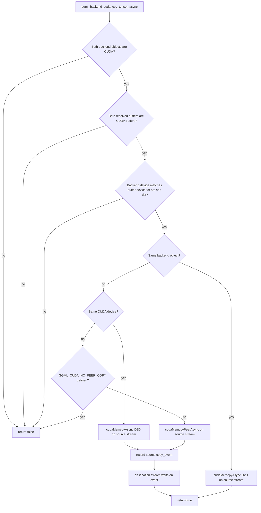

# CUDA asynchronous tensor-copy branches

> **Source baseline:** llama.cpp commit [`e3546c7948e3af463d0b401e6421d5a4c2faf565`](https://github.com/ggml-org/llama.cpp/commit/e3546c7948e3af463d0b401e6421d5a4c2faf565)
>
> This page describes `ggml_backend_cuda_cpy_tensor_async()` at the pinned revision. Newer CUDA, HIP, MUSA, scheduler, and peer-copy behavior must be checked separately.

## Five-minute explanation

The CUDA asynchronous copy callback is narrower than its name may suggest. It is a **CUDA-device-buffer to CUDA-device-buffer** fast path. It does not accept an ordinary CPU/mmap source tensor, CUDA host-buffer staging, or a tensor whose backend and buffer name different devices.

When the callback accepts the copy, it queues the transfer on the **source backend stream**. If source and destination are represented by different backend objects, the source stream records a lazily created event after the copy and the destination stream waits on that event before consuming the destination tensor. No host synchronization occurs in the successful callback.

When any precondition is rejected, the callback returns `false`. The generic scheduler path can then synchronize the relevant backends and perform the normal synchronous tensor copy. Therefore, `false` is not itself an error; it is a request to use the correctness-preserving fallback.

## Branch diagram



Pinned implementation: [`ggml/src/ggml-cuda/ggml-cuda.cu#L2332-L2385`](https://github.com/ggml-org/llama.cpp/blob/e3546c7948e3af463d0b401e6421d5a4c2faf565/ggml/src/ggml-cuda/ggml-cuda.cu#L2332-L2385).

## Exact acceptance and rejection conditions

| Check | Accepted path | Rejected meaning |
|---|---|---|
| Backend type | `backend_src` and `backend_dst` both satisfy `ggml_backend_is_cuda()` | CPU, RPC, Metal, Vulkan, or any mixed-backend pair returns `false` |
| Resolved buffer type | Source and destination buffers both satisfy `ggml_backend_buffer_is_cuda()` | CPU/mmap, CUDA host-buffer, or other non-device-buffer storage returns `false` |
| Backend/buffer device consistency | Source backend device equals source buffer device, and destination backend device equals destination buffer device | Mismatched object wiring returns `false`; debug builds also log the mismatch |
| Different backend objects, same device | Queue `cudaMemcpyAsync(..., cudaMemcpyDeviceToDevice, source_stream)` | Accepted |
| Different devices | Queue `cudaMemcpyPeerAsync()` when peer copy is compiled in | `GGML_CUDA_NO_PEER_COPY` returns `false` |
| Same backend object | Queue `cudaMemcpyAsync(..., cudaMemcpyDeviceToDevice, source_stream)` | Accepted without an extra copy event because producer and consumer use the same backend stream |

### Verified: views resolve to their owning buffer

For both tensors, the callback uses `view_src->buffer` when the tensor is a view and otherwise uses `tensor->buffer`. The eligibility test therefore follows the storage-owning buffer rather than treating a view as independent storage.

### Verified: the transfer size is the destination tensor size

All accepted branches copy `ggml_nbytes(dst)` bytes from `src->data` to `dst->data`. The function does not perform shape conversion or partial-range selection. Scheduler-created source/destination copy tensors must already describe a compatible transfer.

## Stream and event ordering

### Same backend object

```text
source/backend stream:
    earlier producer work
    -> cudaMemcpyAsync(dst, src, D2D)
    -> later consumer work on the same stream
```

CUDA stream order is sufficient. The callback does not create or wait on the dedicated `copy_event` in this branch.

### Different backend objects on the same device

```text
source backend stream:
    earlier producer work
    -> cudaMemcpyAsync(dst, src, D2D)
    -> cudaEventRecord(copy_event)

destination backend stream:
    cudaStreamWaitEvent(copy_event)
    -> consumer work
```

The event is owned by the source CUDA backend context and created lazily with `cudaEventDisableTiming`. The destination wait is a device-side dependency, not a host block.

### Different CUDA devices

The ordering is the same as the different-backend case, but the data operation is `cudaMemcpyPeerAsync(dst, dst_device, src, src_device, size, source_stream)`. Compilation with `GGML_CUDA_NO_PEER_COPY` removes this path and forces the generic fallback.

## What is *not* accepted

### Verified

- A CPU or mmap-backed source tensor is not accepted, even when the destination is CUDA.
- A CUDA host-buffer source is not accepted because the callback requires `ggml_backend_buffer_is_cuda()` for both buffers.
- A mixed CUDA/non-CUDA backend pair is not accepted.
- A cross-device copy is not accepted when peer copy is compiled out.
- A backend context naming a device different from its tensor buffer is not accepted.

### Interpretation

This callback optimizes copies between already device-resident scheduler tensors. Host-to-device input or weight movement uses other APIs or the generic scheduler fallback. It should not be described as a universal asynchronous transfer function.

## Fallback semantics

The scheduler first asks the source backend whether it can perform the copy asynchronously. A `false` result causes the generic path to establish completion with backend synchronization and execute the ordinary tensor-copy mechanism. The fallback may use a destination buffer's direct copy callback, a source-host staging path, or get/set operations depending on buffer capabilities.

### Verified

- Returning `false` preserves correctness by declining an unsupported fast path.
- The successful CUDA callback itself does not call `cudaStreamSynchronize()`.
- Host-visible completion is established later by event dependencies, scheduler synchronization, or an API that retrieves data to the host.

### Interpretation

A profiler should treat `return true` as “the dependency was queued,” not “the bytes are already host-visible.” Conversely, `return false` predicts a possible synchronization bubble, but the exact cost depends on the generic copy route and whether the data was already complete.

## Capability table

| Source storage/backend | Destination storage/backend | Pinned callback result | Primitive when accepted | Ordering |
|---|---|---:|---|---|
| CUDA device buffer, same backend object | CUDA device buffer, same backend object | `true` | `cudaMemcpyAsync` D2D | Same source stream order |
| CUDA device buffer, different backend object, same device | CUDA device buffer | `true` | `cudaMemcpyAsync` D2D | Source event; destination stream wait |
| CUDA device buffer, different CUDA devices | CUDA device buffer | `true` when peer copy enabled | `cudaMemcpyPeerAsync` | Source event; destination stream wait |
| CUDA device buffer, different CUDA devices | CUDA device buffer | `false` with `GGML_CUDA_NO_PEER_COPY` | Generic fallback | Backend synchronization may occur |
| CPU/mmap buffer | CUDA device buffer | `false` | Generic fallback / other transfer API | Depends on fallback |
| CUDA host buffer | CUDA device buffer | `false` | Generic fallback / host-to-device API | Depends on fallback |
| CUDA device buffer | CPU or non-CUDA backend | `false` | Generic fallback | Depends on fallback |
| Backend device differs from its buffer device | Any | `false` | Generic fallback | Configuration inconsistency |

## Important caveats

### Verified

- The callback uses one `copy_event` stored in the source CUDA context for different-backend copies. CUDA stream ordering ensures the event record follows the queued copy.
- Event capability advertisement is tied to peer-copy build configuration in the pinned backend, although same-device asynchronous copies still exist.
- HIP and MUSA share portions of this CUDA backend source through compatibility layers, but API/runtime behavior must be validated on those builds rather than inferred from CUDA names alone.

### Open questions

- Does the generic fallback choose direct destination-buffer copy, host staging, or get/set for each CPU/CUDA buffer combination at this revision?
- How much overlap is measurable for same-device split copies versus peer copies during prefill and one-token decode?
- Can multiple outstanding copies from one source backend contend on its single stream or shared `copy_event` in representative scheduler graphs?
- Which later llama.cpp PRs changed peer-copy gating, event ownership, or copy-stream selection?
- How do Metal shared events and command buffers compare with this source-stream/event/destination-wait design?

## Source map

| Concern | Symbol |
|---|---|
| Async copy callback | `ggml_backend_cuda_cpy_tensor_async` |
| CUDA backend test | `ggml_backend_is_cuda` |
| CUDA device-buffer test | `ggml_backend_buffer_is_cuda` |
| Same-device transfer | `cudaMemcpyAsync(..., cudaMemcpyDeviceToDevice, ...)` |
| Peer transfer | `cudaMemcpyPeerAsync` |
| Copy completion marker | `cudaEventRecord(cuda_ctx_src->copy_event, cuda_ctx_src->stream())` |
| Destination dependency | `cudaStreamWaitEvent(cuda_ctx_dst->stream(), cuda_ctx_src->copy_event, 0)` |
| Host completion boundary | `ggml_backend_cuda_synchronize` / `cudaStreamSynchronize` |

## Next investigation

Trace the pinned Metal backend's graph submission, buffer copies, command-buffer completion, and event/shared-event support. Then compare CUDA and Metal in one capability matrix without assuming that unified memory eliminates synchronization requirements.
