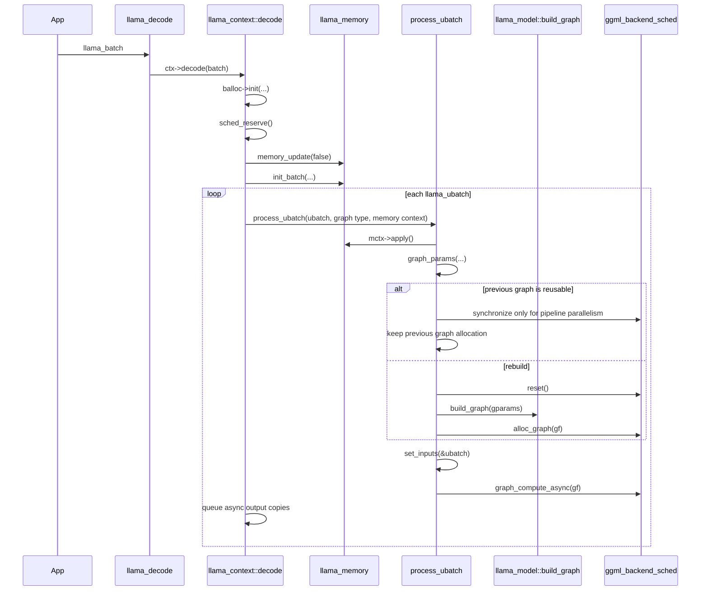

# Decode, graph reuse, and scheduler handoff

> **Evidence scope — Verified:** llama.cpp commit [`e3546c7948e3af463d0b401e6421d5a4c2faf565`](https://github.com/ggml-org/llama.cpp/tree/e3546c7948e3af463d0b401e6421d5a4c2faf565). Line numbers and behavior below describe that revision only.

This page traces one bounded vertical slice: the public `llama_decode()` API through micro-batch preparation, graph reuse or rebuild, scheduler allocation, and asynchronous scheduler submission.

## Five-minute model

`llama_decode()` does not directly execute transformer kernels. It delegates to `llama_context::decode()`, which validates and partitions the caller batch, prepares the active memory module, and processes one `llama_ubatch` at a time. Each micro-batch enters `process_ubatch()`.

`process_ubatch()` computes a graph-parameter description for the current micro-batch. If the previous graph result says that its topology and input tensor shapes are compatible, llama.cpp reuses that graph and only rewrites its input tensors. Otherwise it resets the graph result and scheduler, builds a new architecture-specific GGML graph, and asks the scheduler to allocate the graph. It then submits the graph through `graph_compute()`, which selects the CPU threadpool/thread count and calls `ggml_backend_sched_graph_compute_async()`.



## Exact call chain

### 1. Public API boundary

**Verified:** [`llama_decode()`](https://github.com/ggml-org/llama.cpp/blob/e3546c7948e3af463d0b401e6421d5a4c2faf565/src/llama-context.cpp#L4042-L4052) is a thin wrapper around `ctx->decode(batch)`. It translates the internal return code into API logging but does not build or execute a graph itself.

```text
llama_decode(ctx, batch)
  -> llama_context::decode(batch)
```

### 2. Batch and memory preparation

**Verified:** [`llama_context::decode()`](https://github.com/ggml-org/llama.cpp/blob/e3546c7948e3af463d0b401e6421d5a4c2faf565/src/llama-context.cpp#L1664-L1984):

1. rejects empty input and redirects encoder-only contexts to `encode()`;
2. initializes `llama_batch_allocr`, which normalizes the external batch and exposes token/output counts;
3. calls `sched_reserve()` before compute;
4. applies pending memory shifts/copies through `memory_update(false)`;
5. asks the active memory module for a batch context with `memory->init_batch(...)`;
6. retries once after `memory_update(true)` when memory-slot preparation fails;
7. iterates the resulting `llama_ubatch` objects and calls `process_ubatch()`.

**Interpretation:** the external `llama_batch` is an API-level container, while `llama_ubatch` is the scheduler/graph-sized unit that determines the concrete graph input dimensions for this execution.

## Graph reuse decision

**Verified:** [`process_ubatch()`](https://github.com/ggml-org/llama.cpp/blob/e3546c7948e3af463d0b401e6421d5a4c2faf565/src/llama-context.cpp#L1288-L1358) first applies the memory context and then creates `gparams = graph_params(...)`. The comment states the invariant directly: the graph parameters must uniquely determine the full graph topology.

The decision is:

```text
reuse = !graph_reuse_disable && previous_result.can_reuse(gparams)
```

On reuse:

- the previous `ggml_cgraph` and its scheduler allocation remain active;
- `n_reused` is incremented;
- `set_inputs(&ubatch)` rewrites graph input tensors;
- with pipeline parallelism, the scheduler is synchronized before input writes because the preceding asynchronous GPU execution may still read those tensors.

On rebuild:

1. `llm_graph_result::reset()` clears the previous result;
2. `ggml_backend_sched_reset()` resets scheduler graph state;
3. the evaluation callback is restored;
4. `model.build_graph(gparams)` constructs the architecture-specific GGML graph;
5. `ggml_backend_sched_alloc_graph()` assigns and allocates graph tensors for scheduler-selected backends.

**Verified:** setting the environment variable `LLAMA_GRAPH_REUSE_DISABLE` to a nonzero value disables reuse for the context.

### What compatibility means

**Verified:** reuse is not merely “same token count.” Each graph-input implementation can veto reuse. The base `llm_graph_input_i::can_reuse()` returns `false`, so any input type without an explicit compatibility check prevents reuse. Implemented checks include examples such as:

- token/embedding input tensor dimensions matching the new micro-batch;
- position tensor length matching `n_tokens × n_pos_per_embd`;
- output-id tensor count matching `n_outputs`;
- attention/KV input shapes matching the current memory context;
- recurrent-state view offsets matching state-head metadata.

**Interpretation:** graph reuse is a topology-and-shape cache, not a result cache. Weight tensors and allocated intermediates may be reused, but token values, positions, masks, and memory indices are rewritten before each compute.

## Reserve versus allocate

These operations solve different problems.

### Scheduler reserve

**Verified:** `llama_context::graph_reserve()` builds representative graphs and calls `ggml_backend_sched_reserve()` or split-only sizing helpers. Reserve establishes enough backend compute-buffer capacity for expected graph shapes. A scheduler reset during reservation explicitly invalidates the previous reusable graph result.

### Per-graph allocation

**Verified:** `ggml_backend_sched_alloc_graph()` runs only on the rebuild branch inside `process_ubatch()`. It binds the newly built graph tensors to the already managed scheduler/backend buffers. A reused graph skips this allocation call.

**Interpretation:** reserve is capacity planning; allocation is binding a particular graph's tensors into that capacity.

## Threading and asynchronous execution

**Verified:** [`llama_context::graph_compute()`](https://github.com/ggml-org/llama.cpp/blob/e3546c7948e3af463d0b401e6421d5a4c2faf565/src/llama-context.cpp#L2409-L2436):

- selects `n_threads_batch` and `threadpool_batch` when `ubatch.n_tokens > 1`;
- selects `n_threads` and the regular threadpool for a one-token decode micro-batch;
- installs the selected threadpool on the CPU backend when that backend exposes the procedure;
- propagates the thread count to backends that expose thread-count setters;
- calls `ggml_backend_sched_graph_compute_async(sched, gf)`.

**Verified:** after submission, `decode()` queues asynchronous tensor reads for logits, embeddings, and backend-sampling outputs. Therefore the word “async” applies both to scheduler graph submission and, when supported, output transfer. Backend APIs may internally fall back to synchronous behavior.

**Open question:** this page stops at the scheduler API boundary. The next increment must trace `ggml_backend_sched_graph_compute_async()` through graph splitting, inter-backend copies/events, and each split's backend execution.

## Failure and rollback behavior

**Verified:** graph-build failure returns `GGML_STATUS_FAILED`; scheduler allocation failure returns `GGML_STATUS_ALLOC_FAILED`; compute failure propagates the scheduler status. When a micro-batch fails, `decode()` removes the affected positions from the active memory module before returning an API error code.

## Key distinction

```text
Graph reuse
  reuses graph topology + tensor allocation
  does not reuse token-dependent values or model outputs

Memory/KV reuse
  preserves sequence history across decode calls
  is managed by the active llama_memory implementation

Backend scheduling
  places graph nodes/tensors and launches backend work
  begins after graph compatibility/build and input updates
```
