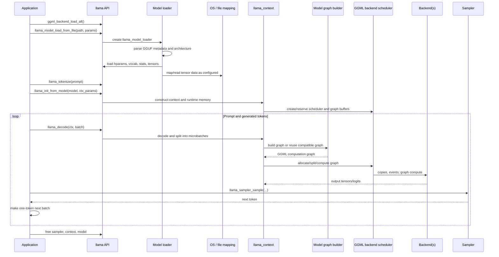

# Brief end-to-end inference

This is the first verified vertical slice. It follows the minimal `examples/simple/simple.cpp` path at upstream revision `e3546c7948e3`. Backend, architecture, and configuration choices can alter internal branches.

## One-page flow



## 1. Load backend implementations

**Verified.** The minimal example calls `ggml_backend_load_all()` before model loading. This makes registered CPU/GPU/accelerator implementations discoverable to later device selection and context construction.

Source: [`examples/simple/simple.cpp`](https://github.com/ggml-org/llama.cpp/blob/e3546c7948e3af463d0b401e6421d5a4c2faf565/examples/simple/simple.cpp)

## 2. Load the model

**Verified.** The example creates default model parameters, changes `n_gpu_layers`, and calls `llama_model_load_from_file`.

The public function delegates to an internal file-loading implementation. The internal path:

1. creates `llama_model_loader`;
2. creates an architecture-specific model object;
3. prepares candidate devices;
4. loads hyperparameters;
5. loads the vocabulary;
6. loads statistics/metadata;
7. loads tensors unless vocabulary-only mode is active.

Source: [`src/llama.cpp`](https://github.com/ggml-org/llama.cpp/blob/e3546c7948e3af463d0b401e6421d5a4c2faf565/src/llama.cpp)

!!! note "mmap timing clue"
    A source comment resets model load timing because page faults deferred by `mmap()` may occur during the first evaluation. This is important: mapping a file is not equivalent to physically reading every mapped page into RAM at model-load time.

## 3. Tokenize and create `llama_context`

**Verified.** The example tokenizes the prompt, computes context and batch limits, and calls `llama_init_from_model`.

**Interpretation.** The model object is mostly long-lived model state and weights; `llama_context` is the active inference runtime: sequence state, memory modules, backend instances, scheduler, graph buffers, output handling, and runtime configuration.

## 4. Prepare the first batch

The prompt tokens are wrapped in a `llama_batch`. Encoder-decoder models can take an encoder path first; a decoder-only model enters the decode loop directly.

## 5. Decode

The application calls `llama_decode(ctx, batch)`.

The detailed implementation page will trace these stages:

```text
public llama_decode
  -> llama_context::decode
     -> batch validation/allocation
     -> memory update and slot preparation
     -> microbatch loop
        -> process_ubatch
           -> graph reuse check OR scheduler reset + model.build_graph
           -> graph allocation
           -> set graph inputs
           -> graph_compute
              -> choose thread counts/thread pool
              -> ggml_backend_sched_graph_compute_async
                 -> split graph by backend
                 -> prepare cross-backend copies/events
                 -> execute each backend split
```

This chain is a research target until every condition and exact symbol is pinned on the detailed page.

## 6. Kernel execution

The scheduler ultimately asks backend interfaces to compute graph splits. A CPU split reaches CPU graph planning, the thread pool, and operation-specific kernels. Accelerator splits use backend-specific command streams/queues, buffers, kernels, and synchronization.

No single “GPU path” exists: CUDA, Metal, Vulkan, SYCL, OpenCL, and other backends differ substantially behind the common interface.

## 7. Read outputs and sample

After decode, the example calls `llama_sampler_sample`. The sampler selects a token from the available model outputs, checks end-of-generation, converts the token to text, and creates a new one-token batch.

## 8. Repeat and tear down

Single-token decode repeats until the requested length or an end token. Finally the example frees the sampler, context, and model in that order.

## Questions the deeper chapter must answer

- When exactly is a graph rebuilt versus reused?
- Which graph inputs change without changing topology?
- How are prompt processing and token generation reserved separately?
- How does memory-slot selection modify graph inputs?
- When are asynchronous operations synchronized before output access?
- Which tensors cross backend boundaries, and who owns copy buffers?
- What changes for multiple sequences, embeddings, encoders, recurrent models, and MoE?
