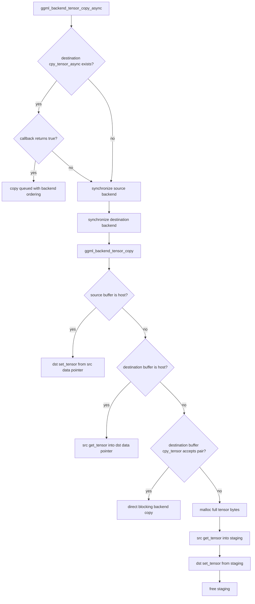

# Generic tensor-copy fallback and staging

> **Source baseline:** llama.cpp commit [`e3546c7948e3af463d0b401e6421d5a4c2faf565`](https://github.com/ggml-org/llama.cpp/commit/e3546c7948e3af463d0b401e6421d5a4c2faf565)
>
> This page describes the generic backend-copy helpers in `ggml/src/ggml-backend.cpp` at that revision. Backend implementations and later scheduler changes must be documented separately.

## Five-minute explanation

When the scheduler needs to move a tensor between backends, it first gives the destination backend a chance to perform a native asynchronous copy. If that callback is absent or returns `false`, GGML deliberately switches to a correctness-first path:

1. synchronize the source backend;
2. synchronize the destination backend;
3. perform a blocking generic tensor copy;
4. prefer direct host access when either side is host-visible;
5. otherwise ask the destination buffer for a direct backend-specific copy;
6. if that also fails, allocate a temporary host buffer, read the source into it, write it into the destination, and free it.

The fallback preserves the ordering expected from an asynchronous copy submitted after previously queued work. Its cost can be much higher because it may drain two execution queues and, in the worst case, stage the full tensor through newly allocated host memory.

## Exact fallback call chain



## Why both backends are synchronized

### Verified

`ggml_backend_tensor_copy_async()` comments that a true asynchronous copy normally occurs after queued operations on both involved backends. To emulate that ordering when no usable asynchronous callback exists, it calls `ggml_backend_synchronize(backend_src)` and `ggml_backend_synchronize(backend_dst)` before invoking `ggml_backend_tensor_copy()`.

A backend with no `synchronize` callback makes `ggml_backend_synchronize()` return immediately. This is safe only because such a backend is expected not to have independently queued unfinished work behind that interface; the pinned CPU backend, for example, completes graph execution before returning.

### Interpretation

The two synchronizations are queue-drain barriers, not merely memory fences. They can destroy copy/compute overlap and can serialize otherwise independent work on both sides of a split boundary.

## The blocking copy decision tree

`ggml_backend_tensor_copy()` requires identical tensor layouts and handles four cases.

### 1. Source buffer is host-visible

If `ggml_backend_buffer_is_host(src->buffer)` is true, GGML calls:

```text
ggml_backend_tensor_set(dst, src->data, 0, ggml_nbytes(src))
```

The source bytes are read directly through the source tensor's host pointer. The destination buffer's `set_tensor` implementation owns any required host-to-device or host-to-private-buffer transfer and returns only according to that buffer API's blocking contract.

### 2. Destination buffer is host-visible

If only the destination is host-visible, GGML calls:

```text
ggml_backend_tensor_get(src, dst->data, 0, ggml_nbytes(src))
```

The source buffer's `get_tensor` implementation copies into the destination tensor's host pointer.

### 3. Destination buffer supports a direct copy

If neither side is host-visible, GGML calls `ggml_backend_buffer_copy_tensor(src, dst)`. That helper resolves the destination tensor's owning buffer and invokes the destination buffer's optional `cpy_tensor` callback.

The destination buffer therefore decides whether it can directly consume the source buffer type. This is a blocking buffer-level operation, distinct from the backend-level `cpy_tensor_async` callback tried earlier.

### 4. Full host-staging fallback

If the destination buffer rejects the direct copy, GGML:

1. allocates `ggml_nbytes(src)` with `malloc()`;
2. calls `ggml_backend_tensor_get(src, staging, ...)`;
3. calls `ggml_backend_tensor_set(dst, staging, ...)`;
4. frees the staging allocation.

### Interpretation

This last branch is the portability floor. It works by decomposing an unsupported device-to-device transfer into device-to-host plus host-to-device operations, but it temporarily duplicates the complete logical tensor in pageable process memory.

## Important ownership boundaries

| Object | Owner | Lifetime | Meaning |
|---|---|---|---|
| Original source tensor storage | Source buffer/model/scheduler allocation | Existing tensor lifetime | Authoritative bytes before the copy |
| Scheduler destination copy tensor | Scheduler graph context and allocator | Copy-slot / allocated graph lifetime | Backend-local execution input |
| Temporary host staging allocation | `ggml_backend_tensor_copy()` | One fallback call | Emergency transfer buffer only |
| Backend queue/stream/command buffer | Concrete backend | Backend-defined | Orders native asynchronous work |

The temporary `malloc()` buffer is not a cache and is not retained between graph executions. The scheduler copy tensor may persist with the allocated graph, but its contents are refreshed according to split execution and copy-slot reuse.

## Representative backend combinations

### CPU or mmap-backed host source to CUDA device

### Verified

The pinned CUDA backend-level asynchronous copy callback rejects CPU/mmap buffers because it requires CUDA device buffers on both sides. The generic path therefore synchronizes source and destination first.

Because the CPU/mmap source buffer is host-visible, `ggml_backend_tensor_copy()` takes the first branch and calls the CUDA destination buffer's blocking `set_tensor`. In the pinned CUDA implementation, ordinary buffer set operations may use CUDA asynchronous primitives internally but synchronize before returning, so the generic call remains host-blocking.

### Interpretation

There is no extra generic `malloc()` staging allocation in this case: the mmap/CPU tensor's existing host pointer is the staging source. Page faults may still occur when the CPU reads file-backed source pages, and the CUDA transfer cannot overlap earlier queued destination work because the destination was synchronized first.

### CUDA host buffer to CUDA device

### Verified

CUDA host buffers are host-visible but are not CUDA device buffers, so the pinned backend-level CUDA `cpy_tensor_async` callback rejects this pair. The generic path synchronizes both backends, then uses the host-source branch and invokes destination `set_tensor` from the host buffer pointer.

### Interpretation

Pinned host buffers can avoid the generic heap-staging allocation and may be pinned or backend-optimized, but this route is still not scheduler-level asynchronous because the fallback synchronizes first and the ordinary destination buffer operation is blocking to its caller.

### CPU or mmap source to Metal shared/private storage

### Verified

A CPU/mmap source is host-visible, so after rejected/absent backend async copy support the generic copy uses destination `set_tensor` directly from the source pointer. The Metal destination buffer implementation determines whether it can copy directly into shared storage or must encode/carry out a blit for private storage.

The generic fallback has already synchronized the source and Metal backend before this call, so previous Metal graph or copy command buffers are complete at the copy boundary.

### Interpretation

For shared Metal memory, addressability may make the byte movement cheaper or allow a CPU-visible destination mapping, but it does not undo the synchronization bubble already introduced. For private storage, a transfer or blit remains necessary. Exact cost and temporary ownership depend on the Metal buffer implementation and platform generation.

## Synchronization and visibility guarantees

### Verified

After the fallback returns:

- all work queued before the source synchronization has completed;
- all work queued before the destination synchronization has completed;
- the blocking tensor-copy helper has returned;
- the copied destination bytes are ready according to the destination buffer's blocking `set_tensor`, `get_tensor`, or `cpy_tensor` contract.

This is stronger than a successful asynchronous callback, which only means that the copy and dependencies were accepted/queued.

### Interpretation

The fallback exchanges overlap for a simple completion guarantee. It is safe for immediate subsequent submission on the destination backend, but expensive boundaries can become visible as idle accelerator time, host stalls, page-fault latency, and repeated allocation overhead.

## Capability and cost table

| Source → destination | Backend async callback | Generic blocking branch | Extra full-size heap staging | Main synchronization cost |
|---|---|---|---:|---|
| CPU/mmap → CUDA device | Rejected by pinned CUDA callback | Host source → destination `set_tensor` | No | Drain source and CUDA queues; blocking H2D |
| CUDA host → CUDA device | Rejected by pinned CUDA callback | Host source → destination `set_tensor` | No | Drain CUDA contexts; blocking transfer |
| CUDA device → CPU host | Usually rejected by destination CPU backend/no async callback | Destination host → source `get_tensor` | No | Drain CUDA and CPU; blocking D2H |
| CPU/mmap → Metal shared/private | No generic native backend pair accepted | Host source → destination `set_tensor` | No | Drain Metal; blocking buffer operation |
| Unsupported device A → device B | Callback absent/rejected | Destination `cpy_tensor`, if accepted | Maybe | Drain both devices; possibly staged D2H + H2D |
| Device A → device B with no direct `cpy_tensor` | Rejected | `malloc` + get + set + free | Yes | Two queue drains plus two blocking transfers |

## Failure and caveats

### Verified

- Tensor layouts must match; the helper asserts otherwise.
- The generic staging branch does not explicitly handle `malloc()` failure before passing the pointer to `get_tensor`.
- The staging allocation size is the full `ggml_nbytes(src)` value.
- Buffer host visibility is determined by the buffer type's optional `is_host` callback; absent means false.
- Direct blocking copy capability belongs to the destination buffer's `cpy_tensor` callback.

### Interpretation

Large unsupported cross-device copies can create short-lived RSS spikes and allocator pressure. Repeated fallback copies can also obscure the cost source: the scheduler may report a copy boundary while the actual transfer becomes two backend-specific blocking operations plus host allocation.

## Truth labels

### Verified

- Backend async-copy failure synchronizes both backends before blocking copy.
- Host-visible source and destination branches avoid generic heap staging.
- The final portability fallback stages the whole tensor through `malloc()` memory.
- Destination buffer capability controls direct blocking device-to-device copy.
- Fallback return provides a blocking completion boundary, unlike successful queued async submission.

### Interpretation

- The fallback is best viewed as a correctness-preserving serialization point.
- CPU/mmap-to-accelerator paths can combine page-fault latency, queue drains, and transfer latency in one scheduler boundary.
- Avoiding the heap-staging branch does not imply an asynchronous or zero-copy transfer.

### Historical

- These findings describe the pinned baseline. Newer scheduler PRs may add more asynchronous paths, specialized copies, staging pools, or different ownership and event rules.

### Open questions

- Which current backends implement destination-buffer `cpy_tensor` for every source-buffer pair?
- Do newer revisions reuse staging allocations instead of allocating per unsupported copy?
- What are the measured synchronization and page-fault costs for CPU/mmap-to-CUDA and CPU/mmap-to-Metal during prefill versus token decode?
- How do Vulkan, SYCL, RPC, and Android accelerator backends map the same generic branches?

## Pinned source map

| Concern | Symbol |
|---|---|
| Async capability negotiation and synchronized fallback | [`ggml_backend_tensor_copy_async()`](https://github.com/ggml-org/llama.cpp/blob/e3546c7948e3af463d0b401e6421d5a4c2faf565/ggml/src/ggml-backend.cpp#L500-L520) |
| Blocking copy decision tree and host staging | [`ggml_backend_tensor_copy()`](https://github.com/ggml-org/llama.cpp/blob/e3546c7948e3af463d0b401e6421d5a4c2faf565/ggml/src/ggml-backend.cpp#L477-L498) |
| Destination-buffer direct-copy dispatch | [`ggml_backend_buffer_copy_tensor()`](https://github.com/ggml-org/llama.cpp/blob/e3546c7948e3af463d0b401e6421d5a4c2faf565/ggml/src/ggml-backend.cpp#L206-L212) |
| Blocking tensor set/get dispatch | [`ggml_backend_tensor_set()` / `get()`](https://github.com/ggml-org/llama.cpp/blob/e3546c7948e3af463d0b401e6421d5a4c2faf565/ggml/src/ggml-backend.cpp#L326-L354) |
| Backend synchronization wrapper | [`ggml_backend_synchronize()`](https://github.com/ggml-org/llama.cpp/blob/e3546c7948e3af463d0b401e6421d5a4c2faf565/ggml/src/ggml-backend.cpp#L410-L417) |

## Next investigation

Trace destination-buffer `cpy_tensor` and blocking `set_tensor`/`get_tensor` implementations across CPU, CUDA, Metal, Vulkan, SYCL, and RPC, then build a source/destination buffer compatibility matrix backed by runtime traces.