# Guided end-to-end inference atlas

This page is the shortest navigable route from a GGUF file on disk to a generated token. Use the pipeline first, then choose a reading path based on the question you are trying to answer.

> **Baseline:** llama.cpp [`e3546c7948e3af463d0b401e6421d5a4c2faf565`](https://github.com/ggml-org/llama.cpp/commit/e3546c7948e3af463d0b401e6421d5a4c2faf565). Newer behavior must be labelled separately.

## Clickable pipeline

```mermaid
flowchart LR
    A[GGUF file] --> B[Model loader]
    B --> C[llama_model]
    C --> D[llama_context]
    D --> E[Build GGML graph]
    E --> F[Backend scheduler]
    F --> G[CPU / accelerator execution]
    G --> H[Outputs and sampling]
    H --> I[Next decode step]
    I --> E

    click A "../../foundations/gguf-file-anatomy/" "GGUF layout, descriptors, alignment, and mappings"
    click B "../../architecture/model-gguf-loader-pass-a/" "Loader call chain and publication"
    click C "../../objects/llama-model/" "Persistent model ownership"
    click D "../../objects/llama-context/" "Mutable runtime session state"
    click E "../../ggml/graph-construction-and-moe/" "Graph construction, reuse, and MoE"
    click F "../backend-scheduler-execution/" "Splits, copies, events, and execution"
    click G "../../architecture/backend-teardown-comparison/" "Backend completion and lifetime comparison"
    click H "../../architecture/public-api-minimal-example/" "Minimal public API loop"
    click I "../decode-graph-reuse/" "Decode and graph reuse"
```

The loop back from the next decode step to graph construction does **not** mean every object is recreated. The graph may reuse compatible topology and allocation state, while token-dependent values and outputs change.

## What exists at each stage

| Stage | Main object or resource | Lifetime question | Continue with |
|---|---|---|---|
| GGUF parsing | metadata, tensor descriptors, file offsets | What is read, mapped, retained, or copied? | [GGUF file anatomy](../foundations/gguf-file-anatomy.md) |
| Model loading | loader state, mappings, backend buffers | When does temporary loader state become published model state? | [Model and GGUF loader](../architecture/model-gguf-loader-pass-a.md) |
| Persistent model | `llama_model`, vocabulary, tensors, buffers | What can be shared across contexts? | [`llama_model`](../objects/llama-model.md) |
| Runtime session | `llama_context`, scheduler, outputs, memory modules | What changes per sequence, batch, and token? | [`llama_context`](../objects/llama-context.md) |
| Graph construction | `ggml_context`, tensors, nodes, graph topology | Which nodes are rebuilt, and which allocation plans can be reused? | [Graph construction and MoE](../ggml/graph-construction-and-moe.md) |
| Scheduling | splits, copy generations, events, backend assignment | When is data valid on the selected backend? | [Backend scheduler execution](backend-scheduler-execution.md) |
| Execution | CPU work or queued accelerator commands | Does return mean host-visible completion? | [Backend teardown comparison](../architecture/backend-teardown-comparison.md) |
| Persistent attention/state | KV, recurrent, hybrid, or architecture-specific memory | Which state survives the graph invocation? | [Context memory implementations](../architecture/context-memory-implementations.md) |
| Teardown | backend contexts, scheduler buffers/events, mappings | Which completion and ownership conditions make destruction safe? | [Model and context teardown](../architecture/model-context-teardown-order.md) |

## Choose a reading path

=== "First complete pass"

    1. [Brief end to end](end-to-end.md)
    2. [GGUF file anatomy](../foundations/gguf-file-anatomy.md)
    3. [`llama_model`](../objects/llama-model.md)
    4. [`llama_context`](../objects/llama-context.md)
    5. [Graph construction and MoE](../ggml/graph-construction-and-moe.md)
    6. [Backend scheduler execution](backend-scheduler-execution.md)
    7. [Decode and graph reuse](decode-graph-reuse.md)

=== "Memory and page faults"

    1. [Model tensor placement](../foundations/model-tensor-placement.md)
    2. [Memory lifetimes](../foundations/memory-lifetimes.md)
    3. [GGUF file anatomy](../foundations/gguf-file-anatomy.md)
    4. [Runtime context and memory](../architecture/runtime-context-memory-pass-a.md)
    5. [Buffer compatibility](buffer-compatibility.md)

=== "Graphs and scheduler"

    1. [What GGML is](../ggml/what-is-ggml.md)
    2. [Graph construction and MoE](../ggml/graph-construction-and-moe.md)
    3. [Decode and graph reuse](decode-graph-reuse.md)
    4. [Backend scheduler Pass A](../architecture/backend-scheduler-pass-a.md)
    5. [Generic copy fallback](generic-copy-fallback.md)

=== "Backends and synchronization"

    1. [Backend scheduler execution](backend-scheduler-execution.md)
    2. [CPU and CUDA semantics](cpu-cuda-backend-semantics.md)
    3. [Metal semantics](metal-backend-semantics.md)
    4. [Backend teardown comparison](../architecture/backend-teardown-comparison.md)
    5. Follow the detailed backend page linked from the comparison table.

=== "Ownership and teardown"

    1. [System ownership and execution map](../architecture/system-ownership-and-execution-map.md)
    2. [Memory lifetimes](../foundations/memory-lifetimes.md)
    3. [Model and context teardown](../architecture/model-context-teardown-order.md)
    4. [Scheduler core teardown](../architecture/scheduler-teardown-core.md)
    5. [Backend teardown comparison](../architecture/backend-teardown-comparison.md)

## Truth labels for this atlas

**Verified**

- The linked pages are the current canonical project pages for the major stages shown here.
- The pinned baseline separates persistent model ownership, mutable context state, graph construction, scheduler planning, backend execution, and teardown.
- KV and recurrent state are persistent context-memory resources rather than ordinary temporary graph activations.

**Interpretation**

- The atlas is a learning and navigation model, not a claim that runtime execution is a single linear thread. Loading can use mappings and uploads; scheduling can split work; accelerator commands can be asynchronous; and persistent state crosses graph invocations.

**Historical**

- Page coverage and backend behavior are revision-sensitive. The atlas reflects the documentation state and pinned llama.cpp baseline named above.

**Open question**

- The pipeline still needs generated, versioned node metadata shared with the interactive workflow, plus runtime overlays for page faults, copies, event waits, KV growth, and backend queues.

## Next step

Open the [interactive inference workflow](../interactive/inference-workflow.md) for a node-by-node prototype, or start with the [brief end-to-end explanation](end-to-end.md) for a prose walkthrough.
