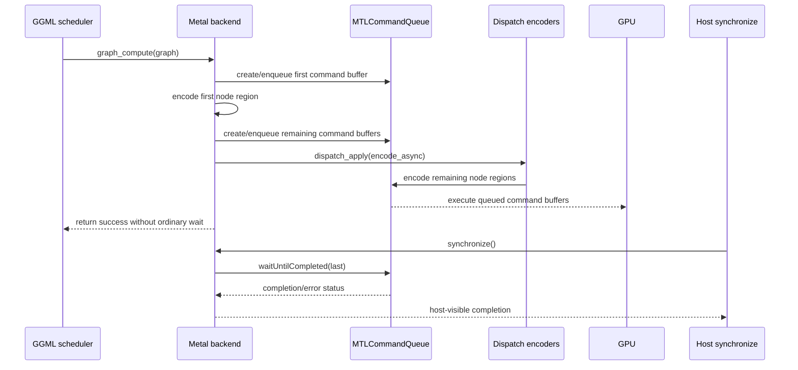

# Metal backend submission, copies, and synchronization

> **Evidence scope:** llama.cpp commit [`e3546c7948e3af463d0b401e6421d5a4c2faf565`](https://github.com/ggml-org/llama.cpp/tree/e3546c7948e3af463d0b401e6421d5a4c2faf565). Newer Metal code may differ.

This page follows the pinned Metal backend from GGML's generic backend interface into Metal command buffers, blit copies, shared events, and the host completion boundary. It then compares those semantics with the pinned CUDA backend.

## Five-minute explanation

Metal graph submission is genuinely asynchronous in the ordinary path. `ggml_backend_metal_graph_compute()` delegates to `ggml_metal_graph_compute()`, which encodes graph nodes into one or more `MTLCommandBuffer` objects, enqueues or commits them, remembers the last queued command buffer, and normally returns without waiting for GPU completion.

Metal tensor set/get operations and Metal-to-Metal copies also create blit command buffers and commit them without an immediate host wait. Ordering is maintained by command-queue order and Metal events. `ggml_metal_synchronize()` is the explicit host boundary: it waits for the last relevant command buffer, checks graph and extra command-buffer status, releases completed extra buffers, and records a persistent backend error if completion failed.

Apple unified memory changes where bytes may physically reside and can remove a PCIe-style transfer, but it does **not** make command completion implicit. CPU visibility and safe buffer reuse still require the appropriate queue/event ordering or synchronization boundary.

## Backend call chain

```text
ggml_backend_graph_compute_async(backend, graph)
  -> backend->iface.graph_compute
  -> ggml_backend_metal_graph_compute()
  -> ggml_metal_graph_compute()
       -> create MTLCommandBuffer objects
       -> enqueue/encode graph nodes
       -> optionally encode remaining command buffers on dispatch threads
       -> remember ctx->cmd_buf_last
       -> return GGML_STATUS_SUCCESS without ordinary completion wait

Host completion request
  -> ggml_backend_synchronize()
  -> ggml_backend_metal_synchronize()
  -> ggml_metal_synchronize()
       -> [ctx->cmd_buf_last waitUntilCompleted]
       -> inspect all graph and extra command buffers
       -> release completed extra command buffers
```

Pinned wrappers:

- [`ggml_backend_metal_graph_compute()`](https://github.com/ggml-org/llama.cpp/blob/e3546c7948e3af463d0b401e6421d5a4c2faf565/ggml/src/ggml-metal/ggml-metal.cpp#L538-L542)
- [`ggml_backend_metal_synchronize()`](https://github.com/ggml-org/llama.cpp/blob/e3546c7948e3af463d0b401e6421d5a4c2faf565/ggml/src/ggml-metal/ggml-metal.cpp#L499-L503)
- [Metal backend interface registration](https://github.com/ggml-org/llama.cpp/blob/e3546c7948e3af463d0b401e6421d5a4c2faf565/ggml/src/ggml-metal/ggml-metal.cpp#L572-L589)

## Command-buffer lifecycle

`ggml_metal_graph_compute()` divides graph encoding between the calling thread and up to `n_cb` additional dispatch workers.

1. The calling thread creates a command buffer for the first graph region, enqueues it, and invokes `encode_async(n_cb)`.
2. Additional command buffers are created for the remaining graph regions.
3. They are enqueued before parallel encoding when abort handling does not require delayed submission.
4. `dispatch_apply()` runs the remaining encoders.
5. `ctx->cmd_buf_last` tracks the last queued command buffer needed by synchronization.
6. The normal path returns success without `waitUntilCompleted`.

The capture/debug path is exceptional: capture requires waiting for command buffers and checking completion status before ending the capture. That blocking path must not be generalized to ordinary inference.



## Tensor set/get and Metal-to-Metal copies

### Host-to-Metal set

`ggml_metal_set_tensor_async()` wraps source bytes in a shared `MTLBuffer`, creates a blit command encoder, copies into the destination tensor buffer, commits the command buffer, and stores it in `cmd_bufs_ext`. It deliberately does not wait.

### Metal-to-host get

`ggml_metal_get_tensor_async()` wraps the caller's destination pointer with `newBufferWithBytesNoCopy`, encodes a blit from the tensor buffer, commits, and remembers the command buffer. The caller must not consume or reuse that destination as completed data until synchronization establishes completion.

### Metal-to-Metal copy

The generic callback first requires both backend objects and both tensor buffers to be Metal. The underlying copy resolves view ownership, encodes a blit of `ggml_nbytes(src)`, signals the source context's copy event, commits, retains the command buffer, and then queues an event wait in the destination context.

```text
source Metal context
  -> blit src buffer to dst buffer
  -> signal source copy event
  -> commit source command buffer

destination Metal context
  -> enqueue command buffer waiting on the copy event
  -> later graph work is ordered after that wait
```

Unlike the pinned CUDA callback, the wrapper does not expose explicit backend-device consistency or peer-copy build branches. Eligibility is established by Metal backend/buffer identity and by successfully resolving both `MTLBuffer` objects. The actual device/queue relationship is therefore delegated to the Metal context/device layer.

## Events are queue dependencies, not host waits

`ggml_metal_event_record()` creates and commits a command buffer that encodes an event signal. `ggml_metal_event_wait()` creates and commits a command buffer that encodes a wait. Both update `cmd_buf_last` and retain the command buffer in `cmd_bufs_ext`; neither waits on the host.

This gives the scheduler a device-side ordering primitive analogous in purpose to CUDA's `cudaEventRecord()` plus `cudaStreamWaitEvent()`, although the underlying queue and memory systems differ.

## Shared and private Metal buffers

The pinned backend exposes shared and private Metal buffer types. Both use the same backend copy interface, while host set/get operations may use temporary shared buffers and blit command buffers.

Do not equate these terms with completion:

- **Shared storage** concerns CPU/GPU addressability and storage mode.
- **Private storage** generally requires explicit GPU-side transfer paths for host data.
- **Event or command-buffer completion** determines when queued operations have finished.
- **Host synchronization** determines when caller-side code may safely assume completion.

A unified physical-memory system can reduce transfer cost, but queue ordering remains part of correctness.

## CUDA-versus-Metal capability table

| Question | Pinned CUDA | Pinned Metal |
|---|---|---|
| Ordinary graph callback returns before accelerator completion | Yes; kernels/CUDA Graph launch are queued on a stream | Yes; command buffers are enqueued/committed and ordinary path returns without waiting |
| Scheduler event record/wait | `cudaEventRecord` and `cudaStreamWaitEvent` | command buffers encoding Metal event signal/wait |
| Host completion boundary | stream/device synchronization through backend synchronize | `waitUntilCompleted` on `cmd_buf_last`, then status checks |
| Async backend-to-backend copy acceptance | CUDA backend + CUDA device buffers + device consistency; peer branch gated | Metal backend + Metal buffers; underlying `MTLBuffer` resolution must succeed |
| Copy ordering | source stream, event, destination stream wait | source blit signals copy event; destination queues event wait |
| Host set/get | ordinary buffer APIs may synchronize immediately; async interface is separate | async set/get commit blit command buffers and defer wait |
| Memory model caveat | discrete VRAM and peer topology are explicit concerns | Apple UMA may share physical memory, but completion/coherence must not be inferred from addressability |
| Unsupported-copy behavior | callback returns `false`; scheduler uses synchronized fallback | wrapper/underlying copy returns `false`; scheduler uses generic fallback |
| Error discovery | CUDA API checks and later synchronization | command-buffer status inspected during `ggml_metal_synchronize`; persistent `has_error` blocks later graph submission |

## Truth-labelled findings

### Verified

- The pinned Metal backend registers asynchronous set, get, copy, graph-compute, synchronize, event-record, and event-wait callbacks.
- Ordinary graph submission returns without waiting after command-buffer encoding/submission.
- Graph encoding can be partitioned across multiple command buffers and host dispatch workers.
- Asynchronous set/get/copy operations use blit command buffers, retain them in `cmd_bufs_ext`, and update `cmd_buf_last`.
- Metal-to-Metal copy signals a copy event in the source context and queues a destination-context event wait.
- Event record and wait are encoded as command buffers and do not themselves perform host waits.
- `ggml_metal_synchronize()` waits for the last relevant command buffer, checks completion status, releases extra command buffers, and enters a persistent error state after failure.

### Interpretation

- `cmd_buf_last` is the backend's coarse host-completion fence, while Metal events provide finer queue-to-queue dependencies.
- The copy event turns an otherwise asynchronous blit into an ordered producer/consumer relation without forcing the CPU to wait.
- Unified memory can reduce copying pressure but does not remove the need to reason about queued execution, safe reuse, or host visibility.
- Metal and CUDA offer similar scheduler-visible asynchronous semantics through different command-submission abstractions.

### Historical

- These findings describe the pinned May 2026-era source baseline. Metal queue ownership, event implementation, graph optimization, and multi-device behavior may change on newer branches.

### Open question

- Which exact Metal event primitive is selected for each supported Apple OS/GPU generation, and what fallback exists when shared events are unavailable?
- Can the pinned multi-device Metal path legally blit across all simulated/physical device combinations, or does it rely on a shared device queue/resource relationship?
- How much command-buffer preparation overlaps actual GPU execution during prompt processing versus one-token decode?
- Which later llama.cpp PRs changed `cmd_buf_last`, copy-event ownership, or error propagation?

## Source map

- [`ggml/src/ggml-metal/ggml-metal.cpp`](https://github.com/ggml-org/llama.cpp/blob/e3546c7948e3af463d0b401e6421d5a4c2faf565/ggml/src/ggml-metal/ggml-metal.cpp): generic backend wrappers and callback registration.
- [`ggml/src/ggml-metal/ggml-metal-context.m`](https://github.com/ggml-org/llama.cpp/blob/e3546c7948e3af463d0b401e6421d5a4c2faf565/ggml/src/ggml-metal/ggml-metal-context.m): command buffers, blits, events, synchronization, and graph submission.
- [`CPU and CUDA backend semantics`](cpu-cuda-backend-semantics.md): prior concrete backend comparison.
- [`CUDA asynchronous copies`](cuda-async-copy.md): pinned CUDA copy acceptance and fallback branches.
- [`Backend scheduler execution`](backend-scheduler-execution.md): generic split/copy/event orchestration.
