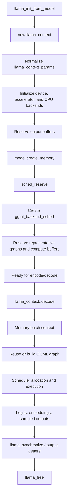

# `llama_context`

> **Evidence scope — Verified:** llama.cpp commit [`e3546c7948e3af463d0b401e6421d5a4c2faf565`](https://github.com/ggml-org/llama.cpp/tree/e3546c7948e3af463d0b401e6421d5a4c2faf565). Behavior and line links below describe that revision only.

`llama_context` is the active inference runtime built around a loaded `llama_model`. The model supplies architecture, weights, vocabulary, devices, and model-level metadata. The context supplies per-run configuration, mutable sequence memory, backend scheduler state, compute buffers, graph-reuse state, output buffers, thread-pool attachment, adapters, sampling state, and performance counters.

## Prerequisites

Read these first when the terms are unfamiliar:

- [Brief end to end](../lifecycle/end-to-end.md)
- [Decode and graph reuse](../lifecycle/decode-graph-reuse.md)
- [Backend scheduler execution](../lifecycle/backend-scheduler-execution.md)
- [Buffer compatibility](../lifecycle/buffer-compatibility.md)

## Five-minute explanation

The public application creates a context with `llama_init_from_model(model, params)`. After validating the requested context configuration, that function allocates a C++ `llama_context`. The constructor copies and normalizes runtime parameters, initializes accelerator and CPU backends, reserves host-visible output storage, asks the model to create the appropriate memory implementation, creates a multi-backend scheduler, and reserves representative worst-case graphs and compute-buffer capacity.

During `llama_decode()`, the context converts the external batch into micro-batches, prepares the active memory module, reuses or rebuilds an architecture-specific GGML graph, assigns and allocates graph tensors through the scheduler, selects CPU thread-pool settings, submits backend work, and arranges output transfers. Later API calls such as `llama_get_logits()` synchronize before exposing host-readable results.

The context **references** the model; it does not own the model object. It **owns** its runtime-specific memory, scheduler, backend instances, graph-result caches, output buffers, adapter state, batch allocator, and other mutable execution state. Therefore the model must outlive every context created from it.



## Construction path

### Public API boundary

**Verified:** [`llama_init_from_model()`](https://github.com/ggml-org/llama.cpp/blob/e3546c7948e3af463d0b401e6421d5a4c2faf565/src/llama-context.cpp#L3363-L3559) validates context parameters and model constraints, then executes `new llama_context(*model, params)`. Construction failures are caught and reported as a null result.

```text
application
  -> llama_init_from_model(model, params)
      -> validate model/context compatibility
      -> new llama_context(*model, params)
```

The deprecated `llama_new_context_with_model()` forwards to the same function. `llama_free()` destroys the context with `delete`.

### Constructor phases

**Verified:** [`llama_context::llama_context()`](https://github.com/ggml-org/llama.cpp/blob/e3546c7948e3af463d0b401e6421d5a4c2faf565/src/llama-context.cpp#L64-L453) performs these major phases:

1. stores a reference to the model and creates adapter and batch-allocation helpers;
2. derives normalized `llama_cparams` values for context size, sequence count, batching, RoPE, attention, embeddings, offload, graph reuse, and memory configuration;
3. initializes configured GPU/device backends, accelerator backends such as BLAS, and a CPU backend;
4. discovers optional backend thread-count procedures;
5. reserves a host-side output buffer;
6. asks `model.create_memory(...)` to create the architecture-appropriate KV, recurrent, hybrid, or other memory implementation;
7. selects default compute-buffer types for each backend, preferring a device host buffer for CPU-side intermediate state when available;
8. enables pipeline parallelism only when the placement and backend capability checks pass;
9. calls `sched_reserve()` to create the scheduler and reserve worst-case graph capacity;
10. initializes full-vocabulary token IDs used by backend samplers.

**Interpretation:** the constructor is a runtime assembly step. It does not merely allocate one struct; it creates a coordinated set of backend, memory, graph, output, and scheduling resources whose exact composition depends on the loaded model and context parameters.

## Ownership and lifetime

| Member or subsystem | Relationship | Lifetime and role |
|---|---|---|
| `const llama_model & model` | Referenced, not owned | Must outlive the context; supplies weights, architecture, vocabulary, layer placement, devices, and memory factory |
| `llama_cparams cparams` | Owned value | Normalized runtime configuration used across graph building, memory, scheduling, and output logic |
| `llama_memory_ptr memory` | Owned | Mutable sequence state; concrete implementation is selected by `model.create_memory()` |
| `ggml_backend_sched_ptr sched` | Owned | Assigns graph nodes/tensors, owns scheduler compute allocations, split state, copy rings, and events |
| `std::vector<ggml_backend_ptr> backends` | Owned | Runtime backend instances, including CPU and selected device/accelerator backends |
| `backend_cpu` | Non-owning alias into `backends` | Used to attach thread pools and execute CPU-assigned graph nodes |
| `gf_res_prev`, `gf_res_reserve` | Owned | Previous reusable graph result and reservation/probe graph result |
| `logits`, `embd`, `embd_seq`, sampling buffers | Owned views/storage | Host-facing output and sampling state, resized and rewritten across calls |
| `buf_output` and output contexts | Owned | Backing storage for host-visible logits, embeddings, and sampling outputs |
| `balloc` | Owned | Reusable external-batch to micro-batch allocator/normalizer |
| `cvec`, `loras` | Owned | Runtime adapter state that can invalidate graph reservation assumptions |
| thread-pool pointers | Borrowed | Caller-owned pools attached to the context; not destroyed by it |

**Verified:** the class declaration and member layout are in [`src/llama-context.h`](https://github.com/ggml-org/llama.cpp/blob/e3546c7948e3af463d0b401e6421d5a4c2faf565/src/llama-context.h#L44-L394).

**Open question:** the public API documents the required model/context destruction order indirectly through pointer use and examples. A future version-comparison page should identify whether a stronger explicit lifetime contract is documented or enforced in later revisions.

## Memory owned or referenced

### Model weights

The context references model tensors and placement metadata through `model`. Weight storage belongs to the model and may be mmap-backed, device-resident, split across backends, or overridden. Creating or freeing a context does not load or unload the model object itself.

### Sequence memory

**Verified:** construction calls `model.create_memory(params_mem, cparams)`. The returned `llama_memory_i` implementation owns or coordinates mutable inference history. Depending on architecture and parameters this can represent KV cache, recurrent state, hybrid memory, or related modules.

During decode, the context calls `memory_update()`, obtains a batch-specific memory context, applies it before graph construction/input updates, and rolls back affected positions when a micro-batch fails.

### Compute and scheduler buffers

`sched_reserve()` creates a `ggml_backend_sched` from the context's backend list and chosen buffer types. It builds representative graphs and reserves backend compute-buffer capacity. A rebuilt graph is later bound into this capacity through scheduler allocation; a reusable graph keeps its previous topology and allocation.

### Outputs

The context owns host-facing buffers for logits, embeddings, optional per-layer inputs, and backend-sampling data. Output getters call `synchronize()` where host-visible completion is required. Output storage is runtime state and can be reordered or resized between logical batches.

### mmap and page faults

**Interpretation:** because the model is referenced rather than copied into the context, a CPU or transfer path that reads mmap-backed model tensors can still trigger file-backed page faults during context execution. Context ownership of the scheduler does not imply ownership or guaranteed physical residency of the model's mapped pages.

## Mutation during inference

A context is intentionally mutable. Important mutation points include:

- batch normalization and micro-batch iteration;
- memory slot assignment, KV/recurrent updates, shifts, copies, and rollback;
- graph-result replacement or input rewriting during graph reuse;
- scheduler reset, allocation, copy-ring rotation, event recording, and backend submission;
- output-buffer reservation, output row mapping, and asynchronous output copies;
- sampler state and generated-token outputs;
- adapter, attention, embedding, thread-count, and abort-callback configuration;
- performance counters and state save/load operations.

**Verified:** [`llama_decode()`](https://github.com/ggml-org/llama.cpp/blob/e3546c7948e3af463d0b401e6421d5a4c2faf565/src/llama-context.cpp#L4042-L4052) is a thin public wrapper around `llama_context::decode()`.

## Decode call chain

```text
llama_decode(ctx, batch)
  -> llama_context::decode(batch)
      -> balloc->init(...)
      -> sched_reserve()
      -> memory_update(false)
      -> memory->init_batch(...)
      -> for each llama_ubatch
          -> process_ubatch(...)
              -> memory_context->apply()
              -> graph_params(...)
              -> reusable?
                   yes: preserve graph/allocation, rewrite inputs
                   no: reset result and scheduler
                       -> model.build_graph(...)
                       -> ggml_backend_sched_alloc_graph(...)
              -> set_inputs(...)
              -> graph_compute(...)
                  -> select thread count/thread pool
                  -> ggml_backend_sched_graph_compute_async(...)
      -> arrange logits/embedding/sampler output copies
```

See [Decode and graph reuse](../lifecycle/decode-graph-reuse.md) and [Backend scheduler execution](../lifecycle/backend-scheduler-execution.md) for the deeper branches.

## Threading and synchronization

`llama_context` is the coordination point for CPU thread-pool selection and backend synchronization, but it is not itself a general thread-safe container.

**Verified:**

- it stores borrowed regular and batch thread-pool pointers;
- `graph_compute()` chooses batch threads when a micro-batch has more than one token and regular decode threads for one-token micro-batches;
- `synchronize()` waits the scheduler/backends before operations requiring completion;
- graph reuse under pipeline parallelism synchronizes before rewriting graph inputs that previous GPU work may still read;
- state serialization/deserialization and host output getters synchronize before accessing completion-sensitive data;
- pipeline parallelism is enabled only when all participating non-CPU devices advertise asynchronous compute and event support.

**Interpretation:** applications should treat one context as one mutable execution stream unless a specific API documents otherwise. Multiple application threads concurrently mutating the same context would need external coordination; backend-internal parallelism does not make the context's host-side state independently thread-safe.

## Teardown

`llama_free(ctx)` calls `delete ctx`. The destructor reports expected versus actual scheduler compute-buffer sizes and releases the optimization context explicitly. Remaining owned smart pointers and containers then release scheduler, graph results, memory, backend instances, output storage, adapters, and helper objects through normal C++ destruction.

**Verified:** [`llama_context::~llama_context()`](https://github.com/ggml-org/llama.cpp/blob/e3546c7948e3af463d0b401e6421d5a4c2faf565/src/llama-context.cpp#L455-L473) does not delete the referenced model.

**Interpretation:** callers should complete or synchronize outstanding use before freeing a context. The current destructor path relies on owned backend/scheduler cleanup semantics rather than documenting a separate explicit final synchronization in the destructor body.

## Source map

| Question | Pinned source |
|---|---|
| Public creation, validation, `new`, and `llama_free()` | [`src/llama-context.cpp`](https://github.com/ggml-org/llama.cpp/blob/e3546c7948e3af463d0b401e6421d5a4c2faf565/src/llama-context.cpp#L3363-L3571) |
| Class API, ownership-bearing members, graph/output/thread state | [`src/llama-context.h`](https://github.com/ggml-org/llama.cpp/blob/e3546c7948e3af463d0b401e6421d5a4c2faf565/src/llama-context.h#L44-L394) |
| Constructor and destructor | [`src/llama-context.cpp`](https://github.com/ggml-org/llama.cpp/blob/e3546c7948e3af463d0b401e6421d5a4c2faf565/src/llama-context.cpp#L64-L473) |
| Scheduler creation and graph reservation | [`llama_context::sched_reserve()`](https://github.com/ggml-org/llama.cpp/blob/e3546c7948e3af463d0b401e6421d5a4c2faf565/src/llama-context.cpp#L544-L720) |
| Micro-batch graph reuse/build/allocate path | [`llama_context::process_ubatch()`](https://github.com/ggml-org/llama.cpp/blob/e3546c7948e3af463d0b401e6421d5a4c2faf565/src/llama-context.cpp#L1288-L1358) |
| Decode orchestration | [`llama_context::decode()`](https://github.com/ggml-org/llama.cpp/blob/e3546c7948e3af463d0b401e6421d5a4c2faf565/src/llama-context.cpp#L1664-L1984) |
| Thread-pool selection and scheduler submission | [`llama_context::graph_compute()`](https://github.com/ggml-org/llama.cpp/blob/e3546c7948e3af463d0b401e6421d5a4c2faf565/src/llama-context.cpp#L2409-L2436) |
| Public synchronization and output getters | [`src/llama-context.cpp`](https://github.com/ggml-org/llama.cpp/blob/e3546c7948e3af463d0b401e6421d5a4c2faf565/src/llama-context.cpp#L3569-L3650) |
| Memory interfaces and implementations | [`src/llama-memory.h`](https://github.com/ggml-org/llama.cpp/blob/e3546c7948e3af463d0b401e6421d5a4c2faf565/src/llama-memory.h) and architecture-specific memory sources |

## Backend and version differences

- CPU-only contexts still use the scheduler abstraction, but CPU graph execution blocks inside the thread-pool-backed compute call.
- GPU or accelerator contexts can queue graph work, copies, and events, but exact completion and overlap depend on backend callbacks and buffer compatibility.
- Device host-buffer selection can change where intermediate CPU-visible compute storage is allocated.
- Pipeline parallelism changes graph-reuse synchronization and scheduler copy-ring behavior.
- Later upstream revisions may change members, memory implementations, sampler integration, scheduler capabilities, and constructor phases; those changes must be documented separately from this baseline.

## Truth labels

### Verified

- The context stores a non-owning reference to `llama_model` and owns runtime-specific memory, scheduler, backend, graph, output, adapter, and batching state.
- The constructor initializes backends, output storage, memory, scheduler capacity, and sampler support.
- Decode mutates memory, graph inputs/results, scheduler state, and outputs.
- Public state and output operations synchronize where completion is required.

### Interpretation

- `llama_context` is best understood as the mutable execution session or runtime instance around an immutable-or-shared model, not as the model itself.
- Scheduler ownership does not guarantee that mmap-backed model pages remain physically resident.
- One context should be treated as one externally coordinated mutable execution stream unless a stronger thread-safety guarantee is documented.

### Historical

- The context layout and construction path have evolved with new memory modules, graph reuse, backend sampling, and scheduler capabilities. This page intentionally preserves the pinned baseline rather than silently describing current `master`.

### Open questions

- Which context operations are explicitly guaranteed thread-safe by the public API, if any, across supported revisions?
- Which memory implementation is selected for every currently supported architecture and hybrid configuration?
- Does teardown in every backend guarantee completion without a preceding explicit `llama_synchronize()` call, and how has that changed historically?
- Which later commits materially change context ownership, sampler integration, graph reservation, or scheduler lifetime?

## Related objects and next page

Related objects: `llama_model`, `llama_batch`, `llama_ubatch`, `llama_memory_i`, `llm_graph_result`, `ggml_cgraph`, `ggml_backend_sched`, and backend buffers.

Next recommended page: [Decode and graph reuse](../lifecycle/decode-graph-reuse.md), followed by [Backend scheduler execution](../lifecycle/backend-scheduler-execution.md).